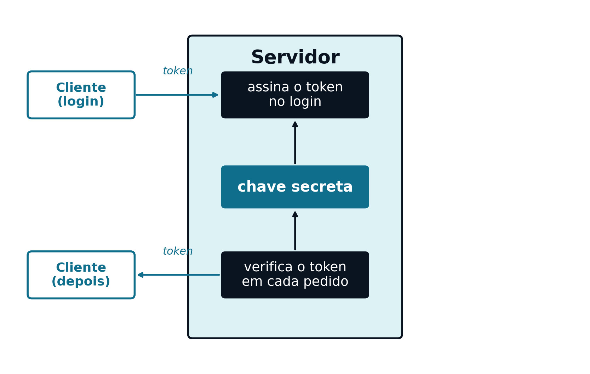

## Introdução {#sec-apB-intro}

O [Capítulo 8](cap08.qmd) mostrou como um JWT (ver @sec-08-jwt) é assinado e verificado, sem nunca aprofundar **com que algoritmo**, nem **que garantias de segurança** essa assinatura oferece. Este apêndice aprofunda especificamente essa questão: a assinatura de *tokens*.

## HMAC: uma Chave Secreta Partilhada {#sec-apB-hmac}

O algoritmo usado no [Capítulo 8](cap08.qmd), `HS256`, é a combinação de **HMAC** (*Hash-based Message Authentication Code*) com a função de resumo criptográfico `SHA-256`. É um algoritmo **simétrico**: a mesma chave secreta é usada tanto para assinar como para verificar um *token*.

Essa chave nunca é gerada no cliente, nem alguma vez viaja até ele: é criada e guardada exclusivamente no servidor (tipicamente uma única vez, na configuração inicial da aplicação), e nunca sai daí. O que o cliente recebe, e mais tarde reenvia, é sempre o *token* já assinado — o resultado de usar a chave — nunca a chave em si.

{#fig-apB-hmac width="65%"}

Isto funciona bem exatamente na situação apresentada ao longo desta UC: **um único servidor** (ou várias instâncias desse mesmo servidor, todas com acesso à mesma chave secreta, ver @sec-08-escalabilidade-horizontal) é, simultaneamente, quem emite os *tokens* e quem os valida. A chave nunca sai desse perímetro de confiança.

O inconveniente do HMAC aparece quando esse perímetro deixa de fazer sentido: se um sistema externo — que não deveria ter autoridade para **emitir** *tokens* válidos — precisasse de os **validar**, teria de receber a mesma chave secreta usada para os assinar. Nesse momento, deixa de ser só um verificador: passa a ser também capaz de forjar *tokens* novos, válidos, para qualquer utilizador.

## RSA e ECDSA: um Par de Chaves {#sec-apB-assimetrico}

Um algoritmo **assimétrico** resolve este problema separando as duas capacidades em duas chaves distintas: uma **chave privada**, que só quem emite *tokens* conhece, e uma **chave pública**, correspondente, que pode ser livremente distribuída a quem precisar de os validar. O que a chave privada assina, só é possível verificar com a chave pública correspondente — mas não é possível **assinar** nada de novo apenas com a chave pública.

Os dois algoritmos assimétricos mais comuns em JWT são `RS256` (RSA com `SHA-256`) e `ES256` (*Elliptic Curve Digital Signature Algorithm* com `SHA-256`) — este último mais recente, com chaves mais pequenas e verificação mais rápida para um nível de segurança equivalente, cada vez mais preferido ao RSA em sistemas novos.

{#fig-apB-assimetrico width="85%"}

Este desenho é o habitual em sistemas compostos por vários serviços independentes (por vezes chamados *microserviços*): um único Serviço de Autenticação, responsável por validar credenciais e emitir *tokens*, e vários outros serviços, cada um deles a validar esses *tokens* de forma completamente autónoma, sem nunca comunicar entre si nem confiar uns nos outros para além da chave pública partilhada.

## Escolher entre HMAC e Assinatura Assimétrica {#sec-apB-escolher}

| | HMAC (`HS256`) | Assimétrico (`RS256`/`ES256`) |
|---|---|---|
| Nº de chaves | Uma só, partilhada | Duas: privada (emite) e pública (verifica) |
| Quem pode emitir *tokens* válidos | Qualquer um com a chave | Só quem tem a chave privada |
| Quem pode validar *tokens* | Qualquer um com a chave | Qualquer um com a chave pública |
| Cenário típico | Um servidor (ou cluster de confiança) emite e valida | Vários serviços independentes só validam |
| Desempenho | Mais rápido, mais simples | Mais lento, chaves maiores (exceto ECDSA) |

Para a aplicação "World Capitals" usada ao longo desta UC — um único servidor, responsável tanto por emitir como por validar os seus próprios *tokens* — o HMAC é uma escolha perfeitamente adequada, e é por isso que o [Capítulo 8](cap08.qmd) o usa como exemplo. A escolha só passaria a pesar a favor de um algoritmo assimétrico se a aplicação crescesse para vários serviços independentes, cada um dos quais devesse poder validar, mas não emitir, credenciais de acesso.

## O Ataque `alg:none` {#sec-apB-alg-none}

O *header* de um JWT declara, ele próprio, qual o algoritmo usado na assinatura (ver @sec-08-jwt). A especificação original do JWT permite, entre os valores possíveis desse campo, o valor `none` — pensado para casos em que a integridade já é garantida por outro mecanismo, e nenhuma assinatura é sequer necessária.

Um verificador mal implementado, que confie cegamente no algoritmo declarado no *header* em vez de impor um algoritmo esperado, pode ser enganado por um *token* como este:

```json
{"alg": "none", "typ": "JWT"}
```

seguido de um *payload* arbitrário e de uma assinatura vazia. Se o código de verificação não rejeitar explicitamente o algoritmo `none`, um atacante pode construir, à mão, um *token* com qualquer *payload* que queira — por exemplo, `{"sub":"admin","role":"admin"}` — sem precisar de conhecer chave nenhuma, e o servidor aceita-o como legítimo.

É exatamente este ataque que motiva a recomendação já feita no [Capítulo 8](cap08.qmd): uma biblioteca bem escrita, como a JJWT, exige que o algoritmo esperado seja indicado explicitamente no código de verificação, e rejeita qualquer *token* que declare um algoritmo diferente — incluindo `none` — independentemente do que o próprio *token* afirme sobre si mesmo.

## Onde Guardar o Token no Cliente {#sec-apB-armazenamento}

Tudo o que foi visto até aqui protege o *token* contra falsificação — mas não contra roubo (ver @sec-08-authorization-header): quem o possui pode usá-lo livremente, como o seu legítimo dono, até ele expirar. O sítio onde o cliente o guarda entre pedidos determina a que tipo de roubo fica exposto.

**Guardar no `localStorage` do *browser***
: Acessível a qualquer código JavaScript que corra na página — incluindo, infelizmente, um *script* malicioso injetado através de uma vulnerabilidade de *Cross-Site Scripting* (XSS). Se essa vulnerabilidade existir na aplicação, um atacante consegue ler o *token* diretamente e reenviá-lo, fazendo-se passar pelo utilizador. Não é, por outro lado, enviado automaticamente pelo *browser* em pedidos a outros sítios, por isso não fica exposto a *Cross-Site Request Forgery* (CSRF)

**Cookie `HttpOnly`**
: Marcado com o atributo `HttpOnly`, um *cookie* fica inacessível ao próprio JavaScript da página — nem um *script* malicioso o consegue ler, o que neutraliza o roubo por XSS. Em troca, o *browser* reenvia automaticamente *cookies* em qualquer pedido dirigido ao domínio, mesmo quando esse pedido é despoletado por uma página de outro sítio — reabrindo a porta a CSRF, que passa a ter de ser mitigado à parte (por exemplo, com o atributo `SameSite`)

| | `localStorage` | Cookie `HttpOnly` |
|---|---|---|
| Acessível a JavaScript | Sim | Não |
| Vulnerável a roubo por XSS | Sim | Não |
| Reenviado automaticamente pelo *browser* | Não | Sim |
| Vulnerável a CSRF | Não | Sim, exige mitigação à parte |

Nenhuma das duas opções é isenta de risco — cada uma troca um tipo de vulnerabilidade por outro. O modelo seguido no [Capítulo 8](cap08.qmd) (*token* reenviado manualmente no cabeçalho `Authorization`, ver @sec-08-fetch-json) pressupõe que o *token* está acessível ao próprio JavaScript, o que aponta para `localStorage`, e é o mais comum em aplicações de página única modernas. Nesse modelo, prevenir XSS deixa de ser só uma boa prática geral: torna-se uma condição essencial para a segurança do próprio mecanismo de autenticação — ainda que a prevenção de XSS em si fique fora do âmbito deste apêndice.

## Boas Práticas Mínimas {#sec-apB-boas-praticas}

- **Nunca aceitar o algoritmo do *token* às cegas** — o código de verificação deve impor explicitamente o algoritmo esperado (ver @sec-apB-alg-none)
- **A chave secreta (HMAC) ou privada (RSA/ECDSA) nunca deve viver no código-fonte** — deve ser lida de uma variável de ambiente ou de um gestor de segredos dedicado, nunca *commitada* num repositório
- **Uma chave curta ou previsível anula a segurança do algoritmo** — o comprimento mínimo recomendado depende do algoritmo, mas uma *string* curta e memorável nunca é apropriada
- **Expiração curta** (a *claim* `exp`, ver @sec-08-ciclo-vida-token) limita os danos de um *token* comprometido, mesmo sem qualquer mecanismo adicional
- **HTTPS é sempre obrigatório** — mesmo um *token* assinado corretamente é uma credencial válida se for intercetado em trânsito; a assinatura protege contra falsificação, não contra escuta da rede

Estas práticas são um ponto de partida, não um tratamento exaustivo de segurança de aplicações Web.
