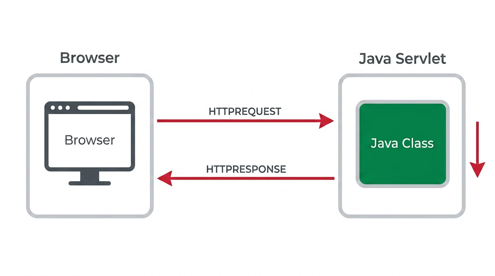

## O Problema: Construir uma Aplicação Web de Raiz {#sec-01-problema}

Uma aplicação Web não é apenas um programa que corre num computador: é um programa que responde a pedidos vindos de múltiplos clientes, em simultâneo, através da rede. Construída de raiz, sem qualquer apoio de plataforma, uma aplicação deste tipo teria de resolver, por si só, um conjunto de problemas comuns a qualquer sistema deste género:

- Receber e interpretar pedidos vindos da rede
- Construir e devolver respostas no formato esperado pelo cliente
- Suportar múltiplos pedidos em simultâneo (*multi-threading*)
- Gerir a ligação a bases de dados
- Manter informação entre pedidos sucessivos do mesmo utilizador
- Proteger recursos de acessos não autorizados

Resolver todos estes problemas repetidamente, aplicação a aplicação, seria um desperdício de esforço. É exactamente para evitar essa repetição que existem plataformas empresariais que fornecem estes serviços prontos a usar, libertando quem desenvolve para se concentrar na lógica de negócio da aplicação.

## Duas Orientações: Apresentação vs. Serviço {#sec-01-frontend-backend}

Uma aplicação Web pode seguir duas orientações distintas, consoante o tipo de resposta que produz:

**Orientada à apresentação** (*presentation-oriented*)
: Gera páginas Web interativas (HTML, CSS e conteúdo dinâmico) em resposta a cada pedido. É o modelo tradicional de uma aplicação Web, pensada para ser consumida diretamente por um utilizador humano através de um *browser*.

**Orientada a serviço** (*service-oriented*)
: Implementa o ponto de acesso (*endpoint*) de um serviço Web, tipicamente devolvendo dados estruturados em formato JSON ou XML, em vez de HTML. Este modelo é pensado para ser consumido por outro programa, seja ele uma aplicação móvel, uma *single-page application* ou outro serviço.

Esta distinção corresponde, em larga medida, à separação entre *front-end* (a parte da aplicação que interage diretamente com quem a usa) e *back-end* (a parte que processa a lógica e os dados). Uma aplicação orientada à apresentação tende a confundir estas duas responsabilidades num único componente do lado do servidor; uma aplicação orientada a serviço separa-as claramente, deixando o *front-end* inteiramente a cargo do cliente.

## O Padrão MVC {#sec-01-mvc}

Organizar todo o código de uma aplicação num único bloco indiferenciado rapidamente se torna insustentável: o código que processa o pedido, o que acede aos dados e o que gera a resposta acabam misturados, difíceis de testar e de alterar em separado. O padrão [*Model-View-Controller*](https://developer.mozilla.org/en-US/docs/Glossary/MVC) (MVC) resolve este problema, dividindo a aplicação em três responsabilidades distintas:

**Model** (Modelo)
: Representa os dados e a lógica de negócio da aplicação, independentemente de como são apresentados. Numa aplicação Web, o Model é tipicamente responsável por aceder à base de dados e devolver a informação já validada.

**View** (Vista)
: Responsável por apresentar os dados a quem os pede, sem conter lógica de negócio. Numa aplicação orientada à apresentação, a View gera HTML; numa aplicação orientada a serviço, não existe, de facto, View do lado do servidor: a resposta é apenas dados estruturados (JSON), e é o cliente que decide como os apresentar.

**Controller** (Controlador)
: Recebe o pedido, decide que operação realizar sobre o Model, e escolhe a View (ou o formato de resposta) a devolver. É o Controller que faz a ponte entre o pedido HTTP recebido e a lógica da aplicação.

Esta separação de responsabilidades é um dos princípios de desenho mais recorrentes de toda esta matéria. Manifesta-se de forma clássica quando um componente do lado do servidor funciona como Controller e delega a apresentação a outro, que funciona como View; e manifesta-se de forma bem menos óbvia quando a View deixa de existir do lado do servidor e passa a ser reconstruída no *browser*, a partir de dados JSON.

## Três Peças: Frontend, Middleware e Backend {#sec-01-tres-pecas}

Tanto a distinção entre apresentação e serviço como o padrão MVC descrevem a mesma ideia central, vista de ângulos diferentes: uma aplicação Web não é um bloco único, mas sim um conjunto de peças com papéis distintos, que comunicam entre si. Ao longo desta UC, essas peças reduzem-se sempre às mesmas três:

**Frontend**
: A parte da aplicação que corre do lado do cliente (tipicamente um *browser*), responsável por apresentar informação e recolher a interação de quem a usa. Corresponde, em larga medida, à View do MVC.

**Middleware**
: O protocolo que liga o Frontend ao Backend, transportando pedidos e respostas entre os dois. Nesta UC, esse protocolo é sempre o HTTP.

**Backend**
: A parte da aplicação que corre do lado do servidor, responsável pela lógica de negócio e pelo acesso aos dados. Corresponde, em larga medida, ao Model e ao Controller do MVC.

Esta divisão em três peças é o mapa para todo o resto desta obra: primeiro constrói-se o Frontend ([Capítulo 2](cap02.qmd), em HTML/CSS/Bootstrap), depois estuda-se em detalhe o Middleware que o liga ao servidor ([Capítulo 3](cap03.qmd), o protocolo HTTP), e só depois se constrói o Backend que efetivamente responde a esses pedidos (a partir do [Capítulo 4](cap04.qmd), com *Servlets* e, mais tarde, com APIs REST).

## O Modelo Cliente-Servidor {#sec-01-cliente-servidor}

O Middleware que liga o Frontend ao Backend assenta no modelo cliente-servidor: o Frontend (tipicamente um *browser*) envia um pedido através da rede, e o Backend processa esse pedido e devolve uma resposta.

{#fig-01-cliente-servidor width="70%"}

Esta troca é feita através do protocolo HTTP (*HyperText Transfer Protocol*), que tem duas características fundamentais:

- É orientado a transações: cada interação é composta por um pedido (*request*) seguido de uma resposta (*response*)
- É *stateless* (sem estado): o servidor não guarda, por si só, qualquer memória de pedidos anteriores do mesmo cliente

A ausência de estado no protocolo não impede que uma aplicação precise de reter informação entre pedidos (por exemplo, para saber que um utilizador está autenticado). Essa necessidade é resolvida ao nível da aplicação, não do protocolo, através de mecanismos como sessões e *cookies* (ver [Capítulo 5](cap05.qmd)).

Os detalhes deste protocolo, o Middleware que liga estas duas peças, são o tema do [Capítulo 3](cap03.qmd).
