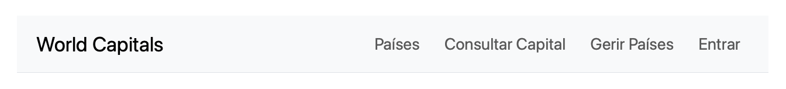

## As Tags Principais do HTML {#sec-02-tags-principais}

Este capítulo constrói a primeira das três peças identificadas no [Capítulo 1](cap01.qmd): o Frontend. É a parte da aplicação que corre no *browser*, e é com ela que se começa, porque é a que se vê e testa mais imediatamente, mesmo sem ainda existir nenhum servidor por trás.

O HTML (*HyperText Markup Language*) descreve o conteúdo de uma página através de elementos, cada um delimitado por uma *tag* de abertura e outra de fecho (por exemplo, `<p>` e `</p>`, delimitando um parágrafo). Antes de qualquer exemplo completo, vale a pena conhecer o vocabulário: as *tags* mais usadas para conteúdo de texto são estas:

| Tag | Para que serve | Exemplo |
|---|---|---|
| `<h1>` a `<h6>` | Títulos e subtítulos, do mais importante (`<h1>`) ao menos importante (`<h6>`). Cada página deve ter, no máximo, um `<h1>`. | `<h1>Título da Página</h1>` |
| `<p>` | Um parágrafo de texto. | `<p>Este é um parágrafo.</p>` |
| `<a>` | Uma ligação (hiperligação) para outra página ou secção, definida pelo atributo `href`. | `<a href="https://www.w3.org">W3C</a>` |
| `<ul>` | Uma lista de items não ordenada (com marcadores); cada item vai dentro de um `<li>`. | `<ul><li>Item1</li><li>Item2</li>...</ul>` |
| `<ol>` | Uma lista de items ordenada (numerada); tal como `<ul>`, os itens vão dentro de `<li>`. | `<ol><li>Primeiro item</li><li>Segundo item</li></ol>` |

Para organizar estes conteúdos em blocos, o HTML oferece um contentor genérico e várias *tags* estruturais (ou semânticas). A diferença entre eles é que o contentor genérico não tem qualquer significado próprio, enquanto as *tags* semânticas descrevem o papel de cada zona da página:

| Tag | Para que serve | Exemplo |
|---|---|---|
| `<div>` | Um contentor genérico, sem qualquer significado próprio; usado para agrupar outros elementos (por exemplo, para lhes aplicar um estilo comum). | `<div class="cartao">...</div>` |
| `<header>` | O cabeçalho da página ou de uma secção (normalmente título, logótipo, menu). | `<header><h1>O Meu Site</h1></header>` |
| `<nav>` | Um bloco de navegação, tipicamente uma lista de ligações. | `<nav><a href="#inicio">Início</a></nav>` |
| `<main>` | O conteúdo principal da página; existe, no máximo, um por página. | `<main><p>Conteúdo...</p></main>` |
| `<section>` | Uma secção temática de conteúdo, normalmente com o seu próprio título. | `<section><h2>Sobre</h2></section>` |
| `<aside>` | Conteúdo relacionado, mas secundário (barra lateral, notas). | `<aside><p>Ver também...</p></aside>` |
| `<footer>` | O rodapé da página ou de uma secção (direitos de autor, contactos). | `<footer>© 2026</footer>` |
| `<form>` | Usado para fazer formulários de introdução de informação, em conjunto com entradas *input*. | `<form><input type="text"/></form>` |

::: {.callout-tip}
## Referência para estudo detalhado

Esta tabela cobre apenas as *tags* mais usadas ao longo desta UC. Para a lista completa de elementos HTML, e a especificação detalhada de cada um, usar a referência [W3C](https://www.w3.org/TR/html52/) (*World Wide Web Consortium*), o organismo internacional que normaliza o HTML.
:::

## Estrutura HTML {#sec-02-html-css}

Um documento HTML mínimo tem sempre a mesma forma: uma declaração de tipo de documento, seguida de um elemento `html`, dividido num `head` (metadados, não visíveis ao público, apenas para os programadores) e num `body` (o conteúdo visível para o público):

```html
<!DOCTYPE html>
<html lang="pt">
  <head>
    <meta charset="UTF-8">
    <title>A Minha Página</title>
  </head>
  <body>
    <h1>Bem-vindo</h1>
    <p>Primeira versão da página.</p>
  </body>
</html>
```

Este código renderiza no *browser* como mostrado na figura @fig-02-pagina-minima:

{#fig-02-pagina-minima width="50%"}

Combinando as *tags* estruturais já apresentadas, uma página ganha uma organização muito mais clara do que um único bloco de `div`s indiferenciados. Cada *tag* rotula o tipo de informação que contém:

```html
<!DOCTYPE html>
<html lang="pt">
<head>
  <meta charset="UTF-8">
  <meta name="viewport" content="width=device-width, initial-scale=1">
  <title>Página de Exemplo</title>
</head>
<body>
  <header>
    <h1>Título do Site</h1>
    <!-- outros elementos no header-->
  </header>
  <nav><!-- menu aqui --></nav>
  <main>
    <section>
      <h2>Introdução</h2>
      <p>Conteúdo inicial.</p>
    </section>
    <section>
      <h2>Outra secção</h2>
      <p>Podem colocar-se quantas secções se quiser.</p>
    </section>
  </main>
  <footer>© 2026</footer>
</body>
</html>
```

Este código renderiza no *browser* como mostrado na figura @fig-02-estrutura-semantica — repare-se que, sem qualquer CSS, as *tags* estruturais não trazem estilo visual próprio; a organização em blocos existe, mas ainda não se vê:

{#fig-02-estrutura-semantica width="50%"}

Dois elementos usam-se com particular frequência numa aplicação Web: uma lista de ligações dentro de `nav`, para a navegação, e um `form`, para recolher dados de quem usa a página.

```html
<nav>
  <ul>
    <li><a href="#home">Início</a></li>
    <li><a href="#sobre">Sobre</a></li>
    <li><a href="#contacto">Contacto</a></li>
  </ul>
</nav>
```

Este código renderiza no *browser* como mostrado na figura @fig-02-nav-lista: sem CSS, uma lista de ligações continua a parecer uma lista, com marcadores e a formatação azul e sublinhada por omissão do *browser* para as ligações:

{#fig-02-nav-lista width="25%"}

```html
<section>
  <h2>Formulário de contacto</h2>
  <form>
    <label for="nome">Nome</label>
    <input id="nome" name="nome" type="text">
    <label for="email">Email</label>
    <input id="email" name="email" type="email">
    <button type="submit">Enviar</button>
  </form>
</section>
```

Este código renderiza no *browser* como mostrado na figura @fig-02-formulario-contacto-bare: mais uma vez, sem CSS, os campos e o botão aparecem com o estilo por omissão do *browser*:

{#fig-02-formulario-contacto-bare width="75%"}

Note-se o atributo `for` de cada `label`, que corresponde ao `id` do respetivo `input`: é o que liga visualmente uma etiqueta ao seu campo, e o que permite a um leitor de ecrã anunciar corretamente o formulário.
O *tag* `input`é dos poucos *tags* que não se usam com um a abertura e um fecho: `<input>` `</input>`, apenas tem uma estrutura `<input .../>`, cuja parte terminal significa que este tag "abre e fecha". Na maior parte das vezes omite-se a fórmula no final `/>` e fica apenas `>`, como se mostra nos exemlos de código acima. 

## Aplicar Estilos Diretamente {#sec-02-aplicar-estilos-diretamente}

O HTML descreve a **estrutura da página**; **a apresentação** é responsabilidade do [CSS](https://developer.mozilla.org/en-US/docs/Web/CSS) (*Cascading Style Sheets*). Esta secção mostra as três formas de associar CSS ao HTML, e depois os dois seletores principais — classe e identificador — usados para direcionar essas regras a elementos concretos.

### Três Formas de Aplicar CSS

O CSS pode ser associado ao HTML de três formas distintas.

**Inline**, diretamente no atributo `style` de um elemento. Por exemplo num elemento `h1`:

```html
<h1 style="color:#0d6efd; margin:0.5rem 0;">Título do Site</h1>
```

Este código renderiza no *browser* como mostrado na figura @fig-02-titulo-inline-style:

{#fig-02-titulo-inline-style width="50%"}

**Interno**, num bloco `<style>` dentro do `<head>` do ficheiro `html`a que se refere:

```html
<head>
  <meta charset="UTF-8">
  <style>
    :root { --brand: #0d6efd; }
    body { font-family: system-ui, sans-serif; line-height:1.5; }
    nav ul { list-style:none; display:flex; gap:1rem; padding:0; }
    nav a { text-decoration:none; padding:0.4rem 0.6rem; }
    nav a:hover { background:var(--brand); }
  </style>
</head>
```

A regra `:root { --brand: #0d6efd; }` define uma variável CSS (uma *custom property*), reutilizada depois com `var(--brand)`: é útil para manter a mesma cor em vários sítios da folha de estilos sem a repetir, e para a poder alterar num único sítio.

**Externo**, num ficheiro `.css` à parte, ligado pelo *tag*  `<link>` posicionadao no `header` do documento onde se pretende aplicar os estilos:

```html
<head>
  <meta charset="UTF-8">
  <link rel="stylesheet" href="styles.css">
</head>
```

```css
/* styles.css */
:root { --brand: #0d6efd; }
body { font-family: system-ui, sans-serif; line-height:1.5; }
nav ul { list-style:none; display:flex; gap:1rem; padding:0; }
nav a { text-decoration:none; padding:0.4rem 0.6rem; }
nav a:hover { background: var(--brand); }
```

Aplicando estas regras (por qualquer uma das três formas) à lista de navegação apresentada atrás, o resultado é mostrado na figura @fig-02-nav-estilada: os marcadores da lista desaparecem, as ligações deixam de estar sublinhadas, e ficam dispostas lado a lado:

{#fig-02-nav-estilada width="55%"}

Das três, o CSS externo é, em geral, a melhor prática: separa claramente a estrutura (HTML) da apresentação (CSS), permite reutilizar o mesmo ficheiro em várias páginas, e mantém cada documento mais curto e mais fácil de ler.

### Classes, IDs e Especificidade

Uma vez definida a estrutura no HTML, o CSS vai conter um conjunto de instruções que vai dizer aos elementos do HTML como vão ser "apresentados". Para aplicar estilos aos elementos, o CSS usa dois seletores principais: a classe (`class`), para grupos de elementos, e o identificador (`id`), que deve ser único na página.
Uma classe pode então designar vários elementos numa página, os quais serão formatados visualmente de forma idêntica. Pode ter-se um número qualquer de elementos da mesma classe no mesmo documento. Já o seletor `id` só pode deve aplicado a um único elemento numa página. Diz-se por isso que o `id`é mais específico dp que a `class`. 

Quando se escrevem regras CSS para uma classe coloca-se um ponto antes do nome da classe: `.nome_classe`, seguida das instruções de formatação entre `{ }`, cada uma delas separada por ponto-e-vírgula. Do lado do HTML os elementos que se pretendem formatar com essas regras têm definido o atributo `class=nome_classe`.
No caso dos elementos HTML com atributo `id=nome_id`, serão formatados do lado das CSS tal como no caso das classes mas, em vez de o seletor começar por `.`, começa por `#`(`#nome_id`).

Um mesmo elemento HTML pode ter aplicadas várias classes em simultâneo, separadas por espaço. Neste caso o elemento HTML será formatado com as regras de TODAS as classes aplicadas:

```html
  <section class="noticias destaque com_hero"> conteúdo da secção </section>

```

Vejam-se os exemplos seguintes:

```html
<h1 id="titulo" class="titulo">Título do Site</h1>
<nav class="menu">
  <ul>
    <li><a class="menu__link ativo" href="#home">Início</a></li>
    <li><a class="menu__link" href="#sobre">Sobre</a></li>
    <li><a class="menu__link" href="#contacto">Contacto</a></li>
  </ul>
</nav>
```

```css
:root { --brand: #0d6efd; }
#titulo { color: var(--brand); }              /* id: único por página */
.menu { border-block: 1px solid #eee; padding: 0.75rem 0; }
.menu__link { text-decoration: none; padding: 0.4rem 0.6rem; }
.menu__link.ativo { font-weight: 600; }
```

Este código renderiza no *browser* como mostrado na figura @fig-02-classes-ids-exemplo: o título fica colorido pela regra `#titulo`, e o menu fica formatado pelas regras `.menu`/`.menu__link`, com a ligação `ativo` a negrito:

{#fig-02-classes-ids-exemplo width="90%"}

Quando o mesmo elemento HTML é formatado por duas regras CSS que entram em conflito, como por exemplo a determinação da sua cor, a regra que vence é determinada pela sua especificidade.
Apresenta-se em baixo a lista de especificidades por ordem decrescente:

1. `!important` (a evitar; torna o CSS difícil de manter)
2. Estilo *inline*, ou seja dentro de cada elemento (`style="..."`)
3. Identificador (`#id`)
4. Classe (`.classe`), atributo ou pseudoclasse
5. Elemento (`h1`, `p`, `a`, ...)

Por exemplo, com que cor ficaria o título do exemplo anterior com esta CSS:

```css
h1 { color: black; }
.titulo { color: blue; }
#titulo { color: green; }  /* vence as duas regras anteriores */
```

O identificador (`#titulo`) é mais específico do que a classe e do que o elemento, por isso vence: o título fica verde, como mostrado na figura @fig-02-especificidade-1:

{#fig-02-especificidade-1 width="60%"}

Ou, se se aplica-se a especificidade `!important`:

```css
h1 { color: black !important; } /* vence porque tem maior especificidade */
.titulo { color: blue; }
#titulo { color: green; }
```

Agora é a regra do elemento (`h1`) que vence, apesar de ser a menos específica das três, porque tem `!important`: o título fica preto, como mostrado na figura @fig-02-especificidade-2:

{#fig-02-especificidade-2 width="60%"}

## Aplicar Estilos Usando Frameworks {#sec-02-aplicar-estilos-frameworks}

### Bootstrap

Escrever e manter todo o CSS de uma aplicação a partir do zero é um trabalho considerável, sobretudo quando se pretende que o resultado seja responsivo (ajustado a diferentes tamanhos de ecrã) e visualmente consistente. Um *framework* CSS como o [Bootstrap](https://getbootstrap.com/docs/5.3/) resolve este problema, fornecendo:

- Produtividade e consistência visual, através de classes utilitárias prontas a usar
- Responsividade já implementada, através de uma grelha (*grid*) e de classes de espaçamento
- Componentes testados e acessíveis (formulários, barras de navegação, botões, entre outros)

O *Bootstrap* pode ser incluído diretamente por *CDN* (*Content Delivery Network*), sem necessidade de instalação: uma folha de estilos no `<head>`, e um ficheiro JavaScript (para os componentes interativos) antes do fecho de `</body>`.

```html
<head>
  <link href="https://cdn.jsdelivr.net/npm/bootstrap@5.3.3/dist/css/bootstrap.min.css" rel="stylesheet">
</head>
<body>
  <!-- conteúdo da página -->
  <script src="https://cdn.jsdelivr.net/npm/bootstrap@5.3.3/dist/js/bootstrap.bundle.min.js"></script>
</body>
```

Uma barra de navegação (*navbar*), com o *Bootstrap*, fica pronta em poucas linhas, já responsiva (colapsa num menu para ecrãs estreitos):

```html
<nav class="navbar navbar-expand-md bg-light border-bottom">
  <div class="container">
    <a class="navbar-brand" href="#">Meu Site</a>
    <button class="navbar-toggler" type="button" data-bs-toggle="collapse" data-bs-target="#nav1">
      <span class="navbar-toggler-icon"></span>
    </button>
    <div id="nav1" class="collapse navbar-collapse">
      <ul class="navbar-nav ms-auto gap-2">
        <li class="nav-item"><a class="nav-link" href="#home">Início</a></li>
        <li class="nav-item"><a class="nav-link" href="#sobre">Sobre</a></li>
        <li class="nav-item"><a class="nav-link" href="#contacto">Contacto</a></li>
      </ul>
    </div>
  </div>
</nav>
```

Este código renderiza no *browser* como mostrado na figura @fig-02-bootstrap-navbar:

{#fig-02-bootstrap-navbar width="95%"}

Um formulário ganha o mesmo tratamento visual através das classes `form-label` e `form-control`:

```html
<section class="container my-4">
  <h2>Formulário de contacto</h2>
  <form class="row g-3 col-lg-6">
    <div class="col-12">
      <label for="nome" class="form-label">Nome</label>
      <input id="nome" name="nome" type="text" class="form-control">
    </div>
    <div class="col-12">
      <label for="email" class="form-label">Email</label>
      <input id="email" name="email" type="email" class="form-control">
    </div>
    <div class="col-12">
      <button class="btn btn-primary" type="submit">Enviar</button>
    </div>
  </form>
</section>
```

Este código renderiza no *browser* como mostrado na figura @fig-02-bootstrap-form: compare-se com a figura @fig-02-formulario-contacto-bare, o mesmo formulário sem Bootstrap:

{#fig-02-bootstrap-form width="80%"}

O mesmo sistema de grelha organiza também o conteúdo principal em colunas. A grelha do Bootstrap divide cada linha (`row`) em doze colunas; a classe `col-6` ocupa seis dessas doze, ou seja, metade da largura:

```html
<main class="container my-4">
  <div class="row">
    <div class="col-6">
      <p>Conteúdo principal…</p>
    </div>
    <aside class="col-6">
      <p>Barra lateral…</p>
    </aside>
  </div>
</main>
```

Este código renderiza no *browser* como mostrado na figura @fig-02-bootstrap-grid: o conteúdo principal e a barra lateral ficam lado a lado, cada um a ocupar metade da largura, embora sem qualquer borda visível a marcar as colunas — é a grelha do Bootstrap que reserva o espaço de cada uma:

{#fig-02-bootstrap-grid width="95%"}

### Outros Frameworks

O *Bootstrap* não é o único *framework* CSS disponível, apenas o mais didático para começar, pela sua abordagem baseada em componentes prontos a usar. Vale a pena conhecer, ainda que sem aprofundar, algumas alternativas populares:

**[Tailwind CSS](https://tailwindcss.com/docs)**
: Um *framework* utilitário (*utility-first*): em vez de componentes prontos como `navbar` ou `card`, fornece classes de baixo nível, uma por propriedade CSS (por exemplo `flex`, `pt-4`, `text-center`), que se combinam diretamente no HTML para construir qualquer visual à medida.

**[Bulma](https://bulma.io/documentation/)**
: Baseado apenas em CSS, sem qualquer JavaScript; sintaxe próxima do *Bootstrap*, mas sem componentes interativos (menus, modais) prontos a usar.

**[Materialize](https://materializecss.com/)**
: Implementa o [*Material Design*](https://m3.material.io/) da Google (sombras, elevação, cores vivas, animações); visualmente mais opinativo do que o *Bootstrap*.

**[Foundation](https://get.foundation/sites/docs/)**
: Orientado a projetos maiores e mais personalizados; mais flexível do que o *Bootstrap*, mas com uma curva de aprendizagem mais exigente.

A tabela seguinte compara estes *frameworks* pela abordagem que seguem e pela facilidade de aprendizagem:

| Framework | Abordagem | Curva de aprendizagem |
|---|---|---|
| **Bootstrap** | Componentes prontos (`navbar`, `card`, `btn`) | Baixa |
| **Tailwind CSS** | Classes utilitárias, uma por propriedade CSS | Média/alta |
| **Bulma** | Componentes CSS, sem JavaScript | Baixa |
| **Materialize** | Componentes segundo o *Material Design* | Média |
| **Foundation** | Componentes configuráveis, mais flexíveis | Alta |

## Boas Práticas {#sec-02-boas-praticas}

- Preferir CSS externo; evitar `!important` e o excesso de estilos *inline*
- Usar uma nomenclatura consistente para classes (por exemplo, a convenção *BEM*: `bloco__elemento--modificador`)
- Pensar em acessibilidade desde o início: contraste de cores, `label` associado a cada `input`, ordem lógica de navegação por teclado
- Testar sempre a responsividade da página, em diferentes larguras de ecrã

## Exercício: as Páginas Estáticas da Aplicação "World Capitals" {#sec-02-world-capitals}

Aplicando o que foi apresentado nas secções anteriores, constroem-se agora as páginas visuais da aplicação usada ao longo dos LABs práticos (ver [Apêndice B](apendiceB.qmd)): uma API que serve informação sobre países e as respetivas capitais. Nesta fase, as páginas são inteiramente estáticas, em HTML/CSS/Bootstrap, sem qualquer JavaScript: os dados apresentados são fixos no próprio HTML, e os formulários ainda não estão ligados a nenhum servidor. É esse o trabalho reservado aos LABs, que se limitarão a acrescentar `fetch()` a este código já pronto.

Todas as páginas partilham a mesma barra de navegação:

```html
<nav class="navbar navbar-expand-md bg-light border-bottom">
  <div class="container">
    <a class="navbar-brand" href="index.html">World Capitals</a>
    <button class="navbar-toggler" type="button" data-bs-toggle="collapse" data-bs-target="#nav1">
      <span class="navbar-toggler-icon"></span>
    </button>
    <div id="nav1" class="collapse navbar-collapse">
      <ul class="navbar-nav ms-auto gap-2">
        <li class="nav-item"><a class="nav-link" href="index.html">Países</a></li>
        <li class="nav-item"><a class="nav-link" href="capital.html">Consultar Capital</a></li>
        <li class="nav-item"><a class="nav-link" href="paises-editar.html">Gerir Países</a></li>
        <li class="nav-item"><a class="nav-link" href="login.html">Entrar</a></li>
      </ul>
    </div>
  </div>
</nav>
```

Este código renderiza no *browser* como mostrado na figura @fig-02-world-capitals-navbar:

{#fig-02-world-capitals-navbar width="95%"}

A partir desta *navbar* comum, constroem-se quatro páginas:

- **Listagem de países** (`index.html`): uma tabela *Bootstrap*, com alguns países fixos no HTML a título de exemplo. Nos LABs, esta tabela passa a ser preenchida dinamicamente a partir do resultado de `/country`.
- **Autenticação** (`login.html`): um formulário com os campos `user` e `pass`, com os mesmos nomes que o *endpoint* `/login` espera receber.
- **Consulta de capital** (`capital.html`): um formulário simples, com um único campo `countrycode`.
- **Gestão de países** (`paises-editar.html`): três formulários distintos, um por operação, todos a apontar para o mesmo *endpoint* `/countryEdit`, distinguidos pelo campo escondido `operation` (ver a nota sobre este desenho no [Capítulo 7](cap07.qmd)).

Estas quatro páginas, ligadas entre si pela barra de navegação comum, constituem já um pequeno sítio Web completo e funcional, mesmo sem qualquer lógica do lado do servidor: é possível navegar entre elas, preencher os formulários e submetê-los. O que falta, ainda, é haver um servidor a responder a esses pedidos, e é isso que a matéria dos capítulos seguintes vai fornecer.

O código completo e autónomo das quatro páginas, pronto a copiar para um editor e a abrir diretamente no *browser*, está reunido no [Apêndice C](apendiceC.qmd).
