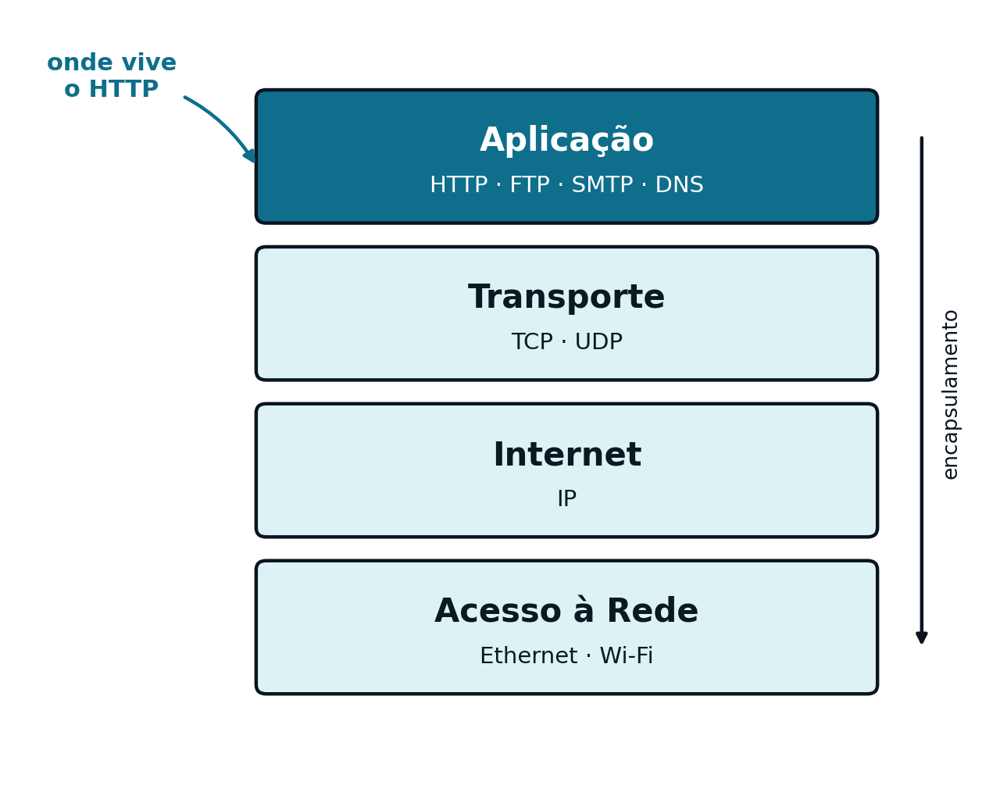
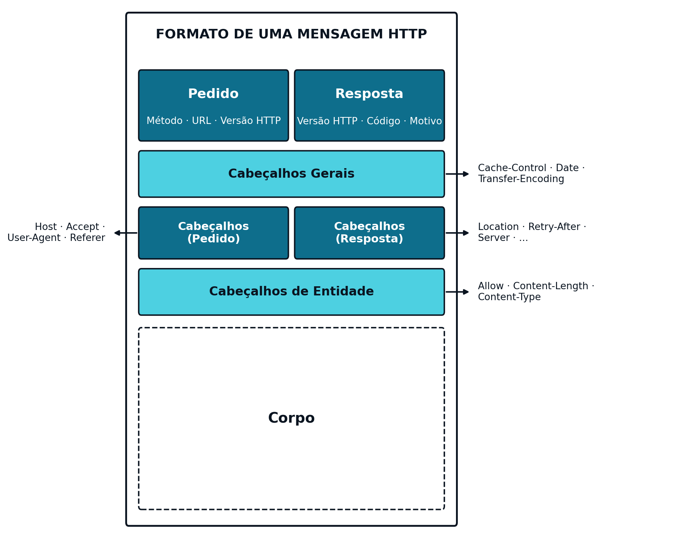

## O Middleware que Liga Frontend e Backend {#sec-03-middleware-intro}

O [Capítulo 1](cap01.qmd) identificou três componentes em qualquer aplicação Web: *Frontend*, *Middleware* e *Backend*. O [Capítulo 2](cap02.qmd) dedicou-se à primeira, um conjunto de páginas HTML com formulários, entre eles o de consulta de capital (`capital.html`) e o de autenticação (`login.html`). Esses formulários, por si só, não fazem nada: precisam de um protocolo que leve os dados que o utilizador preenche até um servidor, e que traga de volta uma resposta. Esse protocolo, o *Middleware* usado nas aplicações *web* é o HTTP (*HyperText Transfer Protocol*). Este capítulo detalha o seu funcionamento.

## O Modelo TCP/IP {#sec-03-modelo-tcpip}

Antes de entrar no detalhe do HTTP propriamente dito, vale a pena recordar onde é que este protocolo encaixa na pilha de comunicações. O modelo TCP/IP organiza essa pilha em quatro camadas, cada uma responsável por um aspeto diferente da comunicação em rede:

| Camada | Responsabilidade | Exemplos de protocolos |
|---|---|---|
| Aplicação | O formato dos dados trocados entre aplicações | HTTP, FTP, SMTP, DNS |
| Transporte | Entrega dos dados entre processos, fiável (TCP) ou não (UDP) | TCP, UDP |
| Internet | Encaminhamento dos dados entre redes, por endereço IP | IP |
| Acesso à Rede | Transmissão física dos dados no meio local | Ethernet, Wi-Fi |

{#fig-03-modelo-tcpip width="80%"}

O HTTP é, portanto, um protocolo da camada de Aplicação: não se preocupa em saber como é que os dados chegam ao destino, apenas define o formato do pedido e da resposta. Essa entrega fica a cargo do TCP, na camada de Transporte, que garante que os dados chegam completos, sem erros e pela ordem em que foram enviados — uma garantia de que o HTTP depende, sem nunca a implementar diretamente.

## O HTTP {#sec-03-o-http}

O [HTTP](https://developer.mozilla.org/en-US/docs/Web/HTTP) (*HyperText Transfer Protocol*) é um protocolo de texto, baseado no modelo pedido-resposta: o cliente envia um pedido, o servidor devolve uma resposta, e a ligação entre os dois não guarda memória de pedidos anteriores — cada pedido é tratado de forma independente, isto é, o HTTP não tem estado (é *stateless*). Esta secção detalha os três aspetos que definem um pedido e uma resposta: os métodos, o formato geral da mensagem e os códigos de estado.

### Métodos

Cada pedido do cliente ao servidor é feito no formato HTTP e indica, através de um método, a operação que se pretende realizar sobre um determinado recurso. O "recurso" no contexto das aplicações *web* pode ser uma página `html`, uma imagem, um `PDF`, ou qualquer outro suscetível de ser manipulado digitalmente:

| Método | Semântica típica |
|---|---|
| `GET` | Obter um recurso |
| `POST` | Criar um recurso |
| `PUT` | Atualizar ou substituir um recurso |
| `DELETE` | Remover um recurso |
| `HEAD` | Obter apenas os cabeçalhos, sem corpo |

Estes cinco métodos cobrem a generalidade das operações realizadas por uma aplicação Web; os dois primeiros (`GET` e `POST`) são, de longe, os mais usados em páginas *web*, enquanto `PUT` e `DELETE` ganham importância sobretudo nos serviços *web*.

### Formato de uma Mensagem {#sec-03-formato-mensagem}

Quando a aplicação no computador do cliente quer comunicar com o servidor, ativa a camada de Aplicação da pilha protocolar de comunicações, a qual formata o pedido de acordo com o protocolo HTTP. Tanto um pedido como a resposta que se lhe segue apresentam uma estrutura geral de uma mensagem semelhante:

1. Uma primeira linha, diferente consoante se trate de um pedido (método, *URL* e versão de HTTP) ou de uma resposta (versão de HTTP, código de estado e motivo)
2. Um conjunto de cabeçalhos (*headers*), que transportam metadados sobre a mensagem (por exemplo, o anfitrião de destino, o tipo de conteúdo ou o seu comprimento)
3. Um corpo (*body*), opcional, com os dados propriamente ditos

Um pedido `GET` não tem, tipicamente, corpo: todos os dados que transporta vão na própria *URL*, sob a forma de parâmetros. Um pedido `POST` transporta os dados no corpo da mensagem, fora da *URL*.

{#fig-03-http-formato-mensagem width="90%" .column-body-outset}

#### Exemplo: do Formulário de Consulta de Capital a um Pedido HTTP

Recorde-se o formulário de consulta de capital construído no [Capítulo 2](cap02.qmd) (`capital.html`):

```html
<form method="GET" action="/capital">
  <label for="countrycode">Código do país</label>
  <input type="text" id="countrycode" name="countrycode">
  <button type="submit">Consultar</button>
</form>
```
Este código `HTML`renderiza no *browser* como mostrado na figura @fig-03-form-capital:

{#fig-03-form-capital width="50%" .browser-shot}

Ao ser submetido (clicando no botáo *Consultar*) com o valor `PT` no `input`, o *browser* gera a seguinte mensagem `GET` de pedido HTTP:

::: {.httpmsg}
GET /capital?countrycode=PT HTTP/1.1\
Host: localhost:8080
:::

Note-se que, por se tratar de um método `GET`, o parâmetro `countrycode` é enviado como parte da *URL* (depois do `?`), e não existe corpo na mensagem. Se o mesmo formulário usasse `method="POST"`, o parâmetro seguiria antes no corpo do pedido, e a *URL* manter-se-ia limpa (`/capital`).

O servidor, ao processar este pedido, devolve uma resposta HTTP como a seguinte:

::: {.httpmsg}
HTTP/1.1 200 OK\
Content-Type: application/json

{\"country\": \"Portugal\", \"capital\": \"Lisboa\", \"ccode\": \"PT\"}
:::

#### Exemplo: do Formulário de Autenticação a um Pedido `POST` com Corpo

Recorde-se agora o formulário de autenticação, também do [Capítulo 2](cap02.qmd) (`login.html`), com os campos `user` e `pass`:

```html
<form method="POST" action="/login">
  <label for="user">Utilizador</label>
  <input type="text" id="user" name="user">
  <label for="pass">Palavra-passe</label>
  <input type="password" id="pass" name="pass">
  <button type="submit">Entrar</button>
</form>
```
Este código `HTML`renderiza no *browser* como mostrado na figura @fig-03-form-login:

{#fig-03-form-login width="90%" .browser-shot}

Ao ser submetido, este formulário gera o seguinte pedido HTTP:

::: {.httpmsg}
POST /login HTTP/1.1\
Host: localhost:8080\
Content-Type: application/x-www-form-urlencoded\
Content-Length: 21

user=javaee&pass=asw2026
:::

Ao contrário do exemplo anterior, os parâmetros já não vão na *URL*: seguem no corpo do pedido, depois de uma linha em branco que separa os cabeçalhos do corpo. É por isso que credenciais e outros dados sensíveis se enviam tipicamente por `POST`, nunca por `GET`: o corpo de um pedido não fica registado nos históricos de navegação nem nos ficheiros de registo (*logs*) do servidor, ao contrário do que acontece com os parâmetros de uma *URL*.

O servidor, ao validar as credenciais com sucesso, devolve uma resposta HTTP como a seguinte — neste caso, uma aplicação orientada à apresentação (ver [Capítulo 1](cap01.qmd)), que responde no corpo da resposta código HTML que vai renderizar no *browser*. Se a aplicação for orientada ao serviço no corpo da resposta viria JSON em vez de HTML:

::: {.httpmsg}
HTTP/1.1 200 OK\
Content-Type: text/html

&lt;h1&gt;Bem-vindo, javaee&lt;/h1&gt;\
&lt;p&gt;Sessão iniciada com sucesso.&lt;/p&gt;
:::

### Códigos de Estado {#sec-03-codigos-estado}

Toda a resposta HTTP inclui um código de estado numérico, que indica sucintamente o resultado do pedido. Os códigos agrupam-se em cinco categorias, consoante a centena:

| Intervalo | Categoria |
|---|---|
| `1xx` | Informativo |
| `2xx` | Sucesso |
| `3xx` | Redirecionamento |
| `4xx` | Erro do cliente |
| `5xx` | Erro do servidor |

Dentro destas categorias, alguns códigos surgem com particular frequência no desenvolvimento de serviços Web:

| Código | Significado |
|---|---|
| `200 OK` | O pedido foi processado com sucesso |
| `201 Created` | Um novo recurso foi criado com sucesso |
| `400 Bad Request` | O pedido está malformado ou falta um parâmetro obrigatório |
| `403 Forbidden` | O cliente não tem permissão para aceder ao recurso |
| `404 Not Found` | O recurso pedido não existe |
| `500 Internal Server Error` | Ocorreu um erro não tratado do lado do servidor |

Escolher o código de estado correto para cada situação é uma parte essencial do desenho de um serviço Web: o código transmite, por si só, informação que o cliente pode usar para decidir como reagir, sem precisar de interpretar o corpo da resposta.
