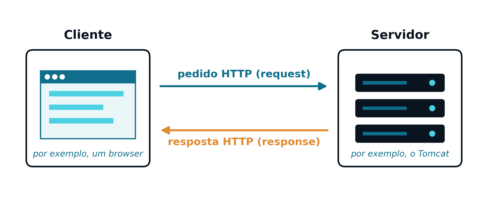
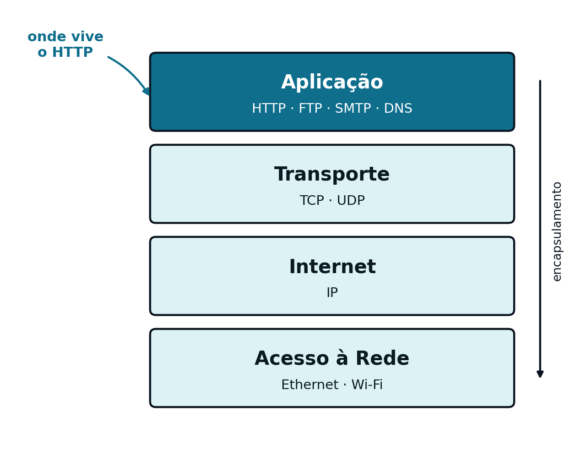
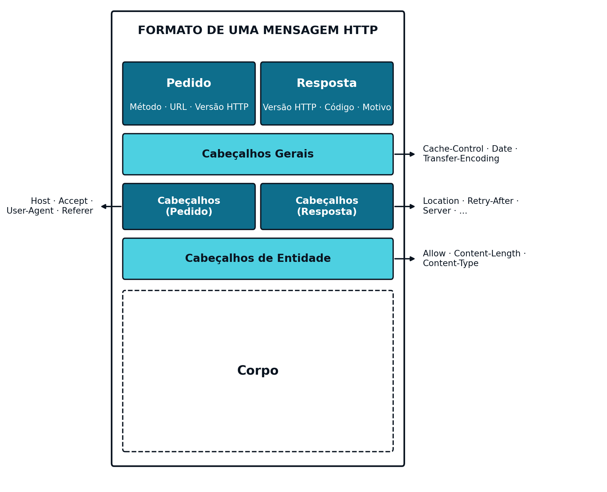

## O Middleware que Liga Frontend e Backend {#sec-03-middleware-intro}

O [Capítulo 1](cap01.qmd) identificou três componentes em qualquer aplicação Web: *Frontend*, *Middleware* e *Backend*. O [Capítulo 2](cap02.qmd) dedicou-se à primeira, um conjunto de páginas HTML com formulários, entre eles o de consulta de capital (`capital.html`) e o de autenticação (`login.html`). Esses formulários, por si só, não fazem nada: precisam de um protocolo que leve os dados que o utilizador preenche até um servidor, e que traga de volta uma resposta. Esse protocolo, o *Middleware* usado nas aplicações *web*, é o HTTP (*HyperText Transfer Protocol*).

O HTTP, no entanto, não trabalha sozinho. Para que um pedido saia do *browser* e chegue a um servidor, possivelmente do outro lado do mundo, o HTTP apoia-se em dois outros protocolos: o TCP, que entrega os dados à aplicação certa, e o IP, que os faz chegar à máquina certa. Este capítulo percorre esse caminho por ordem: parte do modelo cliente-servidor, desce às camadas de transporte e de rede para mostrar onde entram as portas e os endereços IP, e só depois detalha o funcionamento do HTTP.

## O Modelo Cliente-Servidor {#sec-03-cliente-servidor}

Toda a comunicação na *web* assenta no modelo cliente-servidor. Neste modelo há dois papéis bem distintos:

Servidor
: Um programa que está permanentemente à escuta, à espera de pedidos. Não toma a iniciativa de contactar ninguém: limita-se a responder a quem o contacta. Um mesmo servidor atende, em simultâneo, pedidos de muitos clientes diferentes. Nesta UC, o servidor é o Apache Tomcat.

Cliente
: Um programa que toma a iniciativa da comunicação: envia um pedido ao servidor e aguarda a resposta. Na *web*, o cliente é tipicamente um *browser* (Chrome, Firefox, Safari), mas pode ser qualquer programa capaz de enviar pedidos, como o `curl` na linha de comandos ou uma aplicação móvel.

{#fig-03-cliente-servidor width="70%"}

A interação é sempre a mesma: o cliente envia um pedido (*request*), o servidor processa-o e devolve uma resposta (*response*). Este par pedido-resposta é a unidade básica de toda a comunicação na *web*: carregar uma página, submeter um formulário ou obter uma imagem são, cada um, uma ou mais destas trocas.

Para que esta troca aconteça, o cliente precisa de responder a duas perguntas antes de enviar o que quer que seja:

1. **Em que máquina** está o servidor? A resposta é um **endereço IP**, tratado pela camada Internet.
2. **Que programa**, dentro dessa máquina, deve receber o pedido? Uma mesma máquina pode ter vários servidores a correr ao mesmo tempo (um servidor *web*, um servidor de base de dados, um servidor de correio). A resposta é um **número de porta**, tratado pela camada de Transporte.

Só depois de resolvidas estas duas questões entra o HTTP, que define **o que** se diz: o formato do pedido e da resposta. As secções seguintes explicam como é que as três peças se organizam.

## O Modelo TCP/IP {#sec-03-modelo-tcpip}

As comunicações em rede organizam-se em camadas. Cada camada presta um serviço à camada imediatamente acima e usa os serviços da camada imediatamente abaixo, sem precisar de saber como é que essas outras camadas funcionam por dentro. O modelo TCP/IP, usado na Internet, organiza a pilha de comunicações em quatro camadas:

| Camada | Responsabilidade | Endereçamento | Exemplos de protocolos |
|---|---|---|---|
| Aplicação | O formato dos dados trocados entre aplicações | *URL* | HTTP, FTP, SMTP, DNS |
| Transporte | Entrega dos dados ao processo certo, de forma fiável (TCP) ou não (UDP) | Porta | TCP, UDP |
| Internet | Encaminhamento dos dados entre redes, até à máquina certa | Endereço IP | IP |
| Acesso à Rede | Transmissão física dos dados no meio local | Endereço MAC | Ethernet, Wi-Fi |

{#fig-03-modelo-tcpip width="80%"}

### Encapsulamento

Quando o *browser* envia um pedido, os dados descem a pilha, da camada de Aplicação até à camada de Acesso à Rede. Em cada camada é acrescentado um cabeçalho próprio, com a informação de que essa camada precisa. A este processo chama-se encapsulamento (@fig-03-encapsulamento):

1. **Aplicação:** o *browser* constrói a mensagem HTTP (por exemplo, `GET /capital?countrycode=PT`). Estes dados, do ponto de vista das camadas inferiores, são apenas a carga útil (*payload*).
2. **Transporte:** o TCP acrescenta um cabeçalho cuja informação mais importante são as **portas de origem e de destino**. O resultado chama-se segmento TCP.
3. **Internet:** o IP acrescenta um cabeçalho cuja informação mais importante são os **endereços IP de origem e de destino**. O resultado chama-se pacote IP.
4. **Acesso à Rede:** a placa de rede acrescenta um cabeçalho com os endereços físicos (MAC) e, no fim, um código de verificação (FCS, *Frame Check Sequence*) que permite ao recetor detetar se a trama foi corrompida pelo caminho. O resultado chama-se trama (*frame*), que é depois convertida em sinais elétricos, óticos ou rádio.

{#fig-03-encapsulamento width="100%"}

Na receção, o processo inverte-se: cada camada verifica o cabeçalho que lhe diz respeito, retira-o e entrega o resto à camada de cima. A camada Internet confirma que o endereço IP de destino é o da máquina; a camada de Transporte verifica se há alguma aplicação registada na porta de destino e, em caso afirmativo, entrega-lhe os dados; a camada de Aplicação, por fim, recebe a mensagem HTTP tal como o *browser* a escreveu.

O HTTP é, portanto, um protocolo da camada de Aplicação: não se preocupa em saber como é que os dados chegam ao destino, apenas define o formato do pedido e da resposta. Essa entrega fica a cargo das camadas inferiores, das quais as duas mais relevantes para o desenvolvimento *web* são descritas a seguir.

## A Camada de Transporte: o TCP e as Portas {#sec-03-tcp-portas}

### As Portas

Um endereço IP identifica uma máquina, mas numa máquina correm muitos programas ao mesmo tempo. A porta é o número que identifica, dentro de uma máquina, o programa a que os dados se destinam. Quando um servidor arranca, regista-se numa porta e fica à escuta: todos os segmentos TCP que chegam com essa porta de destino são-lhe entregues.

As portas são números inteiros entre 0 e 65535, divididos em três gamas:

| Gama | Designação | Utilização |
|---|---|---|
| 0 a 1023 | Portas bem conhecidas (*well-known ports*) | Reservadas a serviços normalizados |
| 1024 a 49151 | Portas registadas (*registered ports*) | Atribuídas a aplicações específicas |
| 49152 a 65535 | Portas dinâmicas (*ephemeral ports*) | Atribuídas temporariamente aos clientes |

Algumas portas surgem com particular frequência:

| Porta | Serviço |
|---|---|
| 21 | FTP (transferência de ficheiros) |
| 22 | SSH (acesso remoto seguro) |
| 25 | SMTP (envio de correio eletrónico) |
| 53 | DNS (resolução de nomes) |
| 80 | HTTP |
| 443 | HTTPS (HTTP cifrado) |
| 3306 | MySQL / MariaDB |
| 8080 | HTTP alternativo (porta por omissão do Apache Tomcat) |

Quando a porta de destino é a bem conhecida do protocolo, não é preciso escrevê-la no *URL*: `http://www.utad.pt` e `http://www.utad.pt:80` são exatamente o mesmo endereço, porque o *browser* assume a porta 80 para `http` e a porta 443 para `https`. Já o Tomcat, que por omissão escuta na porta 8080, obriga a indicá-la explicitamente, e é por isso que todos os endereços usados nesta UC têm a forma `http://localhost:8080/...`.

O cliente também usa uma porta: a porta de origem. Essa não é escolhida pelo utilizador, é atribuída automaticamente pelo sistema operativo, a partir da gama dinâmica, no momento em que a ligação é aberta. É para essa porta que o servidor envia a resposta. Por isso um *browser* com vários separadores abertos no mesmo *site* consegue receber as respostas de cada um sem as misturar: cada ligação tem a sua porta de origem.

Ao par formado por um endereço IP e uma porta chama-se ***socket***. Uma ligação TCP fica completamente identificada por dois *sockets*: o do cliente (por exemplo, `192.168.1.20:51734`) e o do servidor (por exemplo, `203.0.113.10:80`).

### O TCP

O TCP (*Transmission Control Protocol*) é o protocolo de transporte usado pelo HTTP. A sua função é garantir que os dados chegam ao destino **completos, sem erros e pela ordem em que foram enviados**, apesar de a rede por baixo (o IP) não oferecer nenhuma destas garantias. Para isso, o TCP:

- **Estabelece uma ligação** antes de enviar dados: cliente e servidor trocam três mensagens de sincronização (o chamado *three-way handshake*) e só depois começa a transferência. É por isso que se diz que o TCP é orientado à ligação.
- **Numera os segmentos:** quando os dados são extensos, o TCP parte-os em vários segmentos e atribui a cada um um número de sequência. O recetor usa esses números para os reordenar e para detetar se falta algum.
- **Confirma a receção:** o recetor responde ao emissor com uma confirmação (*acknowledgement*) dos segmentos recebidos. Se um segmento não for confirmado dentro de um certo tempo, o emissor volta a enviá-lo.
- **Controla o fluxo:** o emissor ajusta a quantidade de dados que envia de uma só vez à capacidade de resposta do recetor e ao estado da rede, para não os sobrecarregar.

Para quem desenvolve aplicações *web*, a consequência prática é simples: quando o servidor lê um pedido HTTP, pode contar que esse pedido está inteiro e na ordem certa. Toda a complexidade de lidar com perdas e retransmissões fica escondida dentro do TCP.

A alternativa ao TCP na camada de Transporte é o UDP (*User Datagram Protocol*), que também usa portas mas dispensa a ligação, a numeração e as confirmações. É mais rápido mas não garante a entrega, e é usado em situações onde perder um pacote ocasional é preferível a esperar pela sua retransmissão, como chamadas de voz, vídeo em direto ou consultas DNS.

## A Camada Internet: o IP e os Endereços {#sec-03-ip-enderecos}

### Os Endereços IP

O IP (*Internet Protocol*) é responsável por fazer chegar cada pacote à máquina de destino, identificada pelo seu endereço IP. Na versão 4 do protocolo (IPv4), ainda a mais comum, um endereço IP é formado por quatro números entre 0 e 255, separados por pontos, como `203.0.113.10` ou `192.168.1.20`. Cada um destes números ocupa 8 bits, o que faz de um endereço IPv4 um número de 32 bits, com cerca de 4 300 milhões de combinações possíveis. Esse número revelou-se insuficiente para o crescimento da Internet, e deu origem ao IPv6, com endereços de 128 bits escritos em hexadecimal (por exemplo, `2001:db8::10`), que coexiste hoje com o IPv4.

::: {.callout-note}
## Endereços usados nos exemplos

Os endereços públicos que aparecem neste capítulo (`203.0.113.10`, `2001:db8::10`) e o nome `www.example.com` não pertencem a nenhuma máquina real: fazem parte de blocos reservados pelas normas da Internet exclusivamente para documentação e exemplos (RFC 5737 e RFC 3849 para os endereços, RFC 2606 para os nomes). Os endereços `192.168.1.20` e `127.0.0.1`, pelo contrário, são endereços reais, de uso privado e de *loopback*, respetivamente, e são explicados a seguir.
:::

Tal como acontece com as portas, há endereços reservados para fins específicos:

| Endereço ou gama | Utilização |
|---|---|
| `127.0.0.1` | *Loopback*: a própria máquina (nome `localhost`) |
| `10.0.0.0` a `10.255.255.255` | Endereços privados (redes internas) |
| `172.16.0.0` a `172.31.255.255` | Endereços privados (redes internas) |
| `192.168.0.0` a `192.168.255.255` | Endereços privados (redes domésticas e de escritório) |

O endereço `127.0.0.1` merece destaque nesta UC. Um pedido enviado para `localhost` nunca sai da máquina: desce a pilha de comunicações e volta a subi-la no mesmo computador, onde o Tomcat o recebe. É isso que permite desenvolver e testar uma aplicação *web* completa, cliente e servidor, num único portátil e sem ligação à Internet.

Os endereços privados, por sua vez, só são válidos dentro de uma rede local. É por isso que o portátil de um aluno pode ter o endereço `192.168.1.20` em casa e outro endereço diferente na rede da universidade. Para comunicar com o exterior, o *router* da rede local traduz esse endereço privado num endereço público, num processo chamado NAT (*Network Address Translation*).

### O Encaminhamento

O cliente e o servidor raramente estão na mesma rede. Um pacote IP enviado de casa de um aluno para o servidor da UTAD atravessa várias redes intermédias. Em cada uma delas, um equipamento chamado *router* lê o endereço IP de destino, consulta a sua tabela de encaminhamento (*routing table*) e decide para que rede vizinha deve reenviar o pacote. O pacote avança assim, salto a salto, até à rede onde está o servidor.

Este encaminhamento é feito pacote a pacote, e o IP não dá qualquer garantia de entrega: um pacote pode perder-se, chegar duplicado ou chegar fora de ordem em relação aos que foram enviados antes. É precisamente para compensar estas falhas que o TCP existe na camada acima.

### O DNS: de Nomes a Endereços

Os endereços IP são práticos para as máquinas mas difíceis de memorizar para as pessoas. É por isso que no *browser* se escreve `www.example.com` e não `203.0.113.10`. A rede, porém, só conhece endereços IP: antes de poder enviar o que quer que seja, o *browser* tem de converter o nome no endereço correspondente.

Essa conversão é feita pelo DNS (*Domain Name System*), um sistema hierárquico de servidores distribuídos pela Internet. O *browser* pergunta ao DNS qual o endereço IP associado a um nome, e o DNS responde com o endereço que o *browser* vai depois colocar no cabeçalho IP dos pacotes. O nome `localhost` é um caso especial: é resolvido pela própria máquina, diretamente para `127.0.0.1`, sem consultar nenhum servidor DNS.

::: {.callout-tip}
## Perguntar diretamente ao DNS

O comando `nslookup`, disponível em Windows, macOS e Linux, faz a mesma pergunta que o *browser* faz ao DNS e mostra a resposta. Num terminal:

```bash
nslookup www.utad.pt
```

A resposta indica o servidor DNS que foi consultado e, na linha `Address`, o endereço IP (ou endereços, IPv4 e IPv6) associado ao nome. Repetir o comando com outros nomes (por exemplo, `www.google.com`) mostra que um mesmo nome pode estar associado a vários endereços. Note-se que o `nslookup` consulta sempre um servidor DNS, ao contrário do *browser*, que resolve `localhost` localmente; por isso o resultado de `nslookup localhost` varia de sistema para sistema e não é um bom exemplo.
:::

## Do *URL* à Ligação {#sec-03-url-ligacao}

Com as três camadas apresentadas, é possível acompanhar tudo o que acontece quando o utilizador submete o formulário de consulta de capital e o *browser* tem de aceder ao endereço:

```
http://localhost:8080/capital?countrycode=PT
```

O *URL* contém, ele próprio, a informação de que cada camada precisa:

| Parte do *URL* | Valor | Camada que a usa |
|---|---|---|
| Protocolo | `http` | Aplicação: define o protocolo e a porta por omissão (80) |
| Anfitrião (*host*) | `localhost` | Internet: convertido no endereço IP `127.0.0.1` (normalmente pelo DNS; no caso de `localhost`, pela própria máquina) |
| Porta | `8080` | Transporte: identifica o Tomcat dentro da máquina |
| Caminho e parâmetros | `/capital?countrycode=PT` | Aplicação: identifica o recurso pedido ao servidor |

A partir daqui, a sequência é sempre a mesma:

1. O *browser* extrai o nome do anfitrião do *URL* e obtém o seu endereço IP (através do DNS ou, no caso de `localhost`, diretamente).
2. O *browser* abre uma ligação TCP para o *socket* do servidor, `127.0.0.1:8080`. O sistema operativo atribui ao cliente uma porta de origem da gama dinâmica.
3. O *browser* escreve a mensagem de pedido HTTP e entrega-a ao TCP, que a divide em segmentos, lhe acrescenta as portas e a passa ao IP, que lhe acrescenta os endereços.
4. Do lado do servidor, os pacotes sobem a pilha: o IP reconhece o seu endereço, o TCP reconstitui a mensagem e entrega-a ao programa registado na porta 8080, o Tomcat.
5. O Tomcat processa o pedido e escreve a resposta HTTP, que faz o percurso inverso até à porta de origem do *browser*.
6. O *browser* lê a resposta e apresenta-a ao utilizador.

Os passos 1, 2 e 4 são inteiramente tratados pelo sistema operativo e pela rede; os passos 3, 5 e 6, na parte que diz respeito ao conteúdo da mensagem, são definidos pelo HTTP. É esse conteúdo, o que o cliente pede e o que o servidor responde, que o resto deste capítulo detalha.

## O HTTP {#sec-03-o-http}

O [HTTP](https://developer.mozilla.org/en-US/docs/Web/HTTP) (*HyperText Transfer Protocol*) é um protocolo de texto, baseado no modelo pedido-resposta: o cliente envia um pedido, o servidor devolve uma resposta, e a ligação entre os dois não guarda memória de pedidos anteriores. Cada pedido é tratado de forma independente, isto é, o HTTP não tem estado (é *stateless*). Esta secção detalha os três aspetos que definem um pedido e uma resposta: os métodos, o formato geral da mensagem e os códigos de estado.

### Métodos

Cada pedido do cliente ao servidor é feito no formato HTTP e indica, através de um método, a operação que se pretende realizar sobre um determinado recurso. O "recurso" no contexto das aplicações *web* pode ser uma página `html`, uma imagem, um `PDF`, ou qualquer outro suscetível de ser manipulado digitalmente:

| Método | Semântica típica |
|---|---|
| `GET` | Obter um recurso |
| `POST` | Criar um recurso |
| `PUT` | Atualizar ou substituir um recurso |
| `DELETE` | Remover um recurso |
| `HEAD` | Obter apenas os cabeçalhos, sem corpo |

Estes cinco métodos cobrem a generalidade das operações realizadas por uma aplicação Web; os dois primeiros (`GET` e `POST`) são, de longe, os mais usados em páginas *web*, enquanto `PUT` e `DELETE` ganham importância sobretudo nos serviços *web*.

### Formato de uma Mensagem {#sec-03-formato-mensagem}

Quando a aplicação no computador do cliente quer comunicar com o servidor, ativa a camada de Aplicação da pilha protocolar de comunicações, a qual formata o pedido de acordo com o protocolo HTTP. Tanto um pedido como a resposta que se lhe segue apresentam uma estrutura geral de uma mensagem semelhante:

1. Uma primeira linha, diferente consoante se trate de um pedido (método, *URL* e versão de HTTP) ou de uma resposta (versão de HTTP, código de estado e motivo)
2. Um conjunto de cabeçalhos (*headers*), que transportam metadados sobre a mensagem (por exemplo, o anfitrião de destino, o tipo de conteúdo ou o seu comprimento)
3. Um corpo (*body*), opcional, com os dados propriamente ditos

Um pedido `GET` não tem, tipicamente, corpo: todos os dados que transporta vão na própria *URL*, sob a forma de parâmetros. Um pedido `POST` transporta os dados no corpo da mensagem, fora da *URL*.

{#fig-03-http-formato-mensagem width="90%" .column-body-outset}

#### Exemplo: do Formulário de Consulta de Capital a um Pedido HTTP

Recorde-se o formulário de consulta de capital construído no [Capítulo 2](cap02.qmd) (`capital.html`):

```html
<form method="GET" action="/capital">
  <label for="countrycode">Código do país</label>
  <input type="text" id="countrycode" name="countrycode">
  <button type="submit">Consultar</button>
</form>
```
Este código `HTML` é apresentado no *browser* como mostra a @fig-03-form-capital:

{#fig-03-form-capital width="50%" .browser-shot}

Ao ser submetido (clicando no botáo *Consultar*) com o valor `PT` no `input`, o *browser* gera a seguinte mensagem `GET` de pedido HTTP:

::: {.httpmsg}
GET /capital?countrycode=PT HTTP/1.1\
Host: localhost:8080
:::

Note-se que, por se tratar de um método `GET`, o parâmetro `countrycode` é enviado como parte da *URL* (depois do `?`), e não existe corpo na mensagem. Se o mesmo formulário usasse `method="POST"`, o parâmetro seguiria antes no corpo do pedido, e a *URL* manter-se-ia limpa (`/capital`).

O servidor, ao processar este pedido, devolve uma resposta HTTP como a seguinte:

::: {.httpmsg}
HTTP/1.1 200 OK\
Content-Type: application/json

{\"country\": \"Portugal\", \"capital\": \"Lisboa\", \"ccode\": \"PT\"}
:::

#### Exemplo: do Formulário de Autenticação a um Pedido `POST` com Corpo

Recorde-se agora o formulário de autenticação, também do [Capítulo 2](cap02.qmd) (`login.html`), com os campos `user` e `pass`:

```html
<form method="POST" action="/login">
  <label for="user">Utilizador</label>
  <input type="text" id="user" name="user">
  <label for="pass">Palavra-passe</label>
  <input type="password" id="pass" name="pass">
  <button type="submit">Entrar</button>
</form>
```
Este código `HTML` é apresentado no *browser* como mostra a @fig-03-form-login:

{#fig-03-form-login width="60%"}

Ao clicar em *Entrar*, o formulário preenchido desta forma gera o seguinte pedido HTTP, em que cada campo dá origem a um parâmetro com o nome indicado no seu atributo `name` (`user` e `pass`):

::: {.httpmsg}
POST /login HTTP/1.1\
Host: localhost:8080\
Content-Type: application/x-www-form-urlencoded\
Content-Length: 21

user=javaee&pass=asw2026
:::

Ao contrário do exemplo anterior, os parâmetros já não vão na *URL*: seguem no corpo do pedido, depois de uma linha em branco que separa os cabeçalhos do corpo. É por isso que credenciais e outros dados sensíveis se enviam tipicamente por `POST`, nunca por `GET`: o corpo de um pedido não fica registado nos históricos de navegação nem nos ficheiros de registo (*logs*) do servidor, ao contrário do que acontece com os parâmetros de uma *URL*.

O servidor, ao validar as credenciais com sucesso, devolve uma resposta HTTP. Neste caso trata-se de uma aplicação orientada à apresentação (ver [Capítulo 1](cap01.qmd)), por isso o corpo da resposta traz código HTML para o *browser* apresentar; numa aplicação orientada ao serviço, traria JSON. A resposta tem a seguinte forma:

::: {.httpmsg}
HTTP/1.1 200 OK\
Content-Type: text/html

&lt;h1&gt;Bem-vindo, javaee&lt;/h1&gt;\
&lt;p&gt;Sessão iniciada com sucesso.&lt;/p&gt;
:::

### Códigos de Estado {#sec-03-codigos-estado}

Toda a resposta HTTP inclui um código de estado numérico, que indica sucintamente o resultado do pedido. Os códigos agrupam-se em cinco categorias, consoante a centena:

| Intervalo | Categoria |
|---|---|
| `1xx` | Informativo |
| `2xx` | Sucesso |
| `3xx` | Redirecionamento |
| `4xx` | Erro do cliente |
| `5xx` | Erro do servidor |

Dentro destas categorias, alguns códigos surgem com particular frequência no desenvolvimento de serviços Web:

| Código | Significado |
|---|---|
| `200 OK` | O pedido foi processado com sucesso |
| `201 Created` | Um novo recurso foi criado com sucesso |
| `400 Bad Request` | O pedido está malformado ou falta um parâmetro obrigatório |
| `403 Forbidden` | O cliente não tem permissão para aceder ao recurso |
| `404 Not Found` | O recurso pedido não existe |
| `500 Internal Server Error` | Ocorreu um erro não tratado do lado do servidor |

Escolher o código de estado correto para cada situação é uma parte essencial do desenho de um serviço Web: o código transmite, por si só, informação que o cliente pode usar para decidir como reagir, sem precisar de interpretar o corpo da resposta.
