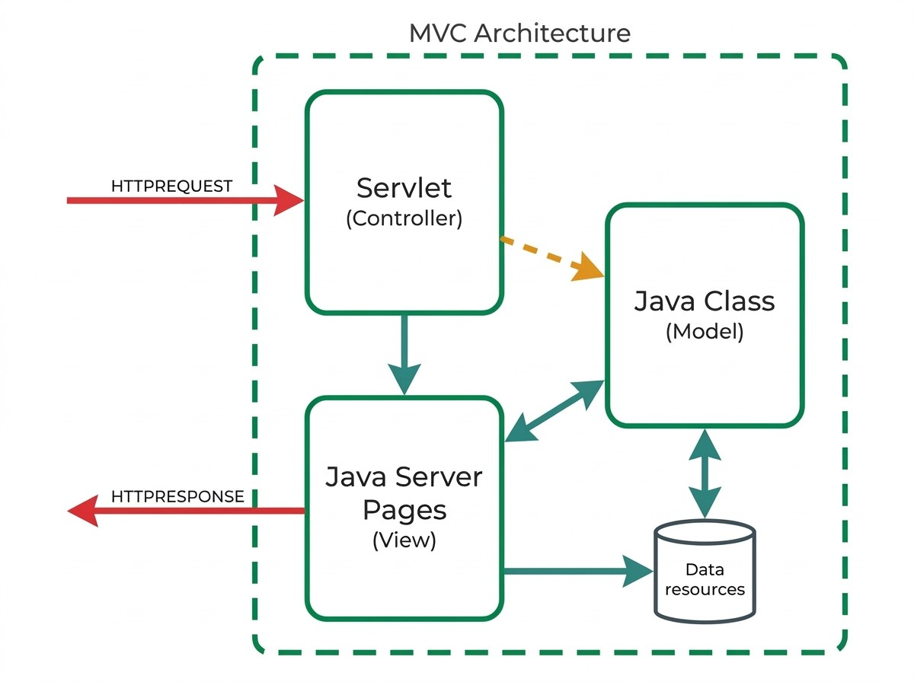

## A Plataforma Jakarta EE {#sec-04-jakarta-ee}

Com o Frontend construído ([Capítulo 2](cap02.qmd)) e o Middleware detalhado ([Capítulo 3](cap03.qmd)), falta a terceira peça identificada no [Capítulo 1](cap01.qmd): o Backend, que efetivamente recebe os pedidos HTTP e lhes responde. É o tema deste capítulo e dos seguintes.

A [*Jakarta EE*](https://jakarta.ee/) (anteriormente conhecida como *Java EE*, até ser renomeada em 2019) é uma plataforma que fornece um conjunto de serviços e *APIs* prontos a usar para lidar com os problemas comuns a qualquer aplicação Web (ver [Capítulo 1](cap01.qmd)), libertando quem desenvolve para se concentrar na lógica de negócio da aplicação.

A plataforma assenta na linguagem Java e na *Java Virtual Machine* (JVM), o que significa que qualquer componente escrito para *Jakarta EE* beneficia da portabilidade e da gestão automática de memória já conhecidas da linguagem.

## Arquitetura em Camadas {#sec-04-arquitetura-camadas}

A plataforma *Jakarta EE* organiza uma aplicação segundo um modelo distribuído em várias camadas (*tiers*), cada uma com uma função bem definida e instalada, tipicamente, em máquinas diferentes:

| Camada | Onde reside | Componentes típicos |
|---|---|---|
| *Client Tier* | Máquina do cliente | Páginas Web (browser), aplicações cliente |
| *Web Tier* | Servidor *Jakarta EE* | *Servlets*, *JavaServer Pages*, *Web Services* |
| *Business Tier* | Servidor *Jakarta EE* | *Enterprise Beans* (lógica de negócio) |
| *EIS Tier* (*Enterprise Information System*) | Servidor de base de dados | Bases de dados, sistemas de informação empresarial |

Esta separação por camadas permite que cada componente evolua de forma relativamente independente das restantes: alterar a base de dados não obriga a reescrever a lógica de negócio, e alterar a interface do cliente não obriga a alterar o servidor.

{#fig-04-arquitetura-jakarta-ee width="70%"}

::: {.callout-note}
## Tomcat não é um servidor Jakarta EE completo

O [*Apache Tomcat*](https://tomcat.apache.org/), usado ao longo desta UC, é um *Servlet Container*: implementa apenas a *Web Tier* (Servlets, JSP). Não inclui suporte para *Enterprise Beans* nem para a *Business Tier* propriamente dita, ao contrário de um servidor de aplicações *Jakarta EE* completo (por exemplo, *WildFly*, *WebSphere* ou *GlassFish*). Na prática, isto significa que a lógica de negócio que, na arquitetura formal, pertenceria à *Business Tier*, é implementada aqui diretamente em classes Java comuns (como os *DAO* usados nos LABs práticos), e não em *Enterprise Beans*.
:::

## Porquê Servlets? {#sec-04-porque-servlets}

Implementar, de raiz, um programa Java capaz de responder a pedidos HTTP obrigaria a resolver, sozinho, um conjunto de problemas comuns a qualquer servidor Web: interpretar a mensagem HTTP recebida, gerir várias ligações em simultâneo (cada uma num *thread* próprio), controlar o ciclo de vida das instâncias em memória, e empacotar tudo isto num formato que um servidor de aplicações saiba instalar e arrancar.

Uma [*Servlet*](https://jakarta.ee/specifications/servlet/) é uma classe Java que corre dentro de um *Servlet Container* (por exemplo, o *Apache Tomcat*) e que recebe, automaticamente, todo este trabalho já feito:

- Interpretação (*parsing*) do pedido HTTP
- Gestão de *threads*, uma por pedido
- Gestão do ciclo de vida da própria *Servlet*
- Um modelo de implantação (*deployment*) próprio, empacotado num ficheiro `.war` (*Web Application Archive*)

O *Servlet Container* corresponde, na arquitetura em camadas apresentada acima, à *Web Tier*: é aí que as *Servlets* residem, entre o cliente e a camada de negócio.

{#fig-04-servlet-http width="70%"}

## O Ciclo de Vida de uma Servlet {#sec-04-ciclo-vida}

Quando um pedido é encaminhado para uma *Servlet*, o contentor segue sempre a mesma sequência:

1. Se ainda não existir uma instância dessa *Servlet* em memória, o contentor carrega a classe, cria uma instância e chama o método `init()`
2. Para cada pedido recebido, o contentor invoca o método `service()`, que despacha para `doGet()`, `doPost()`, ou outro método consoante o verbo HTTP usado, passando-lhe os objetos `request` e `response`
3. Se o contentor precisar de remover a *Servlet* (por exemplo, ao desligar o servidor), invoca o método `destroy()`

Um pormenor importante decorre daqui: existe **uma única instância** de cada *Servlet* em memória, mesmo que existam N clientes a usar o mesmo serviço em simultâneo. Cada pedido é atendido por um *thread* diferente, mas todos esses *threads* partilham a mesma instância. Na prática, isto significa:

::: {.callout-warning}
## Cuidado com o estado partilhado

Nunca guardar dados de um pedido específico em atributos de instância da *Servlet*: como a instância é partilhada por todos os *threads*, um pedido pode ler ou sobrescrever dados de outro pedido em curso. Variáveis locais, declaradas dentro de `doGet()` ou `doPost()`, são seguras, porque cada *thread* tem a sua própria cópia.
:::

{#fig-04-servlet-ciclo-vida width="80%"}

## Da Mensagem HTTP ao Método Java {#sec-04-mapeamento-http-servlet}

Uma *Servlet* liga-se a uma *URL* através da anotação `@WebServlet`, que faz o mapeamento entre um caminho e a classe que o vai tratar:

```java
@WebServlet("/country")
public class CountryServlet extends HttpServlet {
    // ...
}
```

Um pedido a `http://localhost:8080/country` é assim encaminhado para a classe `CountryServlet`. Dentro dela, os elementos da mensagem HTTP (ver [Capítulo 3](cap03.qmd)) correspondem a métodos concretos dos objetos `request` e `response`:

| Elemento HTTP | Acesso em Java |
|---|---|
| Cabeçalhos do pedido | `request.getHeader(nome)` |
| Parâmetros (*query string* ou corpo) | `request.getParameter(nome)` |
| Corpo do pedido (JSON, dados em bruto) | `request.getInputStream()` |
| Escrever a resposta | `response.getWriter()` ou `response.getOutputStream()` |

```java
protected void doGet(HttpServletRequest request, HttpServletResponse response) {
    String countryCode = request.getParameter("countrycode");
    // ...
}
```

{#fig-04-http-request-server width="80%"}

## Content-Type e a Forma da Resposta {#sec-04-content-type}

Antes de escrever qualquer coisa na resposta, é essencial definir o seu `Content-Type`: é este cabeçalho que diz ao cliente como deve interpretar os bytes que se seguem, seja como página HTML, seja como dados [JSON](https://www.json.org/).

```java
response.setContentType("text/html");
PrintWriter out = response.getWriter();
out.println("<html><body>");
out.println("<h1>Hello João</h1>");
out.println("</body></html>");
```

```java
response.setContentType("application/json");
PrintWriter out = response.getWriter();
out.print("{\"name\":\"João\",\"role\":\"admin\"}");
```

Na ausência de uma biblioteca dedicada à geração de JSON, o mais direto é construir a *String* manualmente, tendo o cuidado de escapar as aspas internas com `\"`:

```java
String jsonResponse = "{\"country\": \"Portugal\", \"capital\": \"Lisboa\", \"ccode\": \"PT\"}";
out.print(jsonResponse);
out.flush();
```

Para definir o código de estado da resposta (ver [Capítulo 3](cap03.qmd)), a classe `HttpServletResponse` disponibiliza uma constante para cada código, evitando o uso de números "mágicos" diretamente no código:

| Código HTTP | Constante Java |
|---|---|
| `200` | `HttpServletResponse.SC_OK` |
| `201` | `HttpServletResponse.SC_CREATED` |
| `400` | `HttpServletResponse.SC_BAD_REQUEST` |
| `403` | `HttpServletResponse.SC_FORBIDDEN` |
| `404` | `HttpServletResponse.SC_NOT_FOUND` |
| `500` | `HttpServletResponse.SC_INTERNAL_SERVER_ERROR` |

```java
response.setStatus(HttpServletResponse.SC_NOT_FOUND);
```

## Uma Primeira Servlet: "World Capitals" {#sec-04-primeiro-servlet}

Aplicando o que foi apresentado, uma primeira *Servlet* pode servir como simples verificação de estado (*health check*) da API:

```java
@WebServlet("/status")
public class StatusServlet extends HttpServlet {
    protected void doGet(HttpServletRequest request, HttpServletResponse response)
            throws ServletException, IOException {
        response.setContentType("text/plain");
        PrintWriter out = response.getWriter();
        out.print("OK");
    }
}
```

E um segundo, já a devolver dados fixos em formato JSON, é o primeiro passo da aplicação "World Capitals" usada ao longo desta UC:

```java
@WebServlet("/countrycapital")
public class CountryCapitalServlet extends HttpServlet {
    protected void doGet(HttpServletRequest request, HttpServletResponse response)
            throws ServletException, IOException {
        response.setContentType("application/json");
        PrintWriter out = response.getWriter();

        String jsonResponse = "{\"country\": \"Portugal\", \"capital\": \"Lisboa\", \"ccode\": \"PT\"}";
        out.print(jsonResponse);
        out.flush();
    }
}
```

Esta *Servlet* devolve sempre o mesmo país, com os dados fixos diretamente no código. É deliberadamente uma simplificação: o [Apêndice B](apendiceB.qmd) (LAB1) retoma exatamente este ponto, substituindo os dados fixos por um objeto dedicado ao acesso a dados (*DAO*), preparando o terreno para, mais tarde, ligar a um servidor de base de dados real.

## Servlets e o Padrão MVC: Falta a View {#sec-04-servlets-mvc}

As *Servlets* apresentadas neste capítulo devolvem sempre JSON: são orientadas a serviço, e não têm, de facto, nenhuma View (ver [Capítulo 1](cap01.qmd)). Numa aplicação orientada à apresentação, porém, a mesma *Servlet* que funciona como Controller pode delegar a geração de HTML a uma página dedicada, mantendo a separação de responsabilidades do MVC:

{#fig-04-mvc-servlet-jsp width="70%"}

Essa página dedicada, a *JavaServer Page* (JSP), é abordada em detalhe no [Capítulo 5](cap05.qmd).
