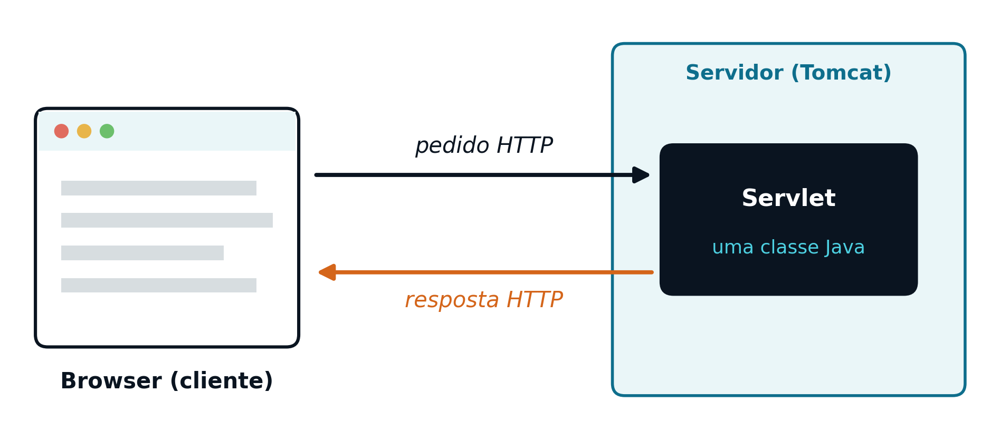

## A Plataforma Jakarta EE {#sec-04-jakarta-ee}

Com o Frontend construído ([Capítulo 2](cap02.qmd)) e o Middleware detalhado ([Capítulo 3](cap03.qmd)), falta a terceira peça identificada no [Capítulo 1](cap01.qmd): o Backend, que efetivamente recebe os pedidos HTTP e lhes responde. É o tema deste capítulo e dos seguintes.

A [*Jakarta EE*](https://jakarta.ee/) (anteriormente conhecida como *Java EE*, até ser renomeada em 2019; a versão atual é a *Jakarta EE* 11, de junho de 2025) é uma plataforma que fornece um conjunto de serviços e *APIs* prontos a usar para lidar com os problemas comuns a qualquer aplicação Web (ver [Capítulo 1](cap01.qmd)), libertando quem desenvolve para se concentrar na lógica de negócio da aplicação.

A plataforma assenta na linguagem Java e na *Java Virtual Machine* (JVM), o que significa que qualquer componente escrito para *Jakarta EE* beneficia da portabilidade e da gestão automática de memória já conhecidas da linguagem.

## Arquitetura em Camadas {#sec-04-arquitetura-camadas}

A plataforma *Jakarta EE* organiza uma aplicação segundo um modelo distribuído em várias camadas (*tiers*), cada uma com uma função bem definida e instalada, tipicamente, em máquinas diferentes:

| Camada | Onde reside | Componentes típicos |
|---|---|---|
| *Client Tier* | Máquina do cliente | Páginas Web (browser), aplicações cliente |
| *Web Tier* | Servidor *Jakarta EE* | *Servlets*, *JavaServer Pages*, *Web Services* |
| *Business Tier* | Servidor *Jakarta EE* | *Enterprise Beans* (lógica de negócio) |
| *EIS Tier* (*Enterprise Information System*) | Servidor de base de dados | Bases de dados, sistemas de informação empresarial |

Esta separação por camadas permite que cada componente evolua de forma relativamente independente das restantes: alterar a base de dados não obriga a reescrever a lógica de negócio, e alterar a interface do cliente não obriga a alterar o servidor.

{#fig-04-arquitetura-jakarta-ee width="85%"}

::: {.callout-note}
## Tomcat não é um servidor Jakarta EE completo

O [*Apache Tomcat*](https://tomcat.apache.org/), usado ao longo desta UC, é um *Servlet Container*: implementa apenas a *Web Tier* (Servlets, JSP). Não inclui suporte para *Enterprise Beans* nem para a *Business Tier* propriamente dita, ao contrário de um servidor de aplicações *Jakarta EE* completo (por exemplo, *WildFly*, *WebSphere* ou *GlassFish*). Na prática, isto significa que a lógica de negócio que, na arquitetura formal, pertenceria à *Business Tier*, é implementada aqui diretamente em classes Java comuns, e não em *Enterprise Beans*.
:::

## Porquê Servlets? {#sec-04-porque-servlets}

Implementar, de raiz, um programa Java capaz de responder a pedidos HTTP obrigaria a resolver, sozinho, um conjunto de problemas comuns a qualquer servidor Web: interpretar a mensagem HTTP recebida, gerir várias ligações em simultâneo (cada uma num *thread* próprio), controlar o ciclo de vida das instâncias em memória, e empacotar tudo isto num formato que um servidor de aplicações saiba instalar e arrancar.

Uma [*Servlet*](https://jakarta.ee/specifications/servlet/) é uma classe Java que corre dentro de um *Servlet Container* (por exemplo, o *Apache Tomcat*) e que recebe, automaticamente, todo este trabalho já feito:

- Interpretação (*parsing*) do pedido HTTP
- Gestão de *threads*, uma por pedido
- Gestão do ciclo de vida da própria *Servlet*
- Um modelo de implantação (*deployment*) próprio, empacotado num ficheiro `.war` (*Web Application Archive*)

O *Servlet Container* corresponde, na arquitetura em camadas apresentada acima, à *Web Tier*: é aí que as *Servlets* residem, entre o cliente e a camada de negócio.

{#fig-04-servlet-http width="80%"}

## O Ciclo de Vida de uma Servlet {#sec-04-ciclo-vida}

Quando um pedido é encaminhado para uma *Servlet*, o contentor segue sempre a mesma sequência (@fig-04-servlet-ciclo-vida):

1. Se ainda não existir uma instância dessa *Servlet* em memória, o contentor carrega a classe, cria uma instância e chama o método `init()`
2. Para cada pedido recebido, o contentor invoca o método `service()`, que despacha para `doGet()`, `doPost()`, ou outro método consoante o verbo HTTP usado, passando-lhe os objetos `request` e `response`
3. Se o contentor precisar de remover a *Servlet* (por exemplo, ao desligar o servidor), invoca o método `destroy()`

{#fig-04-servlet-ciclo-vida width="95%"}

## Uma Instância, Vários *Threads* {#sec-04-threads}

O ciclo de vida tem uma consequência importante: existe **uma única instância** de cada *Servlet* em memória, mesmo que existam N clientes a usar o mesmo serviço em simultâneo. Cada pedido é atendido por um *thread* diferente, mas todos esses *threads* partilham a mesma instância (@fig-04-servlet-threads).

{#fig-04-servlet-threads width="90%"}

::: {.callout-warning}
## Cuidado com o estado partilhado

Nunca guardar dados de um pedido específico em atributos de instância da *Servlet*: como a instância é partilhada por todos os *threads*, um pedido pode ler ou sobrescrever dados de outro pedido em curso. Variáveis locais, declaradas dentro de `doGet()` ou `doPost()`, são seguras, porque cada *thread* tem a sua própria cópia.

**ERRADO:** o nome fica num atributo, partilhado por todos os pedidos

```java
public class PessoaServlet extends HttpServlet {
    private String nome;                            // um só atributo para todos os threads

    protected void doGet(HttpServletRequest request, HttpServletResponse response) throws IOException {
        nome = request.getParameter("nome");        // 1 guarda "joao"; o 2, ao mesmo tempo, "maria"
        response.getWriter().print("Olá, " + nome); // o pedido 1 pode responder "Olá, maria"
    }
}
```

**CERTO:** o nome fica numa variável local, uma cópia por *thread*

```java
    protected void doGet(HttpServletRequest request, HttpServletResponse response) throws IOException {
        String nome = request.getParameter("nome"); // cada pedido tem a sua própria variável
        response.getWriter().print("Olá, " + nome); // cada pedido responde com o seu nome
    }
```
:::

## Da Mensagem HTTP ao Método Java {#sec-04-mapeamento-http-servlet}

Uma *Servlet* liga-se a uma *URL* através da anotação `@WebServlet`, que faz o mapeamento entre um caminho e a classe que o vai tratar:

```java
@WebServlet("/pessoa")
public class PessoaServlet extends HttpServlet {
    // ...
}
```

Um pedido de um cliente a `http://localhost:8080/pessoa` é assim encaminhado para a classe `PessoaServlet`. O contentor descobre esta anotação no momento da instalação da aplicação (*deployment*). A mesma ligação podia ser declarada no ficheiro `web.xml`, o que ainda se encontra em projetos mais antigos. O contentor constrói automaticamente, a partir dos elementos da mensagem HTTP recebida (ver [Capítulo 3](cap03.qmd)), o objeto request; o objeto response, complementar, é o que a Servlet usa para construir a mensagem de saída. Os elementos de cada mensagem correspondem a métodos concretos destes dois objetos (@fig-04-http-request-server):

{#fig-04-http-request-server width="100%"}

A tabela seguinte resume os métodos mais usados:

| Elemento HTTP | Acesso em Java | Quando se usa |
|---|---|---|
| Cabeçalhos do pedido | `request.getHeader(nome)` | Sempre, qualquer que seja o tipo de pedido |
| Parâmetros (*query string* de um `GET`, ou corpo `application/x-www-form-urlencoded` de um `POST`) | `request.getParameter(nome)` | Formulários HTML tradicionais (ver [Capítulo 2](cap02.qmd)), numa aplicação orientada à apresentação |
| Corpo do pedido em bruto (tipicamente JSON) | `request.getInputStream()` | *Web services* REST (ver [Capítulo 7](cap07.qmd)): o corpo não vem no formato `application/x-www-form-urlencoded`, por isso `getParameter()` não o interpreta, e é preciso ler e interpretar o JSON manualmente |
| Escrever a resposta | `response.getWriter()` ou `response.getOutputStream()` | Sempre, qualquer que seja o tipo de resposta |

Por exemplo, para um pedido `GET /pessoa?nome=joao&idade=22`:

```java
protected void doGet(HttpServletRequest request,
                     HttpServletResponse response) throws IOException {
    String nome = request.getParameter("nome");        // "joao"
    String idadeTexto = request.getParameter("idade"); // "22": chega sempre como String
    if (nome == null || idadeTexto == null) {          // parâmetro em falta: null
        response.getWriter().print("Faltam parâmetros");
        return;
    }
    int idade = Integer.parseInt(idadeTexto);          // 22: agora é um número
    response.getWriter().print(nome + " tem " + idade + " anos");
}
```

Dois cuidados decorrem deste exemplo. Primeiro, `getParameter()` devolve `null` quando o parâmetro não veio no pedido, e esse caso tem de ser tratado antes de usar o valor. Segundo, devolve sempre uma `String`, mesmo que o valor seja um número: a idade chega como `"22"` e tem de ser convertida com `Integer.parseInt(...)` antes de poder ser usada como número.

Os mesmos dados podem chegar através de um formulário HTML enviado por `POST`:

```html
<form action="pessoa" method="post">
    <input type="text"   name="nome">
    <input type="number" name="idade">
    <button type="submit">Enviar</button>
</form>
```

Neste caso, o browser envia os campos no corpo do pedido, no formato `nome=joao&idade=22`, e o atributo `name` de cada campo passa a ser o nome do parâmetro do lado da *Servlet*. O pedido é tratado por `doPost()`, mas a leitura dos parâmetros é exatamente a mesma:

```java
protected void doPost(HttpServletRequest request,
                      HttpServletResponse response) throws IOException {
    request.setCharacterEncoding("UTF-8");             // antes de ler os parâmetros
    String nome = request.getParameter("nome");        // o mesmo método do GET
    String idadeTexto = request.getParameter("idade");
    // ... o resto é igual ao doGet()
}
```

A chamada a `setCharacterEncoding("UTF-8")` tem de ser feita antes de ler qualquer parâmetro: sem ela, um nome com acentos, como *João*, pode chegar deformado à *Servlet*. O método `getCharacterEncoding()` devolve a codificação que o pedido está a usar.

O método `getParameter()` devolve um único valor. Quando o mesmo nome aparece várias vezes no pedido, como acontece com um grupo de *checkboxes* ou uma lista de escolha múltipla (`cor=azul&cor=verde`), `getParameter("cor")` não dá erro, mas devolve apenas o primeiro valor, `"azul"`. Para estes casos, o objeto `request` tem três métodos no plural:

- `getParameterValues(nome)` devolve um `String[]` com todos os valores desse nome (`{"azul", "verde"}`), ou `null` se o parâmetro não existir;
- `getParameterNames()` devolve os nomes de todos os parâmetros recebidos, o que é útil quando não se sabe à partida que campos vêm no pedido;
- `getParameterMap()` devolve um mapa (`Map<String, String[]>`) de cada nome para todos os seus valores, para percorrer os parâmetros de uma só vez.

```java
String[] cores = request.getParameterValues("cor");   // {"azul", "verde"}
if (cores != null) {
    for (String cor : cores) {
        // tratar cada cor escolhida
    }
}
```

## Content-Type e a Forma da Resposta {#sec-04-content-type}

Antes de escrever qualquer coisa na resposta, é essencial definir o seu `Content-Type`: é este cabeçalho que diz ao cliente como deve interpretar os bytes que se seguem, seja como página HTML, seja como dados [JSON](https://www.json.org/). A ordem importa: `setContentType()` tem de ser chamado **antes** de `getWriter()`, porque é nesse momento que o *writer* fixa a codificação dos caracteres, e é por isso que convém indicar `charset=UTF-8`, para que os acentos do português cheguem intactos ao cliente.

Com os mesmos dados dos exemplos anteriores (`nome` e `idade`), uma aplicação orientada à apresentação responde com HTML, que o browser mostra como uma página (*joao tem 22 anos*):

```java
response.setContentType("text/html; charset=UTF-8");
PrintWriter out = response.getWriter();
out.println("<html><body>");
out.println("<p>" + nome + " tem " + idade + " anos</p>");
out.println("</body></html>");
```

Uma aplicação orientada ao serviço responde com JSON, que um programa cliente recebe como dados (`{"nome": "joao", "idade": 22}`):

```java
response.setContentType("application/json; charset=UTF-8");
PrintWriter out = response.getWriter();
String json = """
    {
      "nome": "%s",
      "idade": %d
    }
    """.formatted(nome, idade);

out.print(json);
```

São os mesmos dados, para pessoas (HTML) ou para programas (JSON). Na ausência de uma biblioteca dedicada à geração de JSON, o mais direto é usar um bloco de texto (delimitado por `"""`, disponível desde o Java 15), que dispensa escapar as aspas, e o método `formatted()`, que substitui `%s` e `%d` pelos valores. Repare-se que a idade, sendo um número, entra no JSON sem aspas (`%d`). Esta construção serve para valores simples: um `nome` que contenha aspas deixaria o JSON inválido, pelo que, para dados arbitrários, deve usar-se uma biblioteca de JSON.

Para definir o código de estado da resposta (ver [Capítulo 3](cap03.qmd)), a classe `HttpServletResponse` disponibiliza uma constante para cada código, evitando o uso de números "mágicos" diretamente no código:

| Código HTTP | Constante Java |
|---|---|
| `200` | `HttpServletResponse.SC_OK` |
| `201` | `HttpServletResponse.SC_CREATED` |
| `400` | `HttpServletResponse.SC_BAD_REQUEST` |
| `401` | `HttpServletResponse.SC_UNAUTHORIZED` |
| `403` | `HttpServletResponse.SC_FORBIDDEN` |
| `404` | `HttpServletResponse.SC_NOT_FOUND` |
| `500` | `HttpServletResponse.SC_INTERNAL_SERVER_ERROR` |

Se a *Servlet* não definir nenhum código, o contentor responde `200 OK`. É por isso que o exemplo do `doGet()` apresentado atrás, quando faltam parâmetros, está incompleto: escreve "Faltam parâmetros", mas a resposta diz ao cliente que correu tudo bem. Um erro do cliente deve ter o código certo, `400 Bad Request`, para que um programa cliente o detete sem ter de interpretar o texto da resposta:

```java
if (nome == null || idadeTexto == null) {
    response.setStatus(HttpServletResponse.SC_BAD_REQUEST);  // 400
    response.getWriter().print("Faltam parâmetros");
    return;
}
```

::: {.callout-note}
## E se a idade não for um número?

Se o pedido trouxer `idade=abc`, `Integer.parseInt("abc")` lança uma exceção (`NumberFormatException`). Se a *Servlet* não a tratar, o contentor responde `500 Internal Server Error`: o erro foi do cliente, mas a resposta atribui-o ao servidor. O correto é apanhar a exceção e responder também com `400 Bad Request`:

```java
int idade;
try {
    idade = Integer.parseInt(idadeTexto);
} catch (NumberFormatException e) {
    response.setStatus(HttpServletResponse.SC_BAD_REQUEST);  // 400
    response.getWriter().print("A idade tem de ser um número");
    return;
}
```
:::

## Onde Ficam os Dados: o DAO {#sec-04-dao}

Nos exemplos deste capítulo, os dados vêm dos parâmetros do pedido ou estão fixos no código, uma simplificação deliberada nesta fase introdutória. Numa aplicação real, viriam de um objeto dedicado ao acesso a dados, um *Data Access Object* (DAO).

Um DAO não é um conceito formal da *Jakarta EE* nem exige nenhuma anotação ou interface especial: é apenas uma convenção comum, uma classe Java simples que concentra, num único sítio, a forma como os dados são obtidos. Para os dados de uma pessoa, poderia ter este aspeto:

```java
public class PessoaDAO {
    public Pessoa findByNome(String nome) { ... }  // lista em memória, BD, ficheiro...
    public List<Pessoa> findAll() { ... }
}
```

A *Servlet* limita-se a pedir os dados ao DAO, sem saber se, por trás desses métodos, está uma lista fixa em memória, uma base de dados ou outra fonte qualquer:

```java
// na Servlet: não sabe (nem precisa de saber) de onde vêm os dados
Pessoa p = dao.findByNome(nome);
```

A vantagem prática está aqui: se os dados passarem, por exemplo, de uma lista em memória para uma base de dados, **só o DAO muda**, e a *Servlet* fica exatamente igual. Na arquitetura MVC, apresentada a seguir, o DAO faz parte do Model.

## Servlets e o Padrão MVC: Falta a View {#sec-04-servlets-mvc}

A matéria deste curso centra-se mais nas aplicações de serviços web, pelo que as *Servlets* apresentadas devolvem sempre JSON: sendo orientadas a serviço, não têm, de facto, nenhuma View (ver [Capítulo 1](cap01.qmd)). Tal facto não significa que a aplicação não possa alimentar uma vista gráfica; neste caso usa-se o modelo `MVC` em que a *Servlet* faz de `Controller` e alimenta uma página *web* indiretamente através de JSON. Essa página *web* é naturalmente construída em `HTML`, mas tem de ter uma lógica de script que extraia do JSON os dados necessários para os colocar nos locais adequados da página `HTML` (ver [Capítulo 8](cap08.qmd)).

Se a aplicação for, de raiz, orientada à apresentação, porém, a mesma *Servlet* que funciona como Controller pode gerar diretamente o `HTML` da página (da `View`) ou pode ainda delegar essa responsabilidade a uma página dedicada, usando uma tecnologia conhecida como `JSP` (*JavaServer Pages*) mantendo a separação de responsabilidades do MVC, como se pode observar na @fig-04-mvc-servlet-jsp.

{#fig-04-mvc-servlet-jsp width="95%"}

Essa página dedicada, a *JavaServer Page* (JSP), é abordada em detalhe no [Capítulo 5](cap05.qmd).
