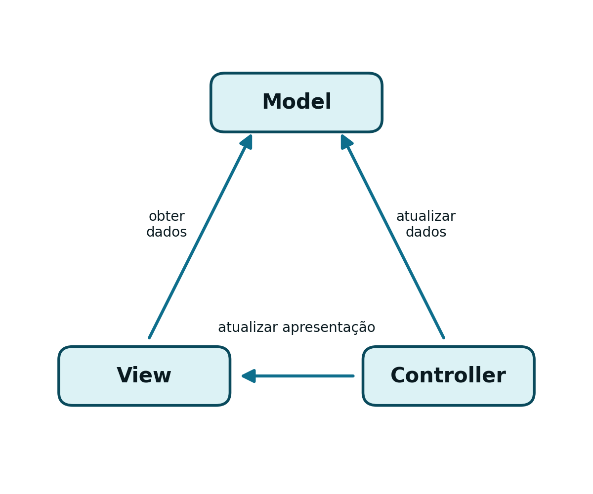
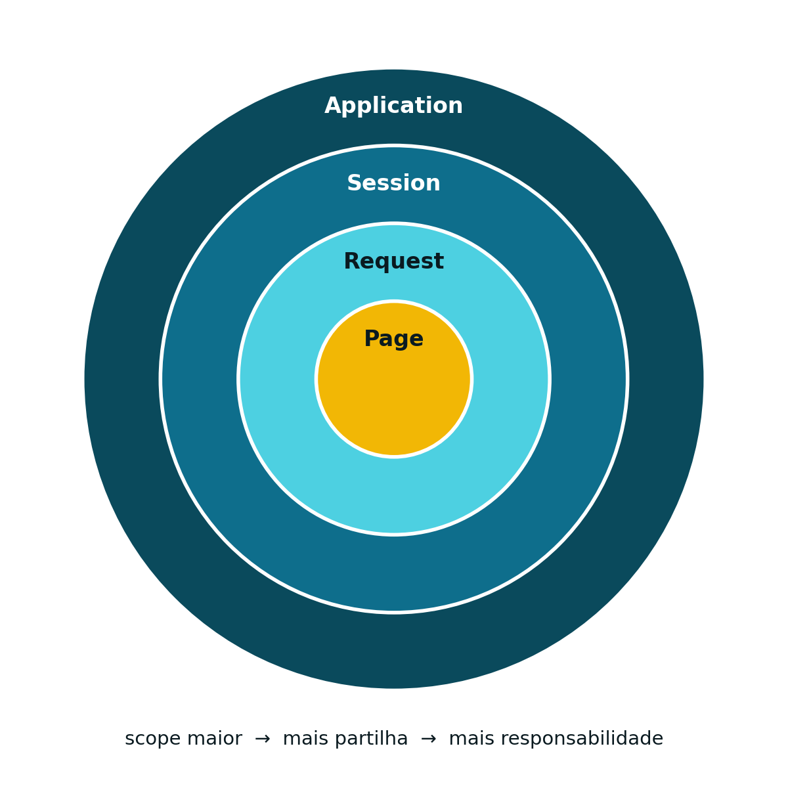

## HTTP é Sem Estado: o Problema {#sec-05-problema-estado}

O protocolo HTTP é *stateless* (ver [Capítulo 1](cap01.qmd)): cada pedido é independente, e o servidor não guarda, por si só, qualquer memória de pedidos anteriores. Não existe, ao nível do protocolo, nenhuma noção de "utilizador com sessão iniciada".

Isto levanta um problema prático imediato: se um utilizador se autentica num pedido, como é que um pedido seguinte, minutos depois, sabe que esse utilizador continua autenticado? A resposta passa por dois mecanismos complementares:

- ***Cookies***: um pequeno pedaço de informação guardado do lado do **cliente**, reenviado automaticamente pelo *browser* em cada pedido seguinte
- **`HttpSession`**: um objeto guardado do lado do **servidor**, associado a um identificador que o cliente devolve a cada pedido

## *Cookies* {#sec-05-cookies}

Um *cookie* é um par chave/valor guardado no *browser*. Quando o servidor envia um *cookie*, espera que o cliente o devolva em todos os pedidos HTTP seguintes, dirigidos ao mesmo domínio.

Distinguem-se dois tipos, consoante a sua persistência:

- **_Session cookies_**: mantidos pelo cliente apenas durante a sessão de navegação (`setMaxAge(-1)`)
- **_Permanent cookies_**: guardados de forma persistente, com um tempo de vida definido (`setMaxAge(60*60*24*30)` para 30 dias, por exemplo)

Criar um *cookie*:

```java
Cookie cookie = new Cookie("userName", "Pedro");
cookie.setMaxAge(-1); // session cookie
response.addCookie(cookie);
```

Ler um *cookie* recebido num pedido:

```java
Cookie[] cookies = request.getCookies();
String user = null;

for (Cookie c : cookies) {
    if (c.getName().equals("userName")) {
        user = c.getValue();
    }
}
```

## Sessões (`HttpSession`) {#sec-05-sessoes-http}

Guardar estado do lado do servidor exige um objeto próprio para o efeito: a `HttpSession`. Uma sessão obtém-se, ou cria-se, a partir do pedido:

```java
HttpSession session = request.getSession();          // cria se não existir
HttpSession session = request.getSession(true);      // equivalente, explícito
HttpSession session = request.getSession(false);     // NUNCA cria; devolve null se não houver
```

Uma vez obtida, a sessão guarda e devolve informação através de atributos, e pode ser terminada explicitamente:

```java
session.setAttribute("email", "foo@fool.com");
String email = (String) session.getAttribute("email");
session.invalidate();                    // termina a sessão
session.setMaxInactiveInterval(1800);     // tempo de inatividade, em segundos
```

Falta uma peça: se HTTP não tem memória de pedidos anteriores, como é que o servidor sabe que dois pedidos sucessivos pertencem à mesma sessão? A resposta são, de novo, os *cookies*: por convenção, o identificador de sessão viaja num *cookie* chamado `JSESSIONID`, criado automaticamente pelo *Servlet Container* na primeira chamada a `getSession()`.

::: {.httpmsg}
JSESSIONID=22562577CE80EF3B1DAAA0E48F2B6392
:::

Quando o cliente não aceita *cookies*, existe uma alternativa: codificar o identificador de sessão diretamente na *URL*.

::: {.httpmsg}
http://localhost:8080/CapitaisAPI/country;jsessionid=829F8836C240B51DD2F074259F242833
:::

É boa prática chamar sempre `response.encodeURL(url)` ao construir uma *URL* de destino: se os *cookies* estiverem ativos, o método devolve a *URL* inalterada; se não estiverem, acrescenta automaticamente o `jsessionid`.

## Autenticação Baseada em Sessão {#sec-05-autenticacao-sessao}

Juntando os dois mecanismos anteriores, obtém-se o padrão clássico de autenticação por sessão, usado no LAB2 desta UC (ver [Apêndice B](apendiceB.qmd)). Depois de validar as credenciais, a `LoginServlet` cria uma sessão e guarda nela o identificador do utilizador:

```java
@WebServlet("/login")
public class LoginServlet extends HttpServlet {
    protected void doPost(HttpServletRequest request, HttpServletResponse response)
            throws ServletException, IOException {
        String user = request.getParameter("user");
        String pass = request.getParameter("pass");

        if (dao.validateUserCredentials(user, pass)) {
            HttpSession session = request.getSession(true);
            session.setAttribute("UserName", user);

            response.setContentType("application/json");
            response.getWriter().print("{\"message\":\"OK\",\"user\":\"" + user + "\"}");
        } else {
            response.setStatus(HttpServletResponse.SC_FORBIDDEN);
            response.getWriter().print("{\"message\":\"FORBIDDEN\",\"error\":\"Invalid login or password\"}");
        }
    }
}
```

Qualquer *endpoint* protegido verifica, no início do seu próprio `doGet()` ou `doPost()`, se existe uma sessão válida com esse atributo:

```java
HttpSession session = request.getSession(false);
if (session == null || session.getAttribute("UserName") == null) {
    response.setStatus(HttpServletResponse.SC_FORBIDDEN);
    response.getWriter().print("{\"error\":\"Authentication required\"}");
    return;
}
// pedido autenticado: continuar o processamento normal
```

O logout resume-se a terminar a sessão:

```java
session.invalidate();
```

## O Padrão MVC com *Servlet* e JSP {#sec-05-mvc-jsp}

O [Capítulo 1](cap01.qmd) apresentou o padrão MVC a nível conceptual, e o [Capítulo 4](cap04.qmd) mostrou como uma *Servlet* funciona como Controller. Falta a peça final: a View.

{#fig-05-mvc-geral width="55%"}

Numa aplicação orientada à apresentação, a *Servlet* recebe o pedido e decide **o quê** mostrar, mas delega a **geração do HTML** propriamente dita a uma [*JavaServer Page*](https://jakarta.ee/specifications/pages/) (JSP). O Model, por sua vez, é uma classe Java comum (por exemplo, um *DAO*), independente de ambos.

A *Servlet* liga-se à JSP através de um `RequestDispatcher`: coloca os dados a mostrar num atributo do pedido, e encaminha (*forward*) o próprio pedido para a página:

```java
request.setAttribute("user", user);
request.getRequestDispatcher("/home.jsp").forward(request, response);
```

Uma JSP é um documento de texto que mistura dois tipos de conteúdo: HTML estático e elementos de *script* dinâmico. Na primeira vez que é pedida, o *Servlet Container* converte-a automaticamente numa classe *Servlet*, que passa a comportar-se, dali em diante, exatamente como qualquer outra *Servlet*.

## Um Exemplo Simples de JSP {#sec-05-exemplo-jsp}

```jsp
<%@ page language="java" contentType="text/html; charset=UTF-8" pageEncoding="UTF-8"%>

<% String name = (String) request.getAttribute("userName"); %>

<!DOCTYPE html>
<html>
<head>
  <meta http-equiv="Content-Type" content="text/html; charset=UTF-8">
  <title>Uma Página JSP</title>
</head>
<body>
  <h1>Olá, <%= name %>!</h1>
</body>
</html>
```

O bloco `<% ... %>` (*scriptlet*) contém código Java arbitrário; o bloco `<%= ... %>` (expressão) insere o valor de uma expressão Java diretamente no HTML gerado. É exatamente este atributo `userName`, colocado no pedido pela *Servlet* através de `request.setAttribute(...)`, que a JSP aqui recupera.

## Ciclo de Vida e Objetos Implícitos {#sec-05-ciclo-vida-jsp}

O ciclo de vida de uma JSP segue o mesmo modelo da *Servlet* em que é convertida (ver [Capítulo 4](cap04.qmd)), com dois pormenores próprios:

- O contentor recompila a JSP automaticamente sempre que o ficheiro `.jsp` é alterado
- Em vez de `init()` e `destroy()`, a JSP oferece os métodos `jspInit()` e `jspDestroy()`

Outra diferença prática: dentro de uma JSP, um conjunto de objetos está disponível automaticamente, sem qualquer declaração prévia, chamados objetos implícitos:

| Objeto implícito | Tipo |
|---|---|
| `out` | `JspWriter` |
| `request` | `HttpServletRequest` |
| `response` | `HttpServletResponse` |
| `session` | `HttpSession` |
| `page` | `Object` |

Por causa do objeto implícito `out`, uma JSP nunca precisa de obter explicitamente um `PrintWriter`: usa-se `out` diretamente.

## *Scopes*: Partilhar Informação Dentro do Servidor {#sec-05-scopes}

Tal como as *Servlets* podem partilhar informação com outros módulos através de atributos (ver [Capítulo 4](cap04.qmd)), esses atributos existem sempre dentro de um determinado âmbito, ou *scope*. Existem quatro classes de *scope*:

- ***Web context*** (ou *application context*): um único por aplicação, partilhado por todos os módulos e todos os utilizadores
- ***Session***: um por utilizador, mantido entre vários pedidos desse utilizador
- ***Request***: um por pedido, perdido assim que a resposta é enviada
- ***Page***: exclusivo de JSP, não é usado nesta UC

Todos os *scopes* seguem a mesma interface: métodos `setAttribute`/`getAttribute`, e `getAttributeNames()` para listar tudo o que lá está guardado.

**Web context**, partilhado por toda a aplicação:

```java
ServletContext context = request.getServletContext();
context.setAttribute("dbHost", "localhost");
String dbHost = (String) context.getAttribute("dbHost");
```

**Session**, já apresentado, partilhado apenas pelo mesmo utilizador:

```java
HttpSession session = request.getSession();
session.setAttribute("email", "foo@fool.com");
String email = (String) session.getAttribute("email");
```

**Request**, o mais restrito de todos, partilhado apenas entre módulos que processam o mesmo pedido (por exemplo, entre uma *Servlet* e a JSP para a qual reencaminha):

```java
request.setAttribute("email", "foo@fool.com");
String email = (String) request.getAttribute("email");
```

Os quatro *scopes* formam uma hierarquia de inclusão, do mais lato ao mais restrito: *Application* contém *Session*, que contém *Request*, que contém *Page*. Quanto maior o *scope*, mais partilhada fica a informação, e maior a responsabilidade de a gerir corretamente (por exemplo, de a remover quando deixa de ser necessária).

{#fig-05-scopes-comparacao width="60%"}

::: {.callout-note}
## *Scopes* não se instanciam

Os objetos de *scope* (`ServletContext`, `HttpSession`, `ServletRequest`) são fornecidos automaticamente pelo contentor. Nunca se cria uma instância nova com `new`: se um deles ainda não existe, os métodos apropriados (`getServletContext()`, `getSession()`) criam-no ou devolvem o existente.
:::
