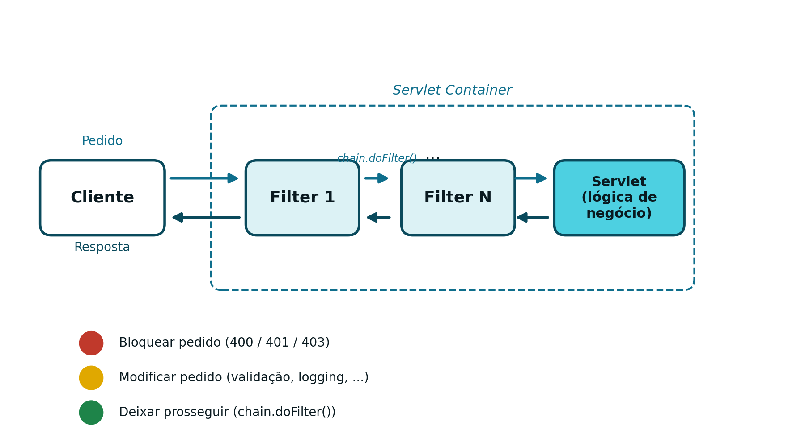
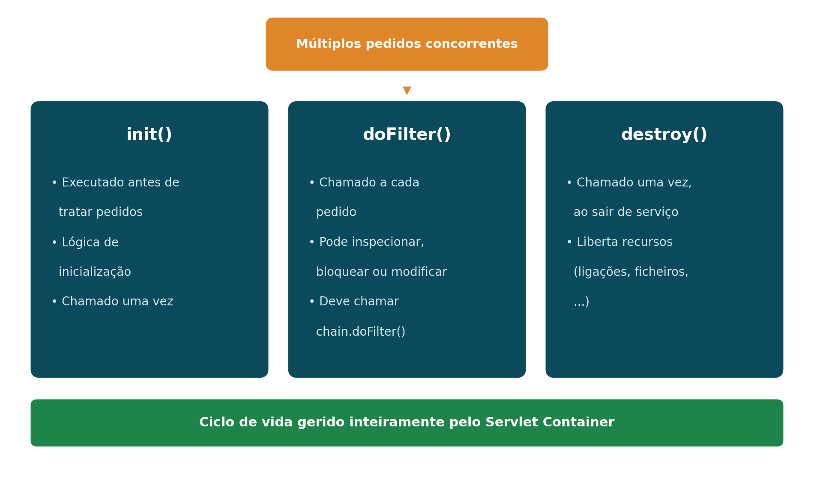
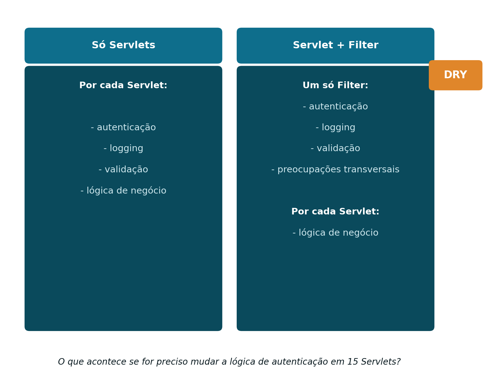

## O Problema: Segurança Repetida em Cada *Servlet* {#sec-05-problema}

Com o que foi apresentado até aqui (ver [Capítulo 4](cap04.qmd)), a autenticação está resolvida: a `LoginServlet` valida as credenciais e grava o utilizador na sessão, e cada *endpoint* protegido verifica essa sessão no início do seu `doGet()` ou `doPost()`. Isto funciona, mas tem um custo escondido: a lógica de autenticação vive, duplicada, dentro de **cada** *Servlet* protegida.

Esta duplicação traz consigo vários problemas:

- A mesma verificação de sessão está repetida em todos os *endpoints* protegidos
- Existe risco real de inconsistência entre essas cópias
- É fácil esquecer a proteção ao criar um novo *endpoint*

Dito de outra forma, esta duplicação viola o princípio *DRY* (*Don't Repeat Yourself*): uma responsabilidade deveria viver num único sítio, e lógica repetida aumenta o custo de manutenção sempre que essa lógica precisa de mudar. Mais concretamente, este desenho viola o **Princípio da Responsabilidade Única**: cada *Servlet* passa a ter duas responsabilidades distintas, a lógica de negócio que lhe é própria, e a lógica de segurança que lhe é imposta. Isto torna as políticas de segurança difíceis de fazer evoluir, e o desenho pouco escalável, quer em número de *endpoints*, quer em complexidade das regras de acesso.

## Autenticação vs. Autorização {#sec-05-autenticacao-autorizacao}

Antes de resolver o problema, vale a pena precisar dois conceitos frequentemente confundidos:

**Autenticação**
: Responde a "quem é o utilizador?". É a verificação de identidade, tipicamente feita no momento do *login*.

```java
if (username.equals("admin") && password.equals("1234")) {
    HttpSession session = request.getSession(true);
    session.setAttribute("UserName", username);
}
```

**Autorização**
: Responde a "o que é que este utilizador tem permissão para aceder?". É a verificação de permissões, feita depois de a identidade já estar confirmada.

```java
if (session.getAttribute("UserRole").equals("ADMIN")) {
    // acesso permitido
}
```

A autenticação acontece sempre primeiro: não faz sentido verificar permissões de alguém cuja identidade ainda não foi confirmada. Esta distinção reflete-se diretamente nos códigos de estado HTTP usados na resposta (ver [Capítulo 1](cap01.qmd)):

- `401 Unauthorized`: o pedido não está autenticado
- `403 Forbidden`: o pedido está autenticado, mas não tem permissão para o recurso pedido

## O que é um Filtro {#sec-05-o-que-e-um-filter}

A pergunta que fica por responder é onde deve viver a lógica de segurança: dentro de cada *Servlet*? Duplicada por todos os *endpoints*? Ou centralizada num único componente? Segurança é, por natureza, uma preocupação transversal (*cross-cutting concern*): atravessa toda a aplicação, em vez de pertencer a um único módulo. É exatamente para isto que existe o Filtro.

Um Filtro é um componente do lado do servidor que intercepta pedidos HTTP:

- É executado **antes** da *Servlet* de destino
- Pode também ser executado **depois** da *Servlet* (sobre a resposta)
- Pode bloquear, redirecionar ou modificar o pedido ou a resposta

Além da autenticação e da autorização, os Filtros são o mecanismo natural para outras preocupações transversais: registo de atividade (*logging*), *CORS* (*Cross-Origin Resource Sharing*), ou validação de entrada. Um Filtro separa estas preocupações da lógica de negócio, que fica exclusivamente na *Servlet*.

## Onde um Filtro se Situa no Pedido {#sec-05-onde-situa}

Um ou mais Filtros podem ser encadeados entre o cliente e a *Servlet* que trata efetivamente o pedido:

```
Cliente → Filtro 1 → ... → Filtro N → Servlet (lógica de negócio) → Resposta
```

{#fig-05-filter-chain width="80%"}

Cada Filtro na cadeia tem, essencialmente, três comportamentos possíveis:

- **Bloquear o pedido**: por exemplo, `400` (dados inválidos), `401` (identidade inválida) ou `403` (autenticado mas sem permissão)
- **Modificar o pedido**: normalização e validação de dados, registo de atividade, entre outros
- **Deixar prosseguir**: chamando `chain.doFilter(request, response)`, passando o controlo ao próximo elemento da cadeia

## Ciclo de Vida de um Filtro {#sec-05-ciclo-vida-filter}

O ciclo de vida de um Filtro segue o mesmo modelo já apresentado para as *Servlets* (ver [Capítulo 3](cap03.qmd)):

- `init()`: executado uma única vez, quando o contentor coloca o Filtro em serviço
- `doFilter()`: executado a cada pedido; pode inspecionar, bloquear ou modificar o pedido e a resposta, e deve chamar `chain.doFilter()` para continuar a cadeia
- `destroy()`: executado uma única vez, quando o Filtro é retirado de serviço, para libertar recursos

Tal como uma *Servlet*, existe **uma única instância** de cada Filtro, partilhada por múltiplos pedidos concorrentes: aplica-se aqui exatamente o mesmo cuidado já referido no Capítulo 3, evitar estado mutável partilhado, e preferir variáveis locais dentro de `doFilter()`.

{#fig-05-filter-lifecycle width="85%"}

## *Servlet* e Filtro: Separação de Responsabilidades {#sec-05-separacao-responsabilidades}

Centralizar a segurança num Filtro reorganiza as responsabilidades de toda a aplicação:

{#fig-05-servlet-vs-filter width="75%"}

Esta reorganização traz vantagens concretas:

- A lógica de autenticação é escrita **uma única vez** (princípio *DRY*)
- A política de segurança é aplicada de forma consistente a todos os *endpoints*
- Deixa de haver risco de "esquecer" a proteção numa *Servlet* nova
- Fica clara a separação entre preocupações transversais (Filtro) e lógica de negócio (*Servlet*)

## Declarar e Implementar um Filtro {#sec-05-declarar-filter}

Um Filtro declara-se com a anotação `@WebFilter`, indicando o padrão de *URLs* a que se aplica:

```java
@WebFilter("/*")
public class AuthenticationFilter implements Filter {
    // ...
}
```

O padrão `"/*"` intercepta todos os pedidos, sem exceção. A classe tem de implementar `jakarta.servlet.Filter`, e o contentor descobre-a automaticamente no momento da implantação (*deployment*). Tal como as *Servlets*, um Filtro também pode ser declarado de forma equivalente, embora considerada préterita, no ficheiro `web.xml`.

Um `doFilter()` típico, que protege todos os pedidos exigindo uma sessão válida, tem esta forma:

```java
public void doFilter(ServletRequest request,
                      ServletResponse response,
                      FilterChain chain)
        throws IOException, ServletException {

    HttpServletRequest req = (HttpServletRequest) request;
    HttpServletResponse res = (HttpServletResponse) response;

    HttpSession session = req.getSession(false);

    if (session == null || session.getAttribute("UserName") == null) {
        res.sendError(HttpServletResponse.SC_UNAUTHORIZED); // 401
        return;
    }

    chain.doFilter(request, response);
}
```

Na prática, nem todos os pedidos devem ser protegidos: o próprio `/login`, e recursos estáticos como `/css`, `/js` ou `/images`, precisam de ficar acessíveis sem autenticação, sob pena de o utilizador nunca conseguir sequer chegar ao formulário de *login*.

```java
String path = req.getRequestURI();

boolean isLogin = path.endsWith("/login");
boolean isStatic = path.startsWith(req.getContextPath() + "/css")
                 || path.startsWith(req.getContextPath() + "/js")
                 || path.startsWith(req.getContextPath() + "/images");

if (isLogin || isStatic) {
    chain.doFilter(request, response);
    return;
}
```

## Redirecionamento vs. `401`: uma Diferença Arquitetural {#sec-05-redirect-vs-401}

A forma correta de reagir a uma falha de autenticação depende do tipo de aplicação:

- Numa aplicação Web tradicional, orientada à apresentação (ver [Capítulo 1](cap01.qmd)), a resposta natural é um **redirecionamento** para a página de *login* (código `302`)
- Numa API REST, cujo contrato é JSON (ver [Capítulos 6](cap06.qmd) e [7](cap07.qmd)), a resposta correta é devolver **`401`**, sem qualquer redirecionamento

A diferença resume-se a uma frase: numa aplicação Web tradicional, uma falha de autenticação muda a página mostrada; numa API REST, muda apenas o código de estado devolvido. É o cliente, não o servidor, quem decide o que fazer a seguir com esse `401`.

## Preparação para uma Segurança Sem Estado {#sec-05-preparacao-sem-estado}

O modelo apresentado neste capítulo assenta inteiramente em sessão: o servidor guarda o estado do utilizador autenticado (`HttpSession`), e o Filtro verifica essa sessão em cada pedido. Este modelo tem uma limitação: exige que o servidor mantenha memória de cada utilizador, o que se torna problemático assim que existe mais do que uma instância do servidor (ver [Capítulo 7](cap07.qmd)).

A alternativa é a autenticação baseada em *token*: em vez de o servidor guardar sessão nenhuma, o próprio pedido transporta, em cada chamada, toda a informação necessária para se autenticar. Esta mudança, de um modelo com estado (*stateful*) para um modelo sem estado (*stateless*), é o tema dos capítulos seguintes.
