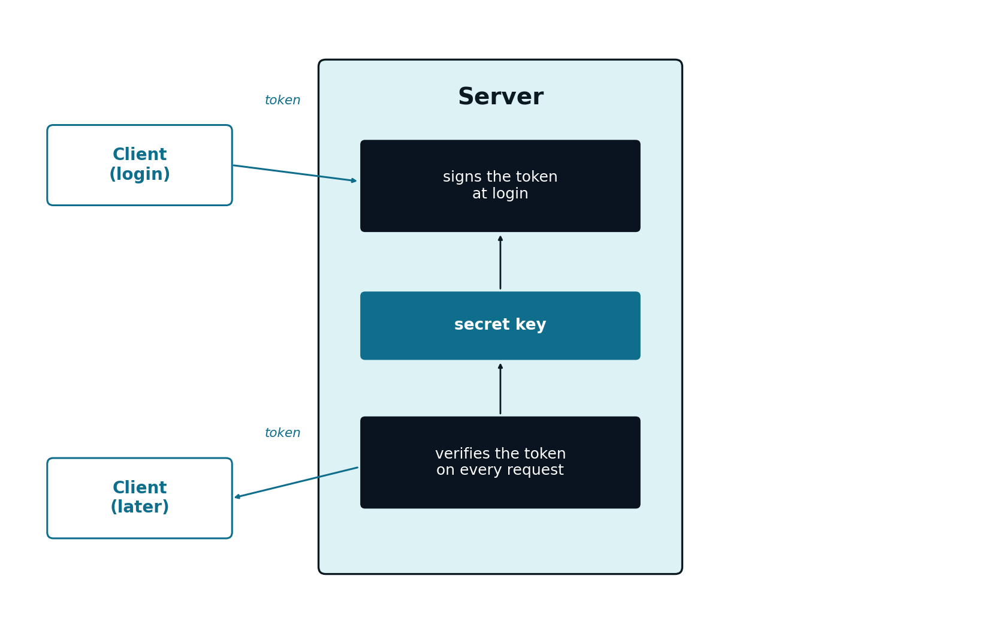

## Introduction {#sec-apB-intro-en}

[Chapter 8](cap08.qmd) showed how a JWT (see @sec-08-jwt-en) is signed and verified, without ever going into detail on **which algorithm** is used, or **what security guarantees** that signature actually offers. This appendix looks specifically at that question: token signing.

## HMAC: a Shared Secret Key {#sec-apB-hmac-en}

The algorithm used in [Chapter 8](cap08.qmd), `HS256`, is the combination of **HMAC** (*Hash-based Message Authentication Code*) with the `SHA-256` cryptographic hash function. It is a **symmetric** algorithm: the same secret key is used both to sign and to verify a *token*.

That key is never generated on the client, nor does it ever travel to it: it is created and stored exclusively on the server (typically once, during the application's initial setup), and never leaves it. What the client receives, and later resends, is always the already-signed *token* — the result of using the key — never the key itself.

{#fig-apB-hmac-en width="65%"}

This works well in exactly the situation presented throughout this course: **a single server** (or several instances of that same server, all with access to the same secret key, see @sec-08-horizontal-scalability-en) is, at the same time, the one that issues *tokens* and the one that validates them. The key never leaves that trust boundary.

The drawback of HMAC appears when that boundary stops making sense: if an external system — one that should not have the authority to **issue** valid *tokens* — needed to **validate** them, it would have to receive the same secret key used to sign them. At that point, it stops being just a verifier: it also becomes capable of forging new, valid *tokens*, for any user.

## RSA and ECDSA: a Key Pair {#sec-apB-asymmetric-en}

An **asymmetric** algorithm solves this problem by splitting the two capabilities into two distinct keys: a **private key**, known only to whoever issues *tokens*, and a corresponding **public key**, which can be freely distributed to whoever needs to validate them. What the private key signs can only be verified with the corresponding public key — but it is not possible to **sign** anything new using only the public key.

The two most common asymmetric algorithms in JWT are `RS256` (RSA with `SHA-256`) and `ES256` (*Elliptic Curve Digital Signature Algorithm* with `SHA-256`) — the latter more recent, with smaller keys and faster verification for an equivalent security level, increasingly preferred over RSA in new systems.

{#fig-apB-asymmetric-en width="85%"}

This design is the usual one in systems made up of several independent services (sometimes called *microservices*): a single Authentication Service, responsible for validating credentials and issuing *tokens*, and several other services, each validating those *tokens* completely on its own, without ever communicating with each other, or trusting each other beyond the shared public key.

## Choosing Between HMAC and Asymmetric Signing {#sec-apB-choosing-en}

| | HMAC (`HS256`) | Asymmetric (`RS256`/`ES256`) |
|---|---|---|
| Number of keys | One, shared | Two: private (issues) and public (verifies) |
| Who can issue valid *tokens* | Anyone with the key | Only whoever has the private key |
| Who can validate *tokens* | Anyone with the key | Anyone with the public key |
| Typical scenario | One server (or trusted cluster) issues and validates | Several independent services only validate |
| Performance | Faster, simpler | Slower, larger keys (except ECDSA) |

For the "World Capitals" application used throughout this course — a single server, responsible both for issuing and for validating its own *tokens* — HMAC is a perfectly adequate choice, which is why [Chapter 8](cap08.qmd) uses it as its example. The choice would only start to favour an asymmetric algorithm if the application grew into several independent services, each of which should be able to validate, but not issue, access credentials.

## The `alg:none` Attack {#sec-apB-alg-none-en}

The *header* of a JWT itself declares which algorithm was used for the signature (see @sec-08-jwt-en). The original JWT specification allows, among the possible values for that field, the value `none` — intended for cases where integrity is already guaranteed by some other mechanism, and no signature is even needed.

A poorly implemented verifier, one that blindly trusts the algorithm declared in the *header* instead of enforcing an expected algorithm, can be fooled by a *token* like this one:

```json
{"alg": "none", "typ": "JWT"}
```

followed by an arbitrary *payload* and an empty signature. If the verification code does not explicitly reject the `none` algorithm, an attacker can build, by hand, a *token* with any *payload* they want — for example, `{"sub":"admin","role":"admin"}` — without needing to know any key at all, and the server accepts it as legitimate.

It is exactly this attack that motivates the recommendation already made in [Chapter 8](cap08.qmd): a well-written library, such as JJWT, requires the expected algorithm to be stated explicitly in the verification code, and rejects any *token* that declares a different algorithm — including `none` — regardless of what the *token* itself claims about itself.

## Where to Store the Token on the Client {#sec-apB-storage-en}

Everything covered so far protects the *token* against forgery — but not against theft (see @sec-08-authorization-header-en): whoever holds it can use it freely, as if they were its rightful owner, until it expires. Where the client stores it between requests determines what kind of theft it is exposed to.

**Storing it in the *browser*'s `localStorage`**
: Accessible to any JavaScript code running on the page — including, unfortunately, a malicious *script* injected through a *Cross-Site Scripting* (XSS) vulnerability. If such a vulnerability exists in the application, an attacker can read the *token* directly and resend it, impersonating the user. On the other hand, it is not automatically sent by the *browser* in requests to other sites, so it is not exposed to *Cross-Site Request Forgery* (CSRF)

**`HttpOnly` cookie**
: Marked with the `HttpOnly` attribute, a *cookie* becomes inaccessible to the page's own JavaScript — not even a malicious *script* can read it, which neutralises theft via XSS. In exchange, the *browser* automatically resends *cookies* on any request to the domain, even when that request is triggered by a page from another site — reopening the door to CSRF, which then has to be mitigated separately (for example, with the `SameSite` attribute)

| | `localStorage` | `HttpOnly` cookie |
|---|---|---|
| Accessible to JavaScript | Yes | No |
| Vulnerable to XSS theft | Yes | No |
| Automatically resent by the *browser* | No | Yes |
| Vulnerable to CSRF | No | Yes, requires separate mitigation |

Neither option is risk-free — each trades one kind of vulnerability for another. The model followed in [Chapter 8](cap08.qmd) (*token* resent manually in the `Authorization` header, see @sec-08-fetch-json-en) assumes the *token* is accessible to the page's own JavaScript, which points to `localStorage`, and is the most common approach in modern single-page applications. In that model, preventing XSS stops being just a general best practice: it becomes an essential condition for the security of the authentication mechanism itself — even though preventing XSS itself falls outside the scope of this appendix.

## Minimum Best Practices {#sec-apB-best-practices-en}

- **Never blindly accept the *token*'s declared algorithm** — the verification code must explicitly enforce the expected algorithm (see @sec-apB-alg-none-en)
- **The secret (HMAC) or private (RSA/ECDSA) key must never live in the source code** — it should be read from an environment variable or a dedicated secrets manager, never *committed* to a repository
- **A short or predictable key defeats the algorithm's security** — the recommended minimum length depends on the algorithm, but a short, memorable *string* is never appropriate
- **A short expiry** (the `exp` *claim*, see @sec-08-token-lifecycle-en) limits the damage from a compromised *token*, even with no additional mechanism
- **HTTPS is always mandatory** — even a correctly signed *token* is a valid credential if it is intercepted in transit; the signature protects against forgery, not against network eavesdropping

These practices are a starting point, not an exhaustive treatment of Web application security.
