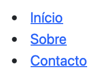
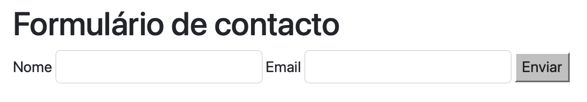

## The Main HTML Tags {#sec-02-main-tags-en}

This chapter builds the first of the three pieces identified in [Chapter 1](cap01.qmd): the Frontend. It is the part of the application that runs in the *browser*, and it is the natural place to start, because it is the part that can be seen and tried out most immediately, even before any server exists behind it.

HTML (*HyperText Markup Language*) describes the content of a page through elements, each delimited by an opening and a closing *tag* (for example, `<p>` and `</p>`, delimiting a paragraph). Before any complete example, it is worth getting familiar with the vocabulary: the most commonly used *tags* for text content are these:

| Tag | What it is for | Example |
|---|---|---|
| `<h1>` to `<h6>` | Headings and subheadings, from most important (`<h1>`) to least important (`<h6>`). Each page should have, at most, one `<h1>`. | `<h1>Page Title</h1>` |
| `<p>` | A paragraph of text. | `<p>This is a paragraph.</p>` |
| `<a>` | A link (hyperlink) to another page or section, defined by the `href` attribute. | `<a href="https://www.w3.org">W3C</a>` |
| `<ul>` | An unordered list of items (with bullet points); each item goes inside an `<li>`. | `<ul><li>Item1</li><li>Item2</li>...</ul>` |
| `<ol>` | An ordered (numbered) list of items; like `<ul>`, items go inside `<li>`. | `<ol><li>First item</li><li>Second item</li></ol>` |

To organise this content into blocks, HTML offers a generic container and several structural (or semantic) *tags*. The difference between them is that the generic container has no meaning of its own, while the semantic *tags* describe the role of each area of the page:

| Tag | What it is for | Example |
|---|---|---|
| `<div>` | A generic container, with no meaning of its own; used to group other elements (for instance, to apply a common style to them). | `<div class="card">...</div>` |
| `<header>` | The header of the page or of a section (typically title, logo, menu). | `<header><h1>My Site</h1></header>` |
| `<nav>` | A navigation block, typically a list of links. | `<nav><a href="#home">Home</a></nav>` |
| `<main>` | The main content of the page; there is, at most, one per page. | `<main><p>Content...</p></main>` |
| `<section>` | A thematic content section, usually with its own heading. | `<section><h2>About</h2></section>` |
| `<aside>` | Related, but secondary, content (sidebar, notes). | `<aside><p>See also...</p></aside>` |
| `<footer>` | The footer of the page or of a section (copyright, contacts). | `<footer>© 2026</footer>` |
| `<form>` | Used to build data-entry forms, together with *input* fields. | `<form><input type="text"/></form>` |

::: {.callout-tip}
## Reference for further study

This table covers only the *tags* used most often throughout this course. For the complete list of HTML elements, and the detailed specification of each, use the [W3C](https://www.w3.org/TR/html52/) (*World Wide Web Consortium*) reference, the international body that standardises HTML.
:::

## HTML Structure {#sec-02-html-css-en}

::: {.callout-note}
## A note on the code examples in this chapter

Several examples below are followed by a screenshot of the page as rendered in the *browser*. To keep every screenshot consistent with the code shown above it, the on-screen text in those specific examples (headings, menu labels, form fields) is left exactly as it appears in the original Portuguese screenshots, even in this English edition. Examples not tied to a screenshot use English text throughout.
:::

A minimal HTML document always has the same shape: a document type declaration, followed by an `html` element, split into a `head` (metadata, not visible to the public, only to developers) and a `body` (the content visible to the public):

```html
<!DOCTYPE html>
<html lang="pt">
  <head>
    <meta charset="UTF-8">
    <title>A Minha Página</title>
  </head>
  <body>
    <h1>Bem-vindo</h1>
    <p>Primeira versão da página.</p>
  </body>
</html>
```

This code renders in the *browser* as shown in figure @fig-02-minimal-page-en:

{#fig-02-minimal-page-en width="50%"}

Combining the structural *tags* already introduced, a page gains an organisation far clearer than a single block of undifferentiated `div`s. Each *tag* labels the kind of information it holds:

```html
<!DOCTYPE html>
<html lang="pt">
<head>
  <meta charset="UTF-8">
  <meta name="viewport" content="width=device-width, initial-scale=1">
  <title>Página de Exemplo</title>
</head>
<body>
  <header>
    <h1>Título do Site</h1>
    <!-- other elements in the header -->
  </header>
  <nav><!-- menu here --></nav>
  <main>
    <section>
      <h2>Introdução</h2>
      <p>Conteúdo inicial.</p>
    </section>
    <section>
      <h2>Outra secção</h2>
      <p>Podem colocar-se quantas secções se quiser.</p>
    </section>
  </main>
  <footer>© 2026</footer>
</body>
</html>
```

This code renders in the *browser* as shown in figure @fig-02-semantic-structure-en — notice that, with no CSS at all, the structural *tags* carry no visual style of their own; the organisation into blocks exists, but is not yet visible:

{#fig-02-semantic-structure-en width="50%"}

Two elements are used with particular frequency in a Web application: a list of links inside `nav`, for navigation, and a `form`, to collect data from whoever uses the page.

```html
<nav>
  <ul>
    <li><a href="#home">Início</a></li>
    <li><a href="#sobre">Sobre</a></li>
    <li><a href="#contacto">Contacto</a></li>
  </ul>
</nav>
```

This code renders in the *browser* as shown in figure @fig-02-nav-list-en: with no CSS, a list of links still looks like a list, with bullet points and the *browser*'s default blue, underlined formatting for links:

{#fig-02-nav-list-en width="25%"}

```html
<section>
  <h2>Formulário de contacto</h2>
  <form>
    <label for="nome">Nome</label>
    <input id="nome" name="nome" type="text">
    <label for="email">Email</label>
    <input id="email" name="email" type="email">
    <button type="submit">Enviar</button>
  </form>
</section>
```

This code renders in the *browser* as shown in figure @fig-02-bare-contact-form-en: once again, with no CSS, the fields and the button appear with the *browser*'s default styling:

{#fig-02-bare-contact-form-en width="75%"}

Note the `for` attribute of each `label`, which matches the `id` of the corresponding `input`: this is what visually links a label to its field, and what allows a screen reader to correctly announce the form.
The `input` *tag* is one of the few *tags* that is not used with an opening and a closing pair: `<input>` `</input>` — it only has the form `<input .../>`, whose trailing part means that this tag "opens and closes" itself. Most of the time, that trailing `/>` is omitted and only `>` is written, as shown in the code examples above.

## Applying Styles Directly {#sec-02-styling-directly-en}

HTML describes the **structure of the page**; the **presentation** is the responsibility of [CSS](https://developer.mozilla.org/en-US/docs/Web/CSS) (*Cascading Style Sheets*). This section shows the three ways of attaching CSS to HTML, and then the two main selectors — class and identifier — used to target those rules at specific elements.

### Three Ways of Applying CSS

CSS can be attached to HTML in three distinct ways.

**Inline**, directly in an element's `style` attribute. For example, on an `h1` element:

```html
<h1 style="color:#0d6efd; margin:0.5rem 0;">Título do Site</h1>
```

This code renders in the *browser* as shown in figure @fig-02-inline-style-title-en:

{#fig-02-inline-style-title-en width="50%"}

**Internal**, in a `<style>` block inside the `<head>` of the `html` file it refers to:

```html
<head>
  <meta charset="UTF-8">
  <style>
    :root { --brand: #0d6efd; }
    body { font-family: system-ui, sans-serif; line-height:1.5; }
    nav ul { list-style:none; display:flex; gap:1rem; padding:0; }
    nav a { text-decoration:none; padding:0.4rem 0.6rem; }
    nav a:hover { background:var(--brand); }
  </style>
</head>
```

The rule `:root { --brand: #0d6efd; }` defines a CSS variable (a *custom property*), reused later with `var(--brand)`: it is useful for keeping the same colour in several places in the style sheet without repeating it, and for being able to change it in a single place.

**External**, in a separate `.css` file, linked through the `<link>` *tag* placed in the `header` of the document where the styles should apply:

```html
<head>
  <meta charset="UTF-8">
  <link rel="stylesheet" href="styles.css">
</head>
```

```css
/* styles.css */
:root { --brand: #0d6efd; }
body { font-family: system-ui, sans-serif; line-height:1.5; }
nav ul { list-style:none; display:flex; gap:1rem; padding:0; }
nav a { text-decoration:none; padding:0.4rem 0.6rem; }
nav a:hover { background: var(--brand); }
```

Applying these rules (through any of the three methods) to the navigation list shown earlier, the result is shown in figure @fig-02-styled-nav-en: the list's bullet points disappear, the links stop being underlined, and they line up side by side:

{#fig-02-styled-nav-en width="55%"}

Of the three, external CSS is, in general, the best practice: it clearly separates structure (HTML) from presentation (CSS), allows the same file to be reused across several pages, and keeps each document shorter and easier to read.

### Classes, IDs and Specificity

Once the structure is defined in HTML, the CSS will hold a set of instructions telling the HTML elements how they should be "presented". To apply styles to elements, CSS uses two main selectors: the class (`class`), for groups of elements, and the identifier (`id`), which must be unique within the page.
A class can therefore label several elements on a page, which will all be formatted identically. Any number of elements can share the same class within the same document. An `id` selector, on the other hand, should only ever be applied to a single element on a page. The `id` is therefore said to be more specific than the `class`.

When writing CSS rules for a class, a dot is placed before the class name: `.class_name`, followed by the formatting instructions between `{ }`, each separated by a semicolon. On the HTML side, the elements meant to be formatted by those rules carry the attribute `class="class_name"`.
For HTML elements with an `id="id_name"` attribute, formatting works the same way as for classes, except that instead of starting with `.`, the selector starts with `#` (`#id_name`).

A single HTML element can have several classes applied at once, separated by spaces. In that case, the element is formatted using the rules of ALL the applied classes:

```html
  <section class="noticias destaque com_hero"> conteúdo da secção </section>

```

Consider the following examples:

```html
<h1 id="titulo" class="titulo">Título do Site</h1>
<nav class="menu">
  <ul>
    <li><a class="menu__link ativo" href="#home">Início</a></li>
    <li><a class="menu__link" href="#sobre">Sobre</a></li>
    <li><a class="menu__link" href="#contacto">Contacto</a></li>
  </ul>
</nav>
```

```css
:root { --brand: #0d6efd; }
#titulo { color: var(--brand); }              /* id: unique per page */
.menu { border-block: 1px solid #eee; padding: 0.75rem 0; }
.menu__link { text-decoration: none; padding: 0.4rem 0.6rem; }
.menu__link.ativo { font-weight: 600; }
```

This code renders in the *browser* as shown in figure @fig-02-classes-ids-example-en: the heading is coloured by the `#titulo` rule, and the menu is styled by the `.menu`/`.menu__link` rules, with the `ativo` link shown in bold:

{#fig-02-classes-ids-example-en width="90%"}

When the same HTML element is styled by two conflicting CSS rules — for instance, both setting its colour — the rule that wins is determined by its specificity.
The list of specificities, from highest to lowest, is:

1. `!important` (best avoided; makes the CSS hard to maintain)
2. Inline style, i.e., inside each element (`style="..."`)
3. Identifier (`#id`)
4. Class (`.class`), attribute or pseudo-class
5. Element (`h1`, `p`, `a`, ...)

For example, what colour would the heading from the previous example end up with, given this CSS?

```css
h1 { color: black; }
.titulo { color: blue; }
#titulo { color: green; }  /* wins over the two rules above */
```

The identifier (`#titulo`) is more specific than both the class and the element, so it wins: the heading turns green, as shown in figure @fig-02-specificity-1-en:

{#fig-02-specificity-1-en width="60%"}

Or, if `!important` is applied:

```css
h1 { color: black !important; } /* wins because it has higher specificity */
.titulo { color: blue; }
#titulo { color: green; }
```

Now it is the element rule (`h1`) that wins, despite being the least specific of the three, because it carries `!important`: the heading turns black, as shown in figure @fig-02-specificity-2-en:

{#fig-02-specificity-2-en width="60%"}

## Applying Styles Using Frameworks {#sec-02-styling-frameworks-en}

### Bootstrap

Writing and maintaining all of an application's CSS from scratch is a considerable amount of work, especially when the result is expected to be responsive (adjusting to different screen sizes) and visually consistent. A CSS *framework* such as [Bootstrap](https://getbootstrap.com/docs/5.3/) solves this problem, providing:

- Productivity and visual consistency, through ready-to-use utility classes
- Responsiveness already built in, through a *grid* and spacing classes
- Tested, accessible components (forms, navigation bars, buttons, among others)

*Bootstrap* can be included directly via *CDN* (*Content Delivery Network*), with no installation required: a style sheet in the `<head>`, and a JavaScript file (for the interactive components) before the closing `</body>`.

```html
<head>
  <link href="https://cdn.jsdelivr.net/npm/bootstrap@5.3.3/dist/css/bootstrap.min.css" rel="stylesheet">
</head>
<body>
  <!-- page content -->
  <script src="https://cdn.jsdelivr.net/npm/bootstrap@5.3.3/dist/js/bootstrap.bundle.min.js"></script>
</body>
```

A navigation bar (*navbar*), with *Bootstrap*, is ready in a handful of lines, already responsive (it collapses into a menu on narrow screens):

```html
<nav class="navbar navbar-expand-md bg-light border-bottom">
  <div class="container">
    <a class="navbar-brand" href="#">Meu Site</a>
    <button class="navbar-toggler" type="button" data-bs-toggle="collapse" data-bs-target="#nav1">
      <span class="navbar-toggler-icon"></span>
    </button>
    <div id="nav1" class="collapse navbar-collapse">
      <ul class="navbar-nav ms-auto gap-2">
        <li class="nav-item"><a class="nav-link" href="#home">Início</a></li>
        <li class="nav-item"><a class="nav-link" href="#sobre">Sobre</a></li>
        <li class="nav-item"><a class="nav-link" href="#contacto">Contacto</a></li>
      </ul>
    </div>
  </div>
</nav>
```

This code renders in the *browser* as shown in figure @fig-02-bootstrap-navbar-en:

{#fig-02-bootstrap-navbar-en width="95%"}

A form gets the same visual treatment through the `form-label` and `form-control` classes:

```html
<section class="container my-4">
  <h2>Formulário de contacto</h2>
  <form class="row g-3 col-lg-6">
    <div class="col-12">
      <label for="nome" class="form-label">Nome</label>
      <input id="nome" name="nome" type="text" class="form-control">
    </div>
    <div class="col-12">
      <label for="email" class="form-label">Email</label>
      <input id="email" name="email" type="email" class="form-control">
    </div>
    <div class="col-12">
      <button class="btn btn-primary" type="submit">Enviar</button>
    </div>
  </form>
</section>
```

This code renders in the *browser* as shown in figure @fig-02-bootstrap-form-en: compare it with figure @fig-02-bare-contact-form-en, the same form without Bootstrap:

{#fig-02-bootstrap-form-en width="80%"}

The same grid system also organises the main content into columns. Bootstrap's grid divides each row (`row`) into twelve columns; the class `col-6` occupies six of those twelve, i.e., half the width:

```html
<main class="container my-4">
  <div class="row">
    <div class="col-6">
      <p>Conteúdo principal…</p>
    </div>
    <aside class="col-6">
      <p>Barra lateral…</p>
    </aside>
  </div>
</main>
```

This code renders in the *browser* as shown in figure @fig-02-bootstrap-grid-en: the main content and the sidebar sit side by side, each occupying half the width, even though there is no visible border marking the columns — it is Bootstrap's grid that reserves the space for each one:

{#fig-02-bootstrap-grid-en width="95%"}

### Other Frameworks

*Bootstrap* is not the only CSS *framework* available, only the most beginner-friendly to start with, thanks to its approach based on ready-to-use components. It is worth knowing about, even without going into depth, a few popular alternatives:

**[Tailwind CSS](https://tailwindcss.com/docs)**
: A *utility-first framework*: instead of ready-made components such as `navbar` or `card`, it provides low-level classes, one per CSS property (for example `flex`, `pt-4`, `text-center`), which are combined directly in the HTML to build any custom look.

**[Bulma](https://bulma.io/documentation/)**
: Based purely on CSS, with no JavaScript at all; syntax close to *Bootstrap*'s, but with no ready-made interactive components (menus, modals).

**[Materialize](https://materializecss.com/)**
: Implements Google's [*Material Design*](https://m3.material.io/) (shadows, elevation, vivid colours, animations); visually more opinionated than *Bootstrap*.

**[Foundation](https://get.foundation/sites/docs/)**
: Aimed at larger, more customised projects; more flexible than *Bootstrap*, but with a steeper learning curve.

The following table compares these *frameworks* by their approach and by ease of learning:

| Framework | Approach | Learning curve |
|---|---|---|
| **Bootstrap** | Ready-made components (`navbar`, `card`, `btn`) | Low |
| **Tailwind CSS** | Utility classes, one per CSS property | Medium/high |
| **Bulma** | CSS components, no JavaScript | Low |
| **Materialize** | Components following *Material Design* | Medium |
| **Foundation** | Configurable, more flexible components | High |

## Best Practices {#sec-02-best-practices-en}

- Prefer external CSS; avoid `!important` and excessive *inline* styles
- Use a consistent naming convention for classes (for example, the *BEM* convention: `block__element--modifier`)
- Think about accessibility from the start: colour contrast, a `label` associated with each `input`, a logical keyboard-navigation order
- Always test the page's responsiveness, at different screen widths

## Exercise: the Static Pages of the "World Capitals" Application {#sec-02-world-capitals-en}

Applying what was presented in the previous sections, this section builds the visual pages of the application used throughout the practical LABs (see [Appendix D](apendiceD1.qmd) and onward): an API serving information about countries and their capitals. At this stage, the pages are entirely static, in HTML/CSS/Bootstrap, with no JavaScript at all: the data shown is fixed directly in the HTML, and the forms are not yet connected to any server. That is the work reserved for the LABs, which will simply add `fetch()` to this already-finished code.

All the pages share the same navigation bar:

```html
<nav class="navbar navbar-expand-md bg-light border-bottom">
  <div class="container">
    <a class="navbar-brand" href="index.html">World Capitals</a>
    <button class="navbar-toggler" type="button" data-bs-toggle="collapse" data-bs-target="#nav1">
      <span class="navbar-toggler-icon"></span>
    </button>
    <div id="nav1" class="collapse navbar-collapse">
      <ul class="navbar-nav ms-auto gap-2">
        <li class="nav-item"><a class="nav-link" href="index.html">Países</a></li>
        <li class="nav-item"><a class="nav-link" href="capital.html">Consultar Capital</a></li>
        <li class="nav-item"><a class="nav-link" href="paises-editar.html">Gerir Países</a></li>
        <li class="nav-item"><a class="nav-link" href="login.html">Entrar</a></li>
      </ul>
    </div>
  </div>
</nav>
```

This code renders in the *browser* as shown in figure @fig-02-world-capitals-navbar-en:

{#fig-02-world-capitals-navbar-en width="95%"}

From this shared *navbar*, four pages are built:

- **Country listing** (`index.html`): a *Bootstrap* table, with a few countries fixed in the HTML as examples. In the LABs, this table becomes dynamically populated from the result of `/country`.
- **Authentication** (`login.html`): a form with the fields `user` and `pass`, with the same names expected by the `/login` *endpoint*.
- **Capital lookup** (`capital.html`): a simple form, with a single `countrycode` field.
- **Country management** (`paises-editar.html`): three separate forms, one per operation, all pointing to the same `/countryEdit` *endpoint*, distinguished by the hidden `operation` field (see the note on this design in [Chapter 7](cap07.qmd)).

These four pages, linked to one another by the shared navigation bar, already form a small, complete, working Web site, even with no server-side logic at all: it is possible to navigate between them, fill in the forms, and submit them. What is still missing is a server to answer those requests, and that is what the material in the following chapters will provide.

The complete, self-contained code for the four pages, ready to copy into an editor and open directly in the *browser*, is gathered in [Appendix A](apendiceA.qmd).
