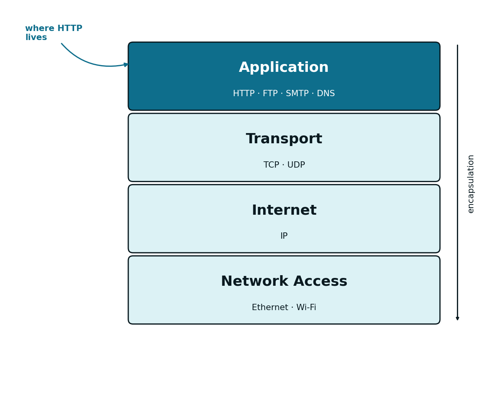
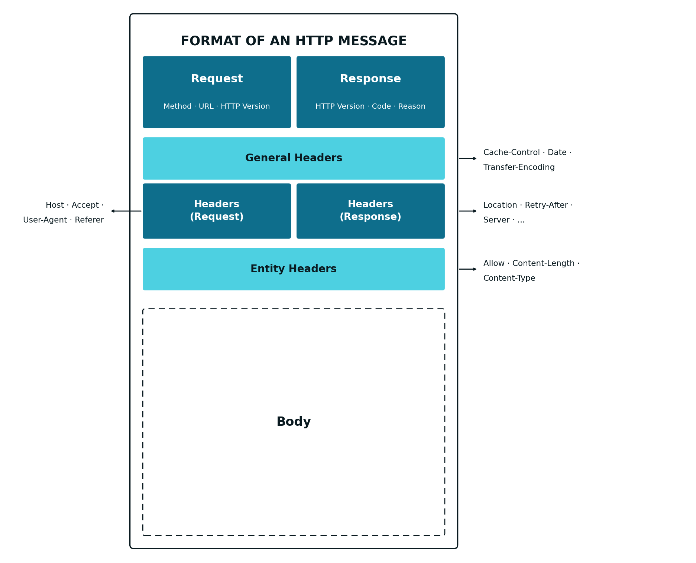

## The Middleware Connecting Frontend and Backend {#sec-03-middleware-intro-en}

[Chapter 1](cap01.qmd) identified three components in any Web application: *Frontend*, *Middleware* and *Backend*. [Chapter 2](cap02.qmd) was devoted to the first of these, a set of HTML pages with forms, including the capital-lookup form (`capital.html`) and the authentication form (`login.html`). On their own, these forms do nothing: they need a protocol to carry the data the user fills in to a server, and to bring a response back. That protocol, the *Middleware* used in Web applications, is HTTP (*HyperText Transfer Protocol*). This chapter details how it works.

## The TCP/IP Model {#sec-03-tcpip-model-en}

Before going into the details of HTTP itself, it is worth recalling where this protocol fits into the communications stack. The TCP/IP model organises that stack into four layers, each responsible for a different aspect of network communication:

| Layer | Responsibility | Example protocols |
|---|---|---|
| Application | The format of the data exchanged between applications | HTTP, FTP, SMTP, DNS |
| Transport | Delivery of data between processes, reliable (TCP) or not (UDP) | TCP, UDP |
| Internet | Routing of data between networks, by IP address | IP |
| Network Access | Physical transmission of data on the local medium | Ethernet, Wi-Fi |

{#fig-03-tcpip-model-en width="80%"}

HTTP is, therefore, an Application-layer protocol: it is not concerned with how the data reaches its destination, only with defining the format of the request and the response. That delivery is TCP's responsibility, at the Transport layer, which guarantees that the data arrives complete, error-free, and in the order it was sent — a guarantee that HTTP depends on, without ever implementing it directly.

## HTTP {#sec-03-http-en}

[HTTP](https://developer.mozilla.org/en-US/docs/Web/HTTP) (*HyperText Transfer Protocol*) is a text-based protocol, based on the request-response model: the client sends a request, the server returns a response, and the connection between the two retains no memory of previous requests — each request is handled independently, that is, HTTP has no state (it is *stateless*). This section details the three aspects that define a request and a response: methods, the general message format, and status codes.

### Methods

Every request from the client to the server is made in HTTP format and indicates, through a method, the operation intended for a given resource. The "resource" in the context of Web applications can be an `html` page, an image, a `PDF`, or any other item capable of being manipulated digitally:

| Method | Typical semantics |
|---|---|
| `GET` | Retrieve a resource |
| `POST` | Create a resource |
| `PUT` | Update or replace a resource |
| `DELETE` | Remove a resource |
| `HEAD` | Retrieve headers only, no body |

These five methods cover the vast majority of operations performed by a Web application; the first two (`GET` and `POST`) are by far the most common in Web pages, while `PUT` and `DELETE` become more important mainly in Web services.

### Message Format {#sec-03-message-format-en}

When the application on the client's computer wants to communicate with the server, it activates the Application layer of the communications protocol stack, which formats the request according to the HTTP protocol. Both a request and the response that follows it share a similar general message structure:

1. A first line, differing between a request (method, *URL* and HTTP version) and a response (HTTP version, status code and reason)
2. A set of headers, carrying metadata about the message (for instance, the destination host, the content type, or its length)
3. An optional body, holding the actual data

A `GET` request typically has no body: all the data it carries goes in the *URL* itself, as parameters. A `POST` request carries its data in the message body, outside the *URL*.

{#fig-03-http-message-format-en width="90%" .column-body-outset}

#### Example: From the Capital-Lookup Form to an HTTP Request

Recall the capital-lookup form built in [Chapter 2](cap02.qmd) (`capital.html`):

```html
<form method="GET" action="/capital">
  <label for="countrycode">Código do país</label>
  <input type="text" id="countrycode" name="countrycode">
  <button type="submit">Consultar</button>
</form>
```
This `HTML` code renders in the *browser* as shown in figure @fig-03-form-capital-en:

{#fig-03-form-capital-en width="50%" .browser-shot}

When submitted (by clicking the *Consultar* button) with the value `PT` in the `input`, the *browser* generates the following `GET` HTTP request:

::: {.httpmsg}
GET /capital?countrycode=PT HTTP/1.1\
Host: localhost:8080
:::

Note that, because this is a `GET` method, the `countrycode` parameter is sent as part of the *URL* (after the `?`), and there is no body in the message. If the same form used `method="POST"`, the parameter would instead travel in the request body, and the *URL* would stay clean (`/capital`).

The server, upon processing this request, returns an HTTP response such as the following:

::: {.httpmsg}
HTTP/1.1 200 OK\
Content-Type: application/json

{\"country\": \"Portugal\", \"capital\": \"Lisboa\", \"ccode\": \"PT\"}
:::

#### Example: From the Authentication Form to a `POST` Request with a Body

Now recall the authentication form, also from [Chapter 2](cap02.qmd) (`login.html`), with the fields `user` and `pass`:

```html
<form method="POST" action="/login">
  <label for="user">Utilizador</label>
  <input type="text" id="user" name="user">
  <label for="pass">Palavra-passe</label>
  <input type="password" id="pass" name="pass">
  <button type="submit">Entrar</button>
</form>
```
This `HTML` code renders in the *browser* as shown in figure @fig-03-form-login-en:

{#fig-03-form-login-en width="90%" .browser-shot}

When submitted, this form generates the following HTTP request:

::: {.httpmsg}
POST /login HTTP/1.1\
Host: localhost:8080\
Content-Type: application/x-www-form-urlencoded\
Content-Length: 21

user=javaee&pass=asw2026
:::

Unlike the previous example, the parameters no longer go in the *URL*: they follow in the request body, after a blank line separating the headers from the body. This is why credentials and other sensitive data are typically sent via `POST`, never `GET`: a request body is not recorded in browser history or in the server's log files, unlike *URL* parameters.

Upon successfully validating the credentials, the server returns an HTTP response such as the following — in this case, a presentation-oriented application (see [Chapter 1](cap01.qmd)), which returns HTML code in the response body, ready to render in the *browser*. If the application were service-oriented, the response body would instead carry JSON rather than HTML:

::: {.httpmsg}
HTTP/1.1 200 OK\
Content-Type: text/html

&lt;h1&gt;Bem-vindo, javaee&lt;/h1&gt;\
&lt;p&gt;Sessão iniciada com sucesso.&lt;/p&gt;
:::

### Status Codes {#sec-03-status-codes-en}

Every HTTP response includes a numeric status code, briefly indicating the outcome of the request. Codes are grouped into five categories, based on the leading digit:

| Range | Category |
|---|---|
| `1xx` | Informational |
| `2xx` | Success |
| `3xx` | Redirection |
| `4xx` | Client error |
| `5xx` | Server error |

Within these categories, a handful of codes come up particularly often when developing Web services:

| Code | Meaning |
|---|---|
| `200 OK` | The request was processed successfully |
| `201 Created` | A new resource was successfully created |
| `400 Bad Request` | The request is malformed, or a required parameter is missing |
| `403 Forbidden` | The client lacks permission to access the resource |
| `404 Not Found` | The requested resource does not exist |
| `500 Internal Server Error` | An unhandled error occurred on the server side |

Choosing the right status code for each situation is an essential part of designing a Web service: the code, by itself, conveys information the client can use to decide how to react, without needing to parse the response body.
