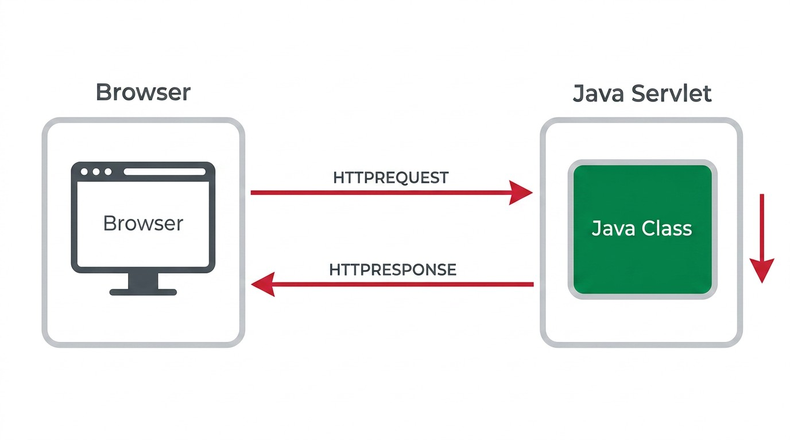
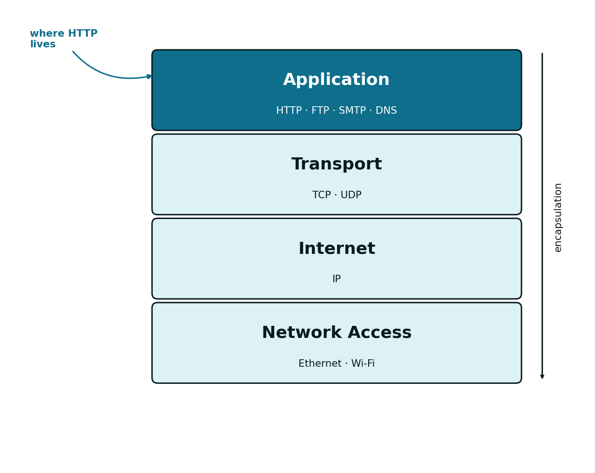
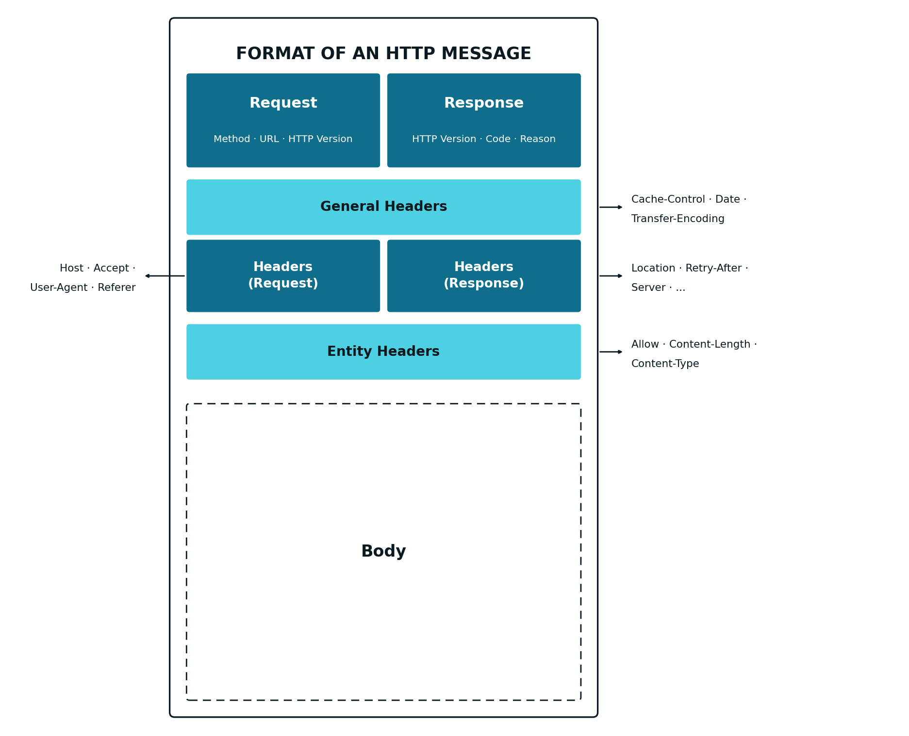

## The Middleware Connecting Frontend and Backend {#sec-03-middleware-intro-en}

[Chapter 1](cap01.qmd) identified three components in any Web application: *Frontend*, *Middleware* and *Backend*. [Chapter 2](cap02.qmd) was devoted to the first of these, a set of HTML pages with forms, including the capital-lookup form (`capital.html`) and the authentication form (`login.html`). On their own, these forms do nothing: they need a protocol to carry the data the user fills in to a server, and to bring a response back. That protocol, the *Middleware* used in Web applications, is HTTP (*HyperText Transfer Protocol*).

HTTP, however, does not work alone. For a request to leave the *browser* and reach a server, possibly on the other side of the world, HTTP relies on two other protocols: TCP, which delivers the data to the right application, and IP, which gets it to the right machine. This chapter follows that path in order: it starts from the client-server model, goes down to the transport and network layers to show where ports and IP addresses come in, and only then details how HTTP works.

## The Client-Server Model {#sec-03-client-server-en}

All communication on the Web rests on the client-server model. In this model there are two clearly distinct roles:

Server
: A program that is permanently listening, waiting for requests. It never takes the initiative to contact anyone: it simply responds to whoever contacts it. A single server handles requests from many different clients at the same time. In this course, the server is Apache Tomcat.

Client
: A program that takes the initiative: it sends a request to the server and waits for the response. On the Web, the client is typically a *browser* (Chrome, Firefox, Safari), but it can be any program capable of sending requests, such as `curl` on the command line or a mobile app.

{#fig-03-client-server-en width="70%"}

The interaction is always the same: the client sends a request, the server processes it and returns a response. This request-response pair is the basic unit of all communication on the Web: loading a page, submitting a form or fetching an image are each one or more of these exchanges.

For this exchange to happen, the client needs to answer two questions before sending anything:

1. **On which machine** is the server? The answer is an **IP address**, handled by the Internet layer.
2. **Which program**, inside that machine, should receive the request? A single machine may have several servers running at the same time (a Web server, a database server, a mail server). The answer is a **port number**, handled by the Transport layer.

Only once these two questions are settled does HTTP come in, defining **what** is said: the format of the request and of the response. The following sections explain how these three pieces fit together.

## The TCP/IP Model {#sec-03-tcpip-model-en}

Network communications are organised in layers. Each layer provides a service to the layer immediately above and uses the services of the layer immediately below, without needing to know how those other layers work internally. The TCP/IP model, used on the Internet, organises the communications stack into four layers:

| Layer | Responsibility | Addressing | Example protocols |
|---|---|---|---|
| Application | The format of the data exchanged between applications | *URL* | HTTP, FTP, SMTP, DNS |
| Transport | Delivery of data to the right process, reliably (TCP) or not (UDP) | Port | TCP, UDP |
| Internet | Routing of data between networks, to the right machine | IP address | IP |
| Network Access | Physical transmission of data over the local medium | MAC address | Ethernet, Wi-Fi |

{#fig-03-tcpip-model-en width="80%"}

### Encapsulation

When the *browser* sends a request, the data travels down the stack, from the Application layer to the Network Access layer. At each layer a header of its own is added, with the information that layer needs. This process is called encapsulation (@fig-03-encapsulation-en):

1. **Application:** the *browser* builds the HTTP message (for example, `GET /capital?countrycode=PT`). From the point of view of the lower layers, this data is just the *payload*.
2. **Transport:** TCP adds a header whose most important information is the **source and destination ports**. The result is called a TCP segment.
3. **Internet:** IP adds a header whose most important information is the **source and destination IP addresses**. The result is called an IP packet.
4. **Network Access:** the network card adds a header with the physical (MAC) addresses and, at the end, a check code (FCS, *Frame Check Sequence*) that lets the receiver detect whether the frame was corrupted along the way. The result is called a frame, which is then converted into electrical, optical or radio signals.

{#fig-03-encapsulation-en width="100%"}

On reception, the process is reversed: each layer checks the header that concerns it, strips it off and passes the rest to the layer above. The Internet layer confirms that the destination IP address is the machine's own; the Transport layer checks whether any application is registered on the destination port and, if so, hands it the data; finally, the Application layer receives the HTTP message exactly as the *browser* wrote it.

HTTP is therefore an Application-layer protocol: it is not concerned with how the data reaches its destination, it only defines the format of the request and of the response. That delivery is the job of the lower layers, the two most relevant of which for Web development are described next.

## The Transport Layer: TCP and Ports {#sec-03-tcp-ports-en}

### Ports

An IP address identifies a machine, but many programs run on a machine at the same time. The port is the number that identifies, within a machine, the program the data is meant for. When a server starts, it registers on a port and starts listening: every TCP segment arriving with that destination port is delivered to it.

Ports are integers between 0 and 65535, divided into three ranges:

| Range | Name | Use |
|---|---|---|
| 0 to 1023 | Well-known ports | Reserved for standard services |
| 1024 to 49151 | Registered ports | Assigned to specific applications |
| 49152 to 65535 | Dynamic (*ephemeral*) ports | Temporarily assigned to clients |

Some ports come up particularly often:

| Port | Service |
|---|---|
| 21 | FTP (file transfer) |
| 22 | SSH (secure remote access) |
| 25 | SMTP (sending email) |
| 53 | DNS (name resolution) |
| 80 | HTTP |
| 443 | HTTPS (encrypted HTTP) |
| 3306 | MySQL / MariaDB |
| 8080 | Alternative HTTP (Apache Tomcat's default port) |

When the destination port is the protocol's well-known port, there is no need to write it in the *URL*: `http://www.utad.pt` and `http://www.utad.pt:80` are exactly the same address, because the *browser* assumes port 80 for `http` and port 443 for `https`. Tomcat, on the other hand, listens on port 8080 by default, so the port must be given explicitly, which is why every address used in this course has the form `http://localhost:8080/...`.

The client also uses a port: the source port. It is not chosen by the user; it is assigned automatically by the operating system, from the dynamic range, when the connection is opened. It is to this port that the server sends its response. This is why a *browser* with several tabs open on the same *site* can receive the responses for each of them without mixing them up: each connection has its own source port.

The pair formed by an IP address and a port is called a ***socket***. A TCP connection is fully identified by two *sockets*: the client's (for example, `192.168.1.20:51734`) and the server's (for example, `203.0.113.10:80`).

### TCP

TCP (*Transmission Control Protocol*) is the transport protocol used by HTTP. Its job is to guarantee that data reaches its destination **complete, error-free and in the order in which it was sent**, even though the network underneath (IP) offers none of these guarantees. To do so, TCP:

- **Establishes a connection** before sending data: client and server exchange three synchronisation messages (the so-called *three-way handshake*) and only then does the transfer begin. This is why TCP is said to be connection-oriented.
- **Numbers the segments:** when the data is large, TCP splits it into several segments and gives each one a sequence number. The receiver uses these numbers to put them back in order and to detect whether any is missing.
- **Acknowledges receipt:** the receiver replies to the sender with an *acknowledgement* of the segments received. If a segment is not acknowledged within a certain time, the sender sends it again.
- **Controls the flow:** the sender adjusts how much data it sends at once to the receiver's capacity and to the state of the network, so as not to overload them.

For Web developers, the practical consequence is simple: when the server reads an HTTP request, it can rely on that request being complete and in the right order. All the complexity of dealing with losses and retransmissions is hidden inside TCP.

The alternative to TCP at the Transport layer is UDP (*User Datagram Protocol*), which also uses ports but does without the connection, the numbering and the acknowledgements. It is faster but does not guarantee delivery, and is used where losing the occasional packet is preferable to waiting for it to be retransmitted, such as voice calls, live video or DNS queries.

## The Internet Layer: IP and Addresses {#sec-03-ip-addresses-en}

### IP Addresses

IP (*Internet Protocol*) is responsible for getting each packet to the destination machine, identified by its IP address. In version 4 of the protocol (IPv4), still the most common, an IP address is made up of four numbers between 0 and 255, separated by dots, such as `203.0.113.10` or `192.168.1.20`. Each of these numbers takes up 8 bits, which makes an IPv4 address a 32-bit number, with about 4.3 billion possible combinations. That number proved insufficient for the growth of the Internet, and gave rise to IPv6, with 128-bit addresses written in hexadecimal (for example, `2001:db8::10`), which today coexists with IPv4.

::: {.callout-note}
## Addresses used in the examples

The public addresses that appear in this chapter (`203.0.113.10`, `2001:db8::10`) and the name `www.example.com` do not belong to any real machine: they are part of blocks reserved by the Internet standards exclusively for documentation and examples (RFC 5737 and RFC 3849 for the addresses, RFC 2606 for the names). The addresses `192.168.1.20` and `127.0.0.1`, by contrast, are real addresses, for private and *loopback* use respectively, and are explained below.
:::

As with ports, some addresses are reserved for specific purposes:

| Address or range | Use |
|---|---|
| `127.0.0.1` | *Loopback*: the machine itself (name `localhost`) |
| `10.0.0.0` to `10.255.255.255` | Private addresses (internal networks) |
| `172.16.0.0` to `172.31.255.255` | Private addresses (internal networks) |
| `192.168.0.0` to `192.168.255.255` | Private addresses (home and office networks) |

The address `127.0.0.1` deserves special mention in this course. A request sent to `localhost` never leaves the machine: it goes down the communications stack and back up again on the same computer, where Tomcat receives it. This is what makes it possible to develop and test a complete Web application, client and server, on a single laptop and without an Internet connection.

Private addresses, in turn, are only valid within a local network. This is why a student's laptop can have the address `192.168.1.20` at home and a different address on the university network. To communicate with the outside world, the local network's *router* translates this private address into a public one, in a process called NAT (*Network Address Translation*).

### Routing

Client and server are rarely on the same network. An IP packet sent from a student's home to the UTAD server crosses several intermediate networks. In each of them, a device called a *router* reads the destination IP address, looks up its *routing table* and decides to which neighbouring network the packet should be forwarded. The packet thus moves forward, hop by hop, until it reaches the network where the server is.

This routing is done packet by packet, and IP gives no guarantee of delivery: a packet may be lost, arrive duplicated or arrive out of order relative to those sent before it. It is precisely to make up for these failures that TCP exists in the layer above.

### DNS: From Names to Addresses

IP addresses are convenient for machines but hard for people to remember. This is why one types `www.example.com` in the *browser* and not `203.0.113.10`. The network, however, only knows IP addresses: before it can send anything, the *browser* has to convert the name into the corresponding address.

This conversion is done by DNS (*Domain Name System*), a hierarchical system of servers distributed across the Internet. The *browser* asks DNS which IP address is associated with a name, and DNS replies with the address that the *browser* will then place in the IP header of the packets. The name `localhost` is a special case: it is resolved by the machine itself, directly to `127.0.0.1`, without consulting any DNS server.

::: {.callout-tip}
## Asking DNS directly

The `nslookup` command, available on Windows, macOS and Linux, asks DNS the same question the *browser* does and shows the answer. In a terminal:

```bash
nslookup www.utad.pt
```

The answer shows the DNS server that was queried and, on the `Address` line, the IP address (or addresses, IPv4 and IPv6) associated with the name. Repeating the command with other names (for example, `www.google.com`) shows that a single name can be associated with several addresses. Note that `nslookup` always queries a DNS server, unlike the *browser*, which resolves `localhost` locally; the result of `nslookup localhost` therefore varies from system to system and is not a good example.
:::

## From *URL* to Connection {#sec-03-url-connection-en}

With the three layers in place, it is possible to follow everything that happens when the user submits the capital-lookup form and the *browser* has to access the address:

```
http://localhost:8080/capital?countrycode=PT
```

The *URL* itself contains the information each layer needs:

| Part of the *URL* | Value | Layer that uses it |
|---|---|---|
| Protocol | `http` | Application: defines the protocol and the default port (80) |
| Host | `localhost` | Internet: converted into the IP address `127.0.0.1` (normally by DNS; for `localhost`, by the machine itself) |
| Port | `8080` | Transport: identifies Tomcat within the machine |
| Path and parameters | `/capital?countrycode=PT` | Application: identifies the resource requested from the server |

From here on, the sequence is always the same:

1. The *browser* extracts the host name from the *URL* and obtains its IP address (through DNS or, for `localhost`, directly).
2. The *browser* opens a TCP connection to the server's *socket*, `127.0.0.1:8080`. The operating system assigns the client a source port from the dynamic range.
3. The *browser* writes the HTTP request message and hands it to TCP, which splits it into segments, adds the ports and passes it to IP, which adds the addresses.
4. On the server side, the packets go up the stack: IP recognises its own address, TCP reassembles the message and hands it to the program registered on port 8080, Tomcat.
5. Tomcat processes the request and writes the HTTP response, which travels the reverse path to the *browser*'s source port.
6. The *browser* reads the response and displays it to the user.

Steps 1, 2 and 4 are handled entirely by the operating system and the network; steps 3, 5 and 6, as far as the content of the message is concerned, are defined by HTTP. It is this content, what the client asks for and what the server replies, that the rest of this chapter details.

## HTTP {#sec-03-http-en}

[HTTP](https://developer.mozilla.org/en-US/docs/Web/HTTP) (*HyperText Transfer Protocol*) is a text-based protocol, based on the request-response model: the client sends a request, the server returns a response, and the connection between the two retains no memory of previous requests. Each request is handled independently, that is, HTTP has no state (it is *stateless*). This section details the three aspects that define a request and a response: methods, the general message format, and status codes.

### Methods

Every request from the client to the server is made in HTTP format and indicates, through a method, the operation intended for a given resource. The "resource" in the context of Web applications can be an `html` page, an image, a `PDF`, or any other item capable of being manipulated digitally:

| Method | Typical semantics |
|---|---|
| `GET` | Retrieve a resource |
| `POST` | Create a resource |
| `PUT` | Update or replace a resource |
| `DELETE` | Remove a resource |
| `HEAD` | Retrieve headers only, no body |

These five methods cover the vast majority of operations performed by a Web application; the first two (`GET` and `POST`) are by far the most common in Web pages, while `PUT` and `DELETE` become more important mainly in Web services.

### Message Format {#sec-03-message-format-en}

When the application on the client's computer wants to communicate with the server, it activates the Application layer of the communications protocol stack, which formats the request according to the HTTP protocol. Both a request and the response that follows it share a similar general message structure:

1. A first line, differing between a request (method, *URL* and HTTP version) and a response (HTTP version, status code and reason)
2. A set of headers, carrying metadata about the message (for instance, the destination host, the content type, or its length)
3. An optional body, holding the actual data

A `GET` request typically has no body: all the data it carries goes in the *URL* itself, as parameters. A `POST` request carries its data in the message body, outside the *URL*.

{#fig-03-http-message-format-en width="90%" .column-body-outset}

#### Example: From the Capital-Lookup Form to an HTTP Request

Recall the capital-lookup form built in [Chapter 2](cap02.qmd) (`capital.html`):

```html
<form method="GET" action="/capital">
  <label for="countrycode">Código do país</label>
  <input type="text" id="countrycode" name="countrycode">
  <button type="submit">Consultar</button>
</form>
```
This `HTML` code is displayed in the *browser* as shown in @fig-03-form-capital-en:

{#fig-03-form-capital-en width="50%" .browser-shot}

When submitted (by clicking the *Consultar* button) with the value `PT` in the `input`, the *browser* generates the following `GET` HTTP request:

::: {.httpmsg}
GET /capital?countrycode=PT HTTP/1.1\
Host: localhost:8080
:::

Note that, because this is a `GET` method, the `countrycode` parameter is sent as part of the *URL* (after the `?`), and there is no body in the message. If the same form used `method="POST"`, the parameter would instead travel in the request body, and the *URL* would stay clean (`/capital`).

The server, upon processing this request, returns an HTTP response such as the following:

::: {.httpmsg}
HTTP/1.1 200 OK\
Content-Type: application/json

{\"country\": \"Portugal\", \"capital\": \"Lisboa\", \"ccode\": \"PT\"}
:::

#### Example: From the Authentication Form to a `POST` Request with a Body

Now recall the authentication form, also from [Chapter 2](cap02.qmd) (`login.html`), with the fields `user` and `pass`:

```html
<form method="POST" action="/login">
  <label for="user">Utilizador</label>
  <input type="text" id="user" name="user">
  <label for="pass">Palavra-passe</label>
  <input type="password" id="pass" name="pass">
  <button type="submit">Entrar</button>
</form>
```
This `HTML` code is displayed in the *browser* as shown in @fig-03-form-login-en:

{#fig-03-form-login-en width="60%"}

When *Entrar* is clicked, the form filled in this way generates the following HTTP request, in which each field gives rise to a parameter named after its `name` attribute (`user` and `pass`):

::: {.httpmsg}
POST /login HTTP/1.1\
Host: localhost:8080\
Content-Type: application/x-www-form-urlencoded\
Content-Length: 21

user=javaee&pass=asw2026
:::

Unlike the previous example, the parameters no longer go in the *URL*: they follow in the request body, after a blank line separating the headers from the body. This is why credentials and other sensitive data are typically sent via `POST`, never `GET`: a request body is not recorded in browser history or in the server's log files, unlike *URL* parameters.

Upon successfully validating the credentials, the server returns an HTTP response. In this case it is a presentation-oriented application (see [Chapter 1](cap01.qmd)), so the response body carries HTML code for the *browser* to display; in a service-oriented application, it would carry JSON. The response looks like this:

::: {.httpmsg}
HTTP/1.1 200 OK\
Content-Type: text/html

&lt;h1&gt;Bem-vindo, javaee&lt;/h1&gt;\
&lt;p&gt;Sessão iniciada com sucesso.&lt;/p&gt;
:::

### Status Codes {#sec-03-status-codes-en}

Every HTTP response includes a numeric status code, briefly indicating the outcome of the request. Codes are grouped into five categories, based on the leading digit:

| Range | Category |
|---|---|
| `1xx` | Informational |
| `2xx` | Success |
| `3xx` | Redirection |
| `4xx` | Client error |
| `5xx` | Server error |

Within these categories, a handful of codes come up particularly often when developing Web services:

| Code | Meaning |
|---|---|
| `200 OK` | The request was processed successfully |
| `201 Created` | A new resource was successfully created |
| `400 Bad Request` | The request is malformed, or a required parameter is missing |
| `403 Forbidden` | The client lacks permission to access the resource |
| `404 Not Found` | The requested resource does not exist |
| `500 Internal Server Error` | An unhandled error occurred on the server side |

Choosing the right status code for each situation is an essential part of designing a Web service: the code, by itself, conveys information the client can use to decide how to react, without needing to parse the response body.
