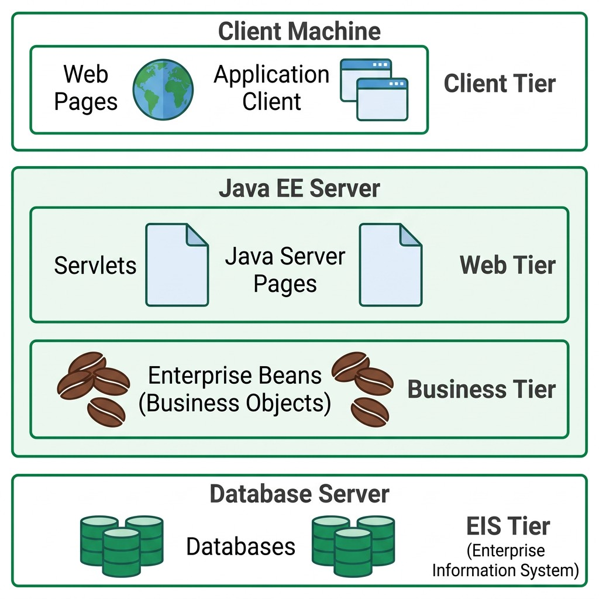
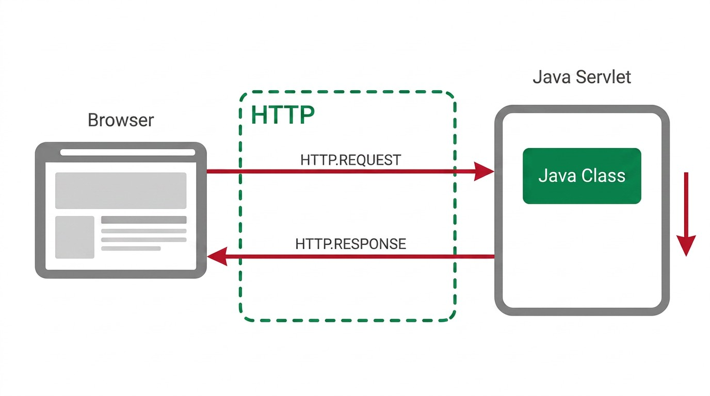

## The Jakarta EE Platform {#sec-04-jakarta-ee-en}

With the Frontend built ([Chapter 2](cap02.qmd)) and the Middleware detailed ([Chapter 3](cap03.qmd)), what remains is the third piece identified in [Chapter 1](cap01.qmd): the Backend, which actually receives HTTP requests and answers them. That is the subject of this chapter and the ones that follow.

[*Jakarta EE*](https://jakarta.ee/) (previously known as *Java EE*, until it was renamed in 2019) is a platform that provides a ready-to-use set of services and *APIs* to deal with the problems common to any Web application (see [Chapter 1](cap01.qmd)), freeing developers to focus on the application's business logic.

The platform rests on the Java language and the *Java Virtual Machine* (JVM), which means any component written for *Jakarta EE* benefits from the portability and automatic memory management already familiar from the language.

## Layered Architecture {#sec-04-layered-architecture-en}

The *Jakarta EE* platform organises an application according to a model distributed across several layers (*tiers*), each with a well-defined role and typically installed on a different machine:

| Tier | Where it resides | Typical components |
|---|---|---|
| *Client Tier* | Client machine | Web pages (browser), client applications |
| *Web Tier* | *Jakarta EE* server | *Servlets*, *JavaServer Pages*, *Web Services* |
| *Business Tier* | *Jakarta EE* server | *Enterprise Beans* (business logic) |
| *EIS Tier* (*Enterprise Information System*) | Database server | Databases, enterprise information systems |

This layering allows each component to evolve relatively independently of the others: changing the database does not require rewriting the business logic, and changing the client interface does not require changing the server.

{#fig-04-jakarta-ee-architecture-en width="70%"}

::: {.callout-note}
## Tomcat is not a complete Jakarta EE server

[*Apache Tomcat*](https://tomcat.apache.org/), used throughout this course, is a *Servlet Container*: it implements only the *Web Tier* (Servlets, JSP). It does not include support for *Enterprise Beans* nor for the *Business Tier* itself, unlike a complete *Jakarta EE* application server (for example, *WildFly*, *WebSphere* or *GlassFish*). In practice, this means that the business logic which, in the formal architecture, would belong to the *Business Tier*, is implemented here directly in plain Java classes, rather than in *Enterprise Beans*.
:::

## Why Servlets? {#sec-04-why-servlets-en}

Implementing, from scratch, a Java program capable of answering HTTP requests would require solving, on its own, a set of problems common to any Web server: parsing the incoming HTTP message, managing several connections at once (each in its own *thread*), controlling the life cycle of the in-memory instances, and packaging all of this into a format that an application server knows how to install and start.

A [*Servlet*](https://jakarta.ee/specifications/servlet/) is a Java class that runs inside a *Servlet Container* (for example, *Apache Tomcat*) and automatically receives all of this work already done:

- Parsing of the HTTP request
- *Thread* management, one per request
- Management of the *Servlet*'s own life cycle
- Its own deployment model, packaged in a `.war` file (*Web Application Archive*)

The *Servlet Container* corresponds, in the layered architecture presented above, to the *Web Tier*: it is there that *Servlets* reside, between the client and the business layer.

{#fig-04-servlet-http-en width="70%"}

## The Life Cycle of a Servlet {#sec-04-lifecycle-en}

When a request is routed to a *Servlet*, the container always follows the same sequence (see @fig-04-servlet-lifecycle-en):

1. If no instance of that *Servlet* yet exists in memory, the container loads the class, creates an instance, and calls the `init()` method
2. For each request received, the container invokes the `service()` method, which dispatches to `doGet()`, `doPost()`, or another method depending on the HTTP verb used, passing it the `request` and `response` objects
3. If the container needs to remove the *Servlet* (for example, when shutting down the server), it invokes the `destroy()` method

An important detail follows from this: there is **a single instance** of each *Servlet* in memory, even if N clients are using the same service at once. Each request is handled by a different *thread*, but all of those *threads* share the same instance. In practice, this means:

::: {.callout-warning}
## Beware of shared state

Never store data specific to one request in the *Servlet*'s instance attributes: since the instance is shared by all *threads*, one request can read or overwrite data belonging to another request in progress. Local variables, declared inside `doGet()` or `doPost()`, are safe, because each *thread* has its own copy.
:::

{#fig-04-servlet-lifecycle-en width="80%"}

## From the HTTP Message to the Java Method {#sec-04-http-to-servlet-mapping-en}

A *Servlet* is bound to a *URL* through the `@WebServlet` annotation, which maps a path to the class that will handle it:

```java
@WebServlet("/country")
public class CountryServlet extends HttpServlet {
    // ...
}
```

A client request to http://localhost:8080/country is thus routed to the `CountryServlet` class. The container automatically builds, from the elements of the incoming HTTP message (see Chapter 3 (cap03.qmd)), the `request` object; the complementary `response` object is what the Servlet uses to build the outgoing message. The elements of each message correspond to concrete methods of these two objects:

| HTTP element | Java access | When it is used |
|---|---|---|
| Request headers | `request.getHeader(name)` | Always, regardless of the type of request |
| Parameters (`GET` query string, or `application/x-www-form-urlencoded` body of a `POST`) | `request.getParameter(name)` | Traditional HTML forms (see [Chapter 2](cap02.qmd)), in a presentation-oriented application |
| Raw request body (typically JSON) | `request.getInputStream()` | REST *Web services* (see [Chapter 7](cap07.qmd)): the body does not arrive in `application/x-www-form-urlencoded` format, so `getParameter()` does not parse it, and the JSON must be read and parsed manually |
| Writing the response | `response.getWriter()` or `response.getOutputStream()` | Always, regardless of the type of response |

```java
protected void doGet(HttpServletRequest request, HttpServletResponse response) {
    String countryCode = request.getParameter("countrycode");
    // ...
}
```

{#fig-04-http-request-server-en width="80%"}

## Content-Type and the Shape of the Response {#sec-04-content-type-en}

Before writing anything to the response, it is essential to set its `Content-Type`: this header tells the client how to interpret the bytes that follow, whether as an HTML page or as [JSON](https://www.json.org/) data.

For a presentation-oriented application:
```java
response.setContentType("text/html");
PrintWriter out = response.getWriter();
out.println("<html><body>");
out.println("<h1>Hello João</h1>");
out.println("</body></html>");
```
For a service-oriented application:

```java
response.setContentType("application/json");
PrintWriter out = response.getWriter();
out.print("{\"name\":\"João\",\"role\":\"admin\"}");
```

In the absence of a dedicated JSON-generation library, the most direct approach is to build the *String* by hand, taking care to escape internal quotes with `\"`:

```java
String jsonResponse = "{\"country\": \"Portugal\", \"capital\": \"Lisboa\", \"ccode\": \"PT\"}";
out.print(jsonResponse);
out.flush();
```

To set the response's status code (see [Chapter 3](cap03.qmd)), the `HttpServletResponse` class provides a constant for each code, avoiding "magic" numbers directly in the code:

| HTTP code | Java constant |
|---|---|
| `200` | `HttpServletResponse.SC_OK` |
| `201` | `HttpServletResponse.SC_CREATED` |
| `400` | `HttpServletResponse.SC_BAD_REQUEST` |
| `403` | `HttpServletResponse.SC_FORBIDDEN` |
| `404` | `HttpServletResponse.SC_NOT_FOUND` |
| `500` | `HttpServletResponse.SC_INTERNAL_SERVER_ERROR` |

```java
response.setStatus(HttpServletResponse.SC_NOT_FOUND);
```

## A First Servlet: "World Capitals" {#sec-04-first-servlet-en}

Applying what has been presented, a first *Servlet* can serve as a simple health check for the API:

```java
@WebServlet("/status")
public class StatusServlet extends HttpServlet {
    protected void doGet(HttpServletRequest request, HttpServletResponse response)
            throws ServletException, IOException {
        response.setContentType("text/plain");
        PrintWriter out = response.getWriter();
        out.print("OK");
    }
}
```

A second one, already returning fixed data in JSON format, is the first step of the "World Capitals" application used throughout this course:

```java
@WebServlet("/countrycapital")
public class CountryCapitalServlet extends HttpServlet {
    protected void doGet(HttpServletRequest request, HttpServletResponse response)
            throws ServletException, IOException {
        response.setContentType("application/json");
        PrintWriter out = response.getWriter();

        String jsonResponse = "{\"country\": \"Portugal\", \"capital\": \"Lisboa\", \"ccode\": \"PT\"}";
        out.print(jsonResponse);
        out.flush();
    }
}
```

This *Servlet* always returns the same country, with the data fixed directly in the code — a deliberate simplification at this introductory stage. In a real application, this data would instead come from an object dedicated to data access, a *Data Access Object* (DAO).

A DAO is not a formal *Jakarta EE* concept, nor does it require any special annotation or interface — it is simply a common convention: a plain Java class that isolates, in a single place, how data is obtained (for example, `findByCode(code)` or `validateUserCredentials(user, pass)`), hiding from the rest of the code whether, behind those methods, there is a fixed in-memory list, a database, or any other source.

## Servlets and the MVC Pattern: the Missing View {#sec-04-servlets-mvc-en}

This course focuses mainly on Web service applications, so the *Servlets* presented always return JSON: being service-oriented, they in fact have no View at all (see [Chapter 1](cap01.qmd)). This does not mean the application cannot feed a graphical view; in that case the `MVC` model is used, with the *Servlet* acting as `Controller` and feeding a Web page indirectly through JSON. That Web page is naturally built in `HTML`, but needs some script logic that extracts the necessary data from the JSON and places it in the right spots on the `HTML` page (see [Chapter 8](cap08.qmd)).

If the application is, from the ground up, presentation-oriented, however, the same *Servlet* that acts as Controller can generate the page's `HTML` (the `View`) directly, or it can delegate that responsibility to a dedicated page, using a technology known as `JSP` (*JavaServer Pages*), keeping MVC's separation of responsibilities, as shown in @fig-04-mvc-servlet-jsp-en.

{#fig-04-mvc-servlet-jsp-en width="70%"}

That dedicated page, the *JavaServer Page* (JSP), is covered in detail in [Chapter 5](cap05.qmd).
