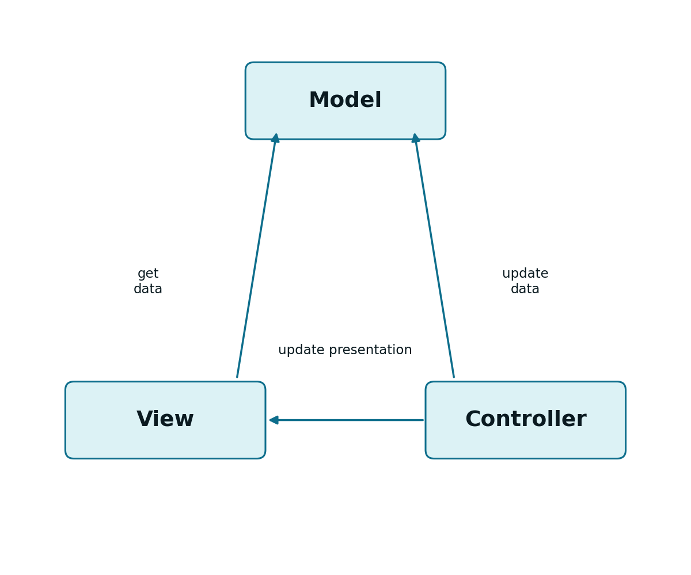
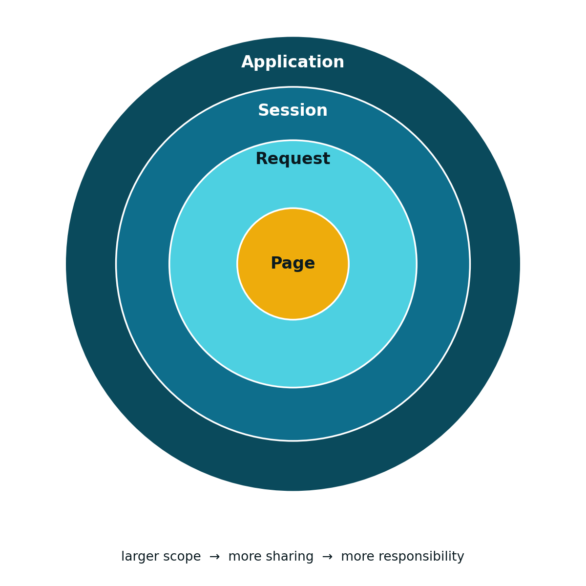

## HTTP Is Stateless: the Problem {#sec-05-state-problem-en}

The HTTP protocol is *stateless* (see [Chapter 1](cap01.qmd)): each request is independent, and the server does not, by itself, retain any memory of previous requests. At the protocol level, there is no notion whatsoever of a "user with an active session".

This raises an immediate practical problem: if a user authenticates in one request, how does a following request, minutes later, know that this user is still authenticated? The answer relies on two complementary mechanisms:

- ***Cookies***: a small piece of information stored on the **client** side, automatically resent by the *browser* on every following request
- **`HttpSession`**: an object stored on the **server** side, associated with an identifier that the client returns on every request

## *Cookies* {#sec-05-cookies-en}

A *cookie* is a key/value pair stored in the *browser*. When the server sends a *cookie*, it expects the client to return it on every subsequent HTTP request directed at the same domain, thereby implementing an identification mechanism layered on top of HTTP's `stateless` nature.

Two types can be distinguished, depending on their persistence:

- ***Session cookies***: kept by the client only for the duration of a browsing session (`setMaxAge(-1)`). While the session is not closed, the client keeps identifying itself through the *cookie*. From the moment the session is closed (by *logout* or by closing the *browser*), the *cookie* is destroyed.
- ***Permanent cookies***: stored persistently, with a defined lifetime (`setMaxAge(60*60*24*30)` — the time is expressed in seconds, here for 30 days).

Creating a *cookie*:

```java
Cookie cookie = new Cookie("userName", "Pedro");
cookie.setMaxAge(-1); // session cookie
response.addCookie(cookie); // the cookie is added to the response and sent to the client
```

Reading a *cookie* received in a request:

```java
Cookie[] cookies = request.getCookies();
String user = null;

for (Cookie c : cookies) {
    if (c.getName().equals("userName")) {
        user = c.getValue();
    }
}
```

## Sessions (`HttpSession`) {#sec-05-http-sessions-en}

Storing state on the server side requires a dedicated object: the `HttpSession`. A session is obtained, or created, from the request:

```java
HttpSession session = request.getSession();          // creates it if it doesn't exist
HttpSession session = request.getSession(true);      // equivalent, explicit
HttpSession session = request.getSession(false);     // NEVER creates one; returns null if there isn't one
```

Once obtained, the session stores and returns information through attributes, and can be explicitly terminated:

```java
session.setAttribute("email", "foo@fool.com");
String email = (String) session.getAttribute("email");
session.invalidate();                    // ends the session
session.setMaxInactiveInterval(1800);     // inactivity time, in seconds
```

One piece is still missing: if HTTP has no memory of previous requests, how does the server know that two successive requests belong to the same session? The answer is, once again, *cookies*: by convention, the session identifier travels in a *cookie* named `JSESSIONID`, automatically created by the *Servlet Container* on the first call to `getSession()`.

::: {.httpmsg}
JSESSIONID=22562577CE80EF3B1DAAA0E48F2B6392
:::

When the client does not accept *cookies*, there is an alternative: encoding the session identifier directly in the *URL*.

::: {.httpmsg}
http://localhost:8080/CapitaisAPI/country;jsessionid=829F8836C240B51DD2F074259F242833
:::

It is good practice to always call `response.encodeURL(url)` when building a destination *URL*: if *cookies* are active, the method returns the *URL* unchanged; if they are not, it automatically appends the `jsessionid`.

## Session-Based Authentication {#sec-05-session-authentication-en}

Combining the two mechanisms above yields the classic session-based authentication pattern. After validating the credentials, the `LoginServlet` creates a session and stores the user's identifier in it:

```java
@WebServlet("/login")
public class LoginServlet extends HttpServlet {
    protected void doPost(HttpServletRequest request, HttpServletResponse response)
            throws ServletException, IOException {
        String user = request.getParameter("user");
        String pass = request.getParameter("pass");

        if (dao.validateUserCredentials(user, pass)) {
            HttpSession session = request.getSession(true);
            session.setAttribute("UserName", user);

            response.setContentType("application/json");
            response.getWriter().print("{\"message\":\"OK\",\"user\":\"" + user + "\"}");
        } else {
            response.setStatus(HttpServletResponse.SC_FORBIDDEN);
            response.getWriter().print("{\"message\":\"FORBIDDEN\",\"error\":\"Invalid login or password\"}");
        }
    }
}
```

Note that `dao` is an instance of a *Data Access Object* (DAO) — a dedicated data-access object, already mentioned in [Chapter 4](cap04.qmd) — responsible, in this case, for validating the credentials received: it typically queries a user database, and returns `true` or `false` depending on whether the `user`/`pass` pair is valid.

Any protected *endpoint* checks, at the start of its own `doGet()` or `doPost()`, whether a valid session with that attribute exists:

```java
HttpSession session = request.getSession(false);
if (session == null || session.getAttribute("UserName") == null) {
    response.setStatus(HttpServletResponse.SC_FORBIDDEN);
    response.getWriter().print("{\"error\":\"Authentication required\"}");
    return;
}
// authenticated request: continue normal processing
```

Logout simply amounts to ending the session:

```java
session.invalidate();
```

## The MVC Pattern with *Servlet* and JSP {#sec-05-mvc-jsp-en}

[Chapter 1](cap01.qmd) introduced the MVC pattern at a conceptual level, and [Chapter 4](cap04.qmd) showed how a *Servlet* acts as Controller. The pages built in [Chapter 2](cap02.qmd) already play the role of View, but they are static: their content does not change depending on the request. This section shows an alternative way of building the View — this time generated dynamically on the server side, from the data the Controller hands it.

{#fig-05-mvc-general-en width="55%"}

In a presentation-oriented application, the *Servlet* receives the request and decides **what** to show, but delegates the actual **generation of HTML** to a [*JavaServer Page*](https://jakarta.ee/specifications/pages/) (JSP). The Model, in turn, is a plain Java class (for example, a *DAO*), independent of both.

The *Servlet* connects to the JSP through a `RequestDispatcher`: it places the data to be shown in a request attribute, and forwards the request itself to the page:

```java
request.setAttribute("user", user);
request.getRequestDispatcher("/home.jsp").forward(request, response);
```

A JSP is a text document that mixes two kinds of content: static HTML and dynamic *script* elements. The first time it is requested, the *Servlet Container* automatically converts it into a *Servlet* class, which from then on behaves exactly like any other *Servlet*, in the role of `Controller`.

## A Simple JSP Example {#sec-05-jsp-example-en}

```jsp
<%@ page language="java" contentType="text/html; charset=UTF-8" pageEncoding="UTF-8"%>

<% String name = (String) request.getAttribute("userName"); %>

<!DOCTYPE html>
<html>
<head>
  <meta http-equiv="Content-Type" content="text/html; charset=UTF-8">
  <title>A JSP Page</title>
</head>
<body>
  <h1>Hello, <%= name %>!</h1>
</body>
</html>
```

The `<% ... %>` block (*scriptlet*) contains arbitrary Java code; the `<%= ... %>` block (expression) inserts the value of a Java expression directly into the generated HTML. It is exactly this `userName` attribute, placed in the request by the *Servlet* through `request.setAttribute(...)`, that the JSP retrieves here.

## Lifecycle and Implicit Objects {#sec-05-jsp-lifecycle-en}

A JSP's lifecycle follows the same model as the *Servlet* it is converted into (see [Chapter 4](cap04.qmd)), with two details of its own:

- The container automatically recompiles the JSP whenever the `.jsp` file changes
- Instead of `init()` and `destroy()`, the JSP offers the methods `jspInit()` and `jspDestroy()`

Another practical difference: inside a JSP, a set of objects is automatically available, with no prior declaration, called implicit objects:

| Implicit object | Type |
|---|---|
| `out` | `JspWriter` |
| `request` | `HttpServletRequest` |
| `response` | `HttpServletResponse` |
| `session` | `HttpSession` |
| `page` | `Object` |

Because of the implicit object `out`, a JSP never needs to explicitly obtain a `PrintWriter`: `out` is used directly.

## *Scopes*: Sharing Information Within the Server {#sec-05-scopes-en}

Just as *Servlets* can share information with other modules through attributes (see [Chapter 4](cap04.qmd)), those attributes always exist within a given *scope*. There are four kinds of *scope*:

- ***Web context*** (or *application context*): a single one per application, shared by all modules and all users
- ***Session***: one per user, kept across several requests from that user
- ***Request***: one per request, lost as soon as the response is sent
- ***Page***: exclusive to JSP, not used in this course

All *scopes* follow the same interface: `setAttribute`/`getAttribute` methods, and `getAttributeNames()` to list everything stored there.

**Web context**, shared by the whole application:

```java
ServletContext context = request.getServletContext();
context.setAttribute("dbHost", "localhost");
String dbHost = (String) context.getAttribute("dbHost");
```

**Session**, already introduced, shared only by the same user:

```java
HttpSession session = request.getSession();
session.setAttribute("email", "foo@fool.com");
String email = (String) session.getAttribute("email");
```

**Request**, the most restricted of all, shared only between modules processing the same request (for example, between a *Servlet* and the JSP it forwards to):

```java
request.setAttribute("email", "foo@fool.com");
String email = (String) request.getAttribute("email");
```

The four *scopes* form an inclusion hierarchy, from the widest to the most restricted: *Application* contains *Session*, which contains *Request*, which contains *Page*. The wider the *scope*, the more widely shared the information, and the greater the responsibility to manage it correctly (for instance, to remove it when it is no longer needed).

{#fig-05-scopes-comparison-en width="60%"}

::: {.callout-note}
## *Scopes* are not instantiated

Scope objects (`ServletContext`, `HttpSession`, `ServletRequest`) are automatically provided by the container. A new instance is never created with `new`: if one does not yet exist, the appropriate methods (`getServletContext()`, `getSession()`) create it or return the existing one.
:::
