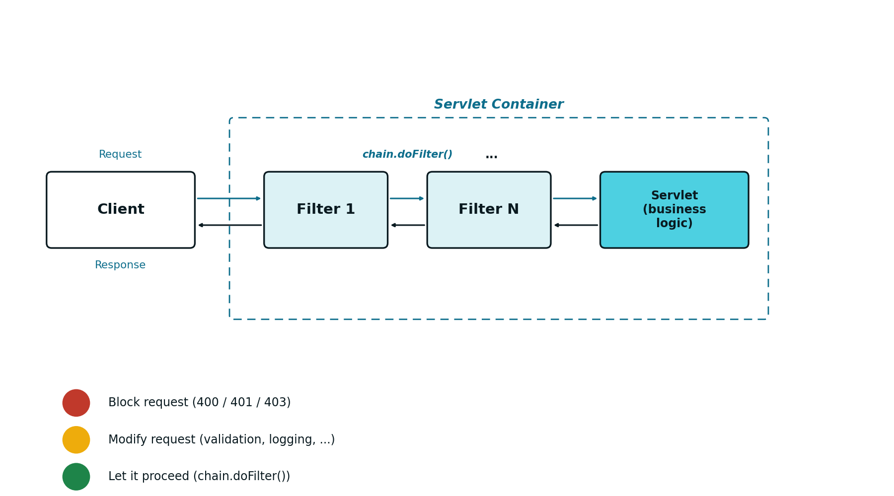
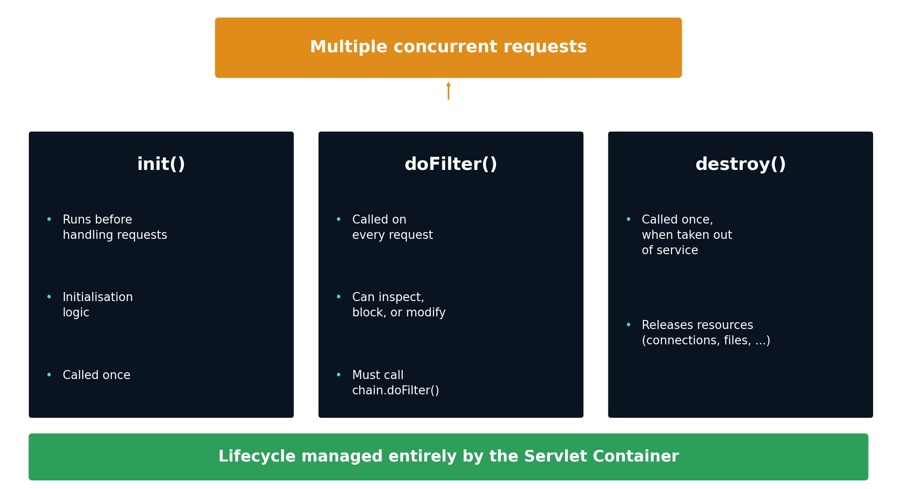
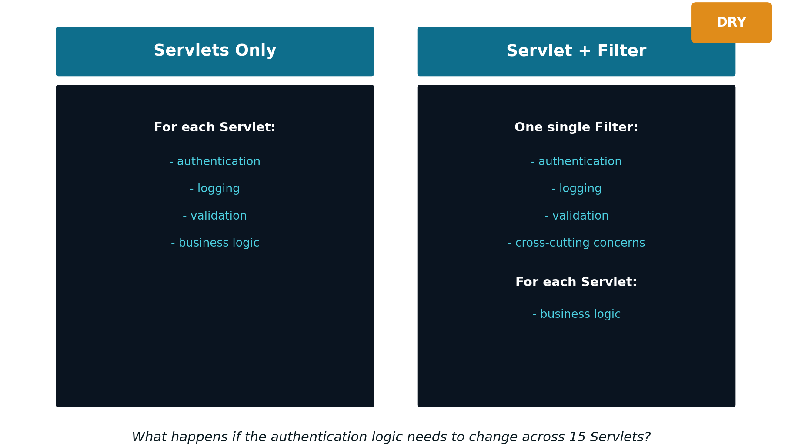

## The Problem: Security Repeated in Every *Servlet* {#sec-06-problem-en}

With what has been presented so far (see [Chapter 5](cap05.qmd)), authentication is solved: the `LoginServlet` validates the credentials and stores the user in the session, and each protected *endpoint* checks that session at the start of its `doGet()` or `doPost()`. This works, but it has a hidden cost: the authentication logic lives, duplicated, inside **every** protected *Servlet*.

This duplication brings several problems along with it:

- The same session check is repeated in every protected *endpoint*
- There is a real risk of inconsistency between these copies
- It is easy to forget the protection when creating a new *endpoint*

Put another way, this duplication violates the *DRY* principle (*Don't Repeat Yourself*): a responsibility should live in a single place, and repeated logic increases the maintenance cost whenever that logic needs to change. More concretely, this design violates the **Single Responsibility Principle**: each *Servlet* ends up with two distinct responsibilities, its own business logic, and the security logic imposed on it. This makes security policies hard to evolve, and the design poorly scalable, both in number of *endpoints* and in the complexity of the access rules.

## Authentication vs. Authorisation {#sec-06-authentication-authorisation-en}

Before solving the problem, it is worth pinning down two often-confused concepts:

**Authentication**
: Answers "who is the user?". It is the identity check, typically performed at *login* time.

```java
if (username.equals("admin") && password.equals("1234")) {
    HttpSession session = request.getSession(true);
    session.setAttribute("UserName", username);
}
```

**Authorisation**
: Answers "what is this user allowed to access?". It is the permission check, performed once identity has already been confirmed.

```java
if (session.getAttribute("UserRole").equals("ADMIN")) {
    // access granted
}
```

Authentication always happens first: it makes no sense to check the permissions of someone whose identity has not yet been confirmed. This distinction is directly reflected in the HTTP status codes used in the response (see [Chapter 3](cap03.qmd)):

- `401 Unauthorized`: the request is not authenticated
- `403 Forbidden`: the request is authenticated, but lacks permission for the requested resource

## What a Filter Is {#sec-06-what-is-a-filter-en}

The question left unanswered is where the security logic should live: inside each *Servlet*? Duplicated across every *endpoint*? Or centralised in a single component? Security is, by nature, a *cross-cutting concern*: it runs through the whole application, rather than belonging to a single module. This is exactly what the Filter exists for.

A [Filter](https://jakarta.ee/specifications/servlet/) is a server-side component that intercepts HTTP requests:

- It runs **before** the destination *Servlet*
- It can also run **after** the *Servlet* (over the response)
- It can block, redirect, or modify the request or the response

Beyond authentication and authorisation, Filters are the natural mechanism for other cross-cutting concerns: activity *logging*, *CORS* (*Cross-Origin Resource Sharing*), or input validation. A Filter separates these concerns from the business logic, which stays exclusively in the *Servlet*.

## Where a Filter Sits in the Request {#sec-06-where-a-filter-sits-en}

One or more Filters can be chained between the client and the *Servlet* that actually handles the request:

```
Client → Filter 1 → ... → Filter N → Servlet (business logic) → Response
```

{#fig-06-filter-chain-en width="80%"}

Each Filter in the chain has, essentially, three possible behaviours:

- **Block the request**: for example, `400` (invalid data), `401` (invalid identity) or `403` (authenticated but without permission)
- **Modify the request**: data normalisation and validation, activity logging, among others
- **Let it proceed**: by calling `chain.doFilter(request, response)`, passing control to the next element in the chain

## A Filter's Lifecycle {#sec-06-filter-lifecycle-en}

A Filter's lifecycle follows the same model already presented for *Servlets* (see [Chapter 4](cap04.qmd)):

- `init()`: executed once, when the container puts the Filter into service
- `doFilter()`: executed on every request; it can inspect, block or modify the request and the response, and must call `chain.doFilter()` to continue the chain
- `destroy()`: executed once, when the Filter is taken out of service, to free resources

Just like a *Servlet*, there is **a single instance** of each Filter, shared by multiple concurrent requests: exactly the same care already mentioned in Chapter 4 applies here — avoid shared mutable state, and prefer local variables inside `doFilter()`.

{#fig-06-filter-lifecycle-en width="85%"}

## *Servlet* and Filter: Separation of Responsibilities {#sec-06-separation-of-responsibilities-en}

Centralising security in a Filter reorganises the responsibilities of the whole application:

{#fig-06-servlet-vs-filter-en width="75%"}

This reorganisation brings concrete advantages:

- The authentication logic is written **once** (*DRY* principle)
- The security policy is applied consistently to every *endpoint*
- There is no longer any risk of "forgetting" the protection on a new *Servlet*
- The separation between cross-cutting concerns (Filter) and business logic (*Servlet*) becomes clear

## Declaring and Implementing a Filter {#sec-06-declaring-a-filter-en}

A Filter is declared with the `@WebFilter` annotation, indicating the *URL* pattern it applies to:

```java
@WebFilter("/*")
public class AuthenticationFilter implements Filter {
    // ...
}
```

The pattern `"/*"` intercepts every request, with no exception. The class must implement `jakarta.servlet.Filter`, and the container discovers it automatically at *deployment* time. Just like *Servlets*, a Filter can also be declared equivalently in the `web.xml` file, although this practice is no longer much in use.

A typical `doFilter()`, protecting every request by requiring a valid session, has this form:

```java
public void doFilter(ServletRequest request,
                      ServletResponse response,
                      FilterChain chain)
        throws IOException, ServletException {

    HttpServletRequest req = (HttpServletRequest) request;
    HttpServletResponse res = (HttpServletResponse) response;

    HttpSession session = req.getSession(false);

    if (session == null || session.getAttribute("UserName") == null) {
        res.sendError(HttpServletResponse.SC_UNAUTHORIZED); // 401
        return;
    }

    chain.doFilter(request, response);
}
```

In practice, not every request should be protected: `/login` itself, and static resources such as `/css`, `/js` or `/images`, need to remain accessible without authentication — otherwise the user could never even reach the *login* form.

```java
String path = req.getRequestURI();

boolean isLogin = path.endsWith("/login");
boolean isStatic = path.startsWith(req.getContextPath() + "/css")
                 || path.startsWith(req.getContextPath() + "/js")
                 || path.startsWith(req.getContextPath() + "/images");

if (isLogin || isStatic) {
    chain.doFilter(request, response);
    return;
}
```

## Redirection vs. `401`: an Architectural Difference {#sec-06-redirect-vs-401-en}

The correct way to react to an authentication failure depends on the kind of application:

- In a traditional, presentation-oriented Web application (see [Chapter 1](cap01.qmd)), the natural response is a **redirect** to the *login* page (code `302`)
- In a REST API, whose contract is JSON (see [Chapters 7](cap07.qmd) and [8](cap08.qmd)), the correct response is to return **`401`**, with no redirection at all

The difference boils down to one sentence: in a traditional Web application, an authentication failure changes the page shown; in a REST API, it only changes the status code returned. It is the client, not the server, that decides what to do next with that `401`.

## Preparing for Stateless Security {#sec-06-preparing-for-stateless-en}

The model presented in this chapter rests entirely on sessions: the server stores the authenticated user's state (`HttpSession`), and the Filter checks that session on every request. This model has one limitation: it requires the server to keep memory of each user, which becomes problematic as soon as there is more than one server instance (see [Chapter 8](cap08.qmd)).

The alternative is token-based authentication: instead of the server storing any session at all, each request itself carries, on every call, all the information needed to authenticate. This shift, from a stateful model to a stateless model, is the subject of the following chapters.
