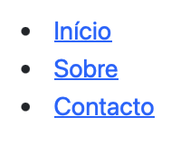
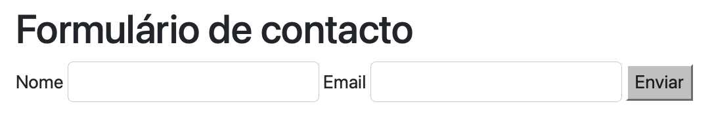
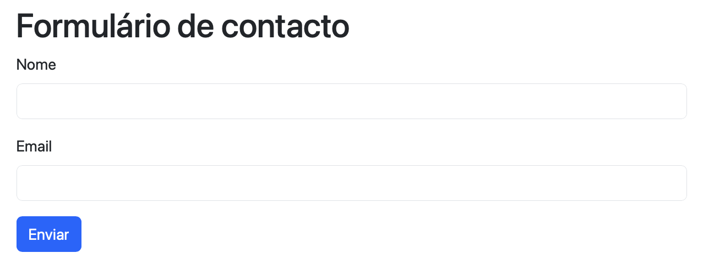
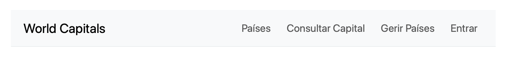

## Onde Estamos {.unnumbered}

<span class="eyebrow">Recapitulação</span>

- Uma aplicação Web tem três peças: **Frontend**, **Middleware**, **Backend** (Cap. 1)
- Este capítulo constrói a primeira: o **Frontend**
- Corre no *browser*; testável e visível sem existir ainda nenhum servidor por trás

## Tags de Conteúdo {.unnumbered}

<span class="eyebrow">HTML</span>

- `<h1>` a `<h6>` — títulos, do mais ao menos importante. Só um `<h1>` por página
- `<p>` — parágrafo de texto
- `<a href="...">` — hiperligação
- `<ul>`/`<ol>` — lista não ordenada/ordenada, cada item num `<li>`

## Tags Estruturais (Semânticas) {.unnumbered}

<span class="eyebrow">HTML</span>

- `<div>` — contentor genérico, sem significado próprio
- `<header>`, `<nav>`, `<main>`, `<section>`, `<aside>`, `<footer>`
- `<form>` — recolha de dados, com `<input>` e outros campos

Diferença chave: as *tags* semânticas descrevem o **papel** de cada zona; o `div` não descreve nada

## HTML Mínimo {.unnumbered}

<span class="eyebrow">HTML — Estrutura</span>

```html
<!DOCTYPE html>
<html lang="pt">
  <head>
    <meta charset="UTF-8">
    <title>A Minha Página</title>
  </head>
  <body>
    <h1>Bem-vindo</h1>
    <p>Primeira versão da página.</p>
  </body>
</html>
```

{height="220px"}

## HTML Semântico {.unnumbered}

<span class="eyebrow">HTML — Estrutura</span>

```html
<header><h1>Título do Site</h1></header>
<nav><!-- menu aqui --></nav>
<main>
  <section><h2>Introdução</h2><p>Conteúdo inicial.</p></section>
</main>
<footer>© 2026</footer>
```

{height="220px"}

Sem CSS, as *tags* estruturais organizam o código mas não se distinguem visualmente

## Nav e Formulário {.unnumbered}

<span class="eyebrow">HTML — Elementos Frequentes</span>

::: {.columns}
::: {.column width="50%"}
```html
<nav>
 <ul>
  <li><a href="#home">Início</a></li>
  <li><a href="#sobre">Sobre</a></li>
 </ul>
</nav>
```
{height="150px"}
:::
::: {.column width="50%"}
```html
<form>
 <label for="nome">Nome</label>
 <input id="nome" name="nome">
 <button type="submit">Enviar</button>
</form>
```
{height="150px"}
:::
:::

O `for` do `label` liga-se ao `id` do `input` — essencial para acessibilidade

## HTML vs. CSS {.unnumbered}

<span class="eyebrow">CSS — Introdução</span>

- HTML descreve a **estrutura**; CSS é responsável pela **apresentação**
- Três formas de associar CSS ao HTML:
  - **Inline** — no atributo `style` de um elemento
  - **Interno** — bloco `<style>` no `<head>`
  - **Externo** — ficheiro `.css` à parte, ligado por `<link>`

## CSS Inline {.unnumbered}

<span class="eyebrow">CSS — Três Formas</span>

```html
<h1 style="color:#0d6efd; margin:0.5rem 0;">
  Título do Site
</h1>
```

{height="200px"}

## CSS Interno {.unnumbered}

<span class="eyebrow">CSS — Três Formas</span>

```html
<head>
  <style>
    :root { --brand: #0d6efd; }
    nav ul { list-style:none; display:flex; }
    nav a:hover { background:var(--brand); }
  </style>
</head>
```

`--brand` é uma *custom property*: reutilizável em toda a folha de estilos, alterável num único sítio

## CSS Externo {.unnumbered}

<span class="eyebrow">CSS — Três Formas</span>

```html
<head>
  <link rel="stylesheet" href="styles.css">
</head>
```

```css
/* styles.css */
nav ul { list-style:none; display:flex; gap:1rem; }
nav a { text-decoration:none; }
```

**Melhor prática:** separa estrutura de apresentação, reutilizável entre páginas, documentos mais curtos

## Nav Estilizada {.unnumbered}

<span class="eyebrow">CSS — Resultado</span>

```css
nav ul { list-style:none; display:flex; gap:1rem; }
nav a { text-decoration:none; padding:0.4rem 0.6rem; }
nav a:hover { background:var(--brand); }
```

{height="220px"}

## Classes vs. IDs {.unnumbered}

<span class="eyebrow">CSS — Seletores</span>

- **Classe** (`.classe`) — pode aplicar-se a vários elementos na página
- **Identificador** (`#id`) — deve ser único por página; mais específico que a classe
- Um elemento pode ter várias classes em simultâneo, separadas por espaço

## Exemplo: Classes e IDs {.unnumbered}

<span class="eyebrow">CSS — Seletores</span>

```css
#titulo { color: var(--brand); }
.menu { border-block: 1px solid #eee; }
.menu__link.ativo { font-weight: 600; }
```

{height="220px"}

## Especificidade {.unnumbered}

<span class="eyebrow">CSS — Conflitos</span>

Quando duas regras entram em conflito, vence a mais específica, por ordem decrescente:

1. `!important` (a evitar)
2. Estilo *inline* (`style="..."`)
3. Identificador (`#id`)
4. Classe (`.classe`), atributo ou pseudoclasse
5. Elemento (`h1`, `p`, `a`, ...)

## Exemplo de Especificidade {.unnumbered}

<span class="eyebrow">CSS — Conflitos</span>

::: {.columns}
::: {.column width="50%"}
```css
h1 { color: black; }
.titulo { color: blue; }
#titulo { color: green; }
```
`#titulo` vence: é mais específico

{height="150px"}
:::
::: {.column width="50%"}
```css
h1 { color: black !important; }
.titulo { color: blue; }
#titulo { color: green; }
```
`h1` vence: `!important` está acima de tudo

{height="150px"}
:::
:::

## Porquê um Framework CSS? {.unnumbered}

<span class="eyebrow">Bootstrap</span>

Escrever e manter todo o CSS de raiz é trabalho considerável. Um *framework* como o Bootstrap fornece:

- Produtividade e consistência visual, com classes utilitárias prontas
- Responsividade já implementada (*grid*, espaçamento)
- Componentes testados e acessíveis (*navbar*, formulários, botões)

## Bootstrap via CDN {.unnumbered}

<span class="eyebrow">Bootstrap</span>

```html
<head>
  <link href=".../bootstrap.min.css" rel="stylesheet">
</head>
<body>
  <!-- conteúdo -->
  <script src=".../bootstrap.bundle.min.js"></script>
</body>
```

Sem necessidade de instalação: uma folha de estilos + um *script* para os componentes interativos

## Navbar Bootstrap {.unnumbered}

<span class="eyebrow">Bootstrap</span>

```html
<nav class="navbar navbar-expand-md bg-light">
  <div class="container">
    <a class="navbar-brand" href="#">Meu Site</a>
    <ul class="navbar-nav ms-auto">
      <li class="nav-item"><a class="nav-link">Início</a></li>
    </ul>
  </div>
</nav>
```

{height="140px"}

## Formulário Bootstrap {.unnumbered}

<span class="eyebrow">Bootstrap</span>

```html
<label class="form-label">Nome</label>
<input class="form-control">
<button class="btn btn-primary">Enviar</button>
```

{height="220px"}

## Grid Bootstrap {.unnumbered}

<span class="eyebrow">Bootstrap</span>

```html
<div class="row">
  <div class="col-6">Conteúdo principal…</div>
  <aside class="col-6">Barra lateral…</aside>
</div>
```

{height="220px"}

A grelha do Bootstrap divide cada `row` em 12 colunas — `col-6` ocupa metade

## Outros Frameworks {.unnumbered}

<span class="eyebrow">Alternativas ao Bootstrap</span>

| Framework | Abordagem | Curva de aprendizagem |
|---|---|---|
| **Bootstrap** | Componentes prontos | Baixa |
| **Tailwind CSS** | Classes utilitárias | Média/alta |
| **Bulma** | Componentes CSS, sem JS | Baixa |
| **Materialize** | Material Design (Google) | Média |
| **Foundation** | Componentes configuráveis | Alta |

## Boas Práticas {.unnumbered}

<span class="eyebrow">Síntese</span>

- Preferir CSS externo; evitar `!important` e estilos *inline* em excesso
- Nomenclatura consistente para classes (ex.: convenção *BEM*)
- Acessibilidade desde o início: contraste, `label` associado a `input`, navegação por teclado
- Testar sempre a responsividade em diferentes larguras de ecrã

## Exercício: World Capitals {.unnumbered}

<span class="eyebrow">Aplicação Prática</span>

Quatro páginas estáticas, sem JavaScript, partilhando a mesma *navbar*:

- **`index.html`** — listagem de países
- **`login.html`** — autenticação (`user`, `pass`)
- **`capital.html`** — consulta de capital por `countrycode`
- **`paises-editar.html`** — gestão de países (`/countryEdit`)

{height="120px"}

## Síntese e Próximos Passos {.unnumbered}

<span class="eyebrow">Fecho</span>

- O Frontend está pronto e navegável — mas sem nenhum servidor por trás
- Falta motivar e explicar o protocolo que liga *browser* e servidor: **HTTP** (Cap. 3)
- Os LABs (Apêndice D) vão ligar este HTML ao *backend*, com `fetch()`
