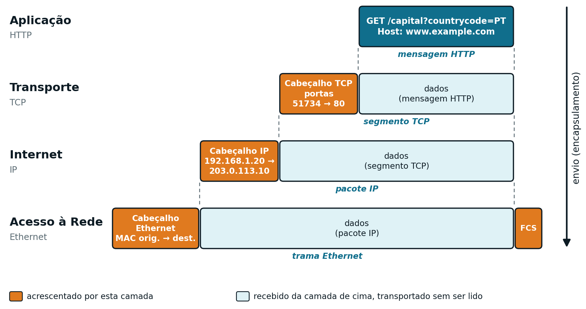
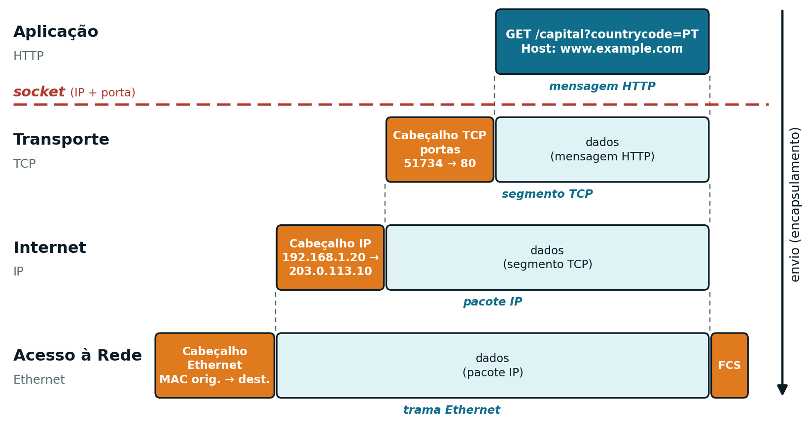

## Onde Estamos {.unnumbered}

<span class="eyebrow">Recapitulação</span>

- O **Frontend** (Cap. 2) está pronto, mas isolado: os formulários não fazem nada sozinhos
- Falta o **Middleware** que leva os dados até um servidor e traz a resposta: o **HTTP**
- Mas o HTTP não trabalha sozinho: apoia-se no **TCP** (a aplicação certa) e no **IP** (a máquina certa)
- Percurso desta aula: cliente-servidor → TCP e portas → IP e endereços → HTTP

## O Modelo Cliente-Servidor {.unnumbered}

<span class="eyebrow">Ponto de Partida</span>

{height="400px"}

## Dois Papéis Distintos {.unnumbered}

<span class="eyebrow">Ponto de Partida</span>

:::: {.columns}
::: {.column width="50%"}
**Servidor**

- Está permanentemente à escuta
- Nunca toma a iniciativa: só responde
- Atende muitos clientes em simultâneo
- Nesta UC: o **Apache Tomcat**
:::
::: {.column width="50%"}
**Cliente**

- Toma a iniciativa: envia o pedido
- Aguarda a resposta
- Tipicamente um *browser*
- Mas também `curl`, uma *app* móvel, ...
:::
::::

A unidade básica da *web* é o par **pedido** (*request*) → **resposta** (*response*).

## Duas Perguntas Antes de Enviar {.unnumbered}

<span class="eyebrow">Ponto de Partida</span>

Antes de enviar o que quer que seja, o cliente tem de saber:

1. **Em que máquina** está o servidor? → um **endereço IP** (camada Internet)
2. **Que programa**, dentro dessa máquina, recebe o pedido? → uma **porta** (camada de Transporte)

Só depois entra o **HTTP**, que define **o que** se diz: o formato do pedido e da resposta.

## O Modelo TCP/IP {.unnumbered}

<span class="eyebrow">Camadas</span>

Cada camada presta um serviço à de cima e usa os serviços da de baixo:

| Camada | Responsabilidade | Endereçamento | Protocolos |
|---|---|---|---|
| Aplicação | Formato dos dados entre aplicações | *URL* | HTTP, FTP, SMTP, DNS |
| Transporte | Entrega ao processo certo | Porta | TCP, UDP |
| Internet | Encaminhamento até à máquina certa | Endereço IP | IP |
| Acesso à Rede | Transmissão física no meio local | Endereço MAC | Ethernet, Wi-Fi |

## Encapsulamento {.unnumbered}

<span class="eyebrow">Camadas</span>

{height="470px"}

## Na Receção: o Caminho Inverso {.unnumbered}

<span class="eyebrow">Camadas</span>

Cada camada verifica o seu cabeçalho, retira-o e entrega o resto à camada de cima:

1. **Acesso à Rede:** a trama é para o meu endereço MAC? Chegou intacta (FCS)?
2. **Internet:** o endereço IP de destino é o meu?
3. **Transporte:** há alguma aplicação registada nesta **porta**? Se sim, entrega-lhe os dados
4. **Aplicação:** o Tomcat recebe a mensagem HTTP tal como o *browser* a escreveu

## Portas {.unnumbered}

<span class="eyebrow">Transporte: TCP e Portas</span>

- O IP identifica a **máquina**; a porta identifica o **programa** dentro dela
- Um servidor, ao arrancar, regista-se numa porta e fica à escuta
- Números de 0 a 65535, em três gamas:

| Gama | Designação | Utilização |
|---|---|---|
| 0 a 1023 | Bem conhecidas (*well-known*) | Serviços normalizados |
| 1024 a 49151 | Registadas | Aplicações específicas |
| 49152 a 65535 | Dinâmicas (*ephemeral*) | Atribuídas aos clientes |

## Portas Mais Comuns {.unnumbered}

<span class="eyebrow">Transporte: TCP e Portas</span>

:::: {.columns}
::: {.column width="45%"}
| Porta | Serviço |
|---|---|
| 22 | SSH |
| 25 | SMTP |
| 53 | DNS |
| 80 | HTTP |
| 443 | HTTPS |
| 3306 | MySQL |
| 8080 | Tomcat |
:::
::: {.column width="55%"}
Se a porta é a bem conhecida, não se escreve:

- `http://www.utad.pt` = `http://www.utad.pt:80`

O Tomcat escuta na 8080, por isso é obrigatório indicá-la:

- `http://localhost:8080/...`
:::
::::

## Porta de Origem e *Sockets* {.unnumbered}

<span class="eyebrow">Transporte: TCP e Portas</span>

- **Porta de origem:** atribuída pelo SO ao cliente; é para ela que o servidor responde
- ***Socket*** = endereço IP + porta: o ponto onde a aplicação entrega os dados ao TCP

{height="340px" fig-align="center"}

Ligação TCP = dois *sockets*: `192.168.1.20:51734` ⟷ `203.0.113.10:80`

## O TCP {.unnumbered}

<span class="eyebrow">Transporte: TCP e Portas</span>

Garante que os dados chegam **completos, sem erros e pela ordem certa**, sobre uma rede (IP) que não garante nada disso:

- **Estabelece uma ligação** antes de enviar (*three-way handshake*)
- **Numera os segmentos**, para os reordenar e detetar falhas
- **Confirma a receção** (*acknowledgement*); o que não é confirmado é reenviado
- **Controla o fluxo**, adaptando-se ao recetor e ao estado da rede

Para quem programa: o servidor lê sempre o pedido HTTP **inteiro e pela ordem certa**.

## TCP vs. UDP {.unnumbered}

<span class="eyebrow">Transporte: TCP e Portas</span>

:::: {.columns}
::: {.column width="50%"}
**TCP**

- Orientado à ligação
- Numeração, confirmações, retransmissão
- Fiável, mas mais lento
- *Web* (HTTP), correio, transferência de ficheiros
:::
::: {.column width="50%"}
**UDP**

- Sem ligação
- Sem confirmações nem retransmissão
- Rápido, mas sem garantia de entrega
- Voz, vídeo em direto, consultas DNS
:::
::::

Ambos usam **portas**.

## Endereços IP {.unnumbered}

<span class="eyebrow">Internet: IP e Endereços</span>

- O IP faz chegar cada pacote à **máquina** de destino
- **IPv4:** quatro números de 0 a 255 → `192.168.1.20`, `203.0.113.10`
    - 32 bits, cerca de 4 300 milhões de endereços: insuficiente
- **IPv6:** 128 bits, em hexadecimal → `2001:db8::10`
- Hoje, IPv4 e IPv6 coexistem

*Nota:* `203.0.113.10`, `2001:db8::10` e `www.example.com` estão reservados para documentação e exemplos (RFC 5737, 3849, 2606): não pertencem a nenhuma máquina real.

## Endereços Reservados {.unnumbered}

<span class="eyebrow">Internet: IP e Endereços</span>

| Endereço ou gama | Utilização |
|---|---|
| `127.0.0.1` | *Loopback*: a própria máquina (`localhost`) |
| `10.x.x.x` | Privados (redes internas) |
| `172.16.x.x` a `172.31.x.x` | Privados (redes internas) |
| `192.168.x.x` | Privados (casa, escritório) |

- Um pedido para `localhost` **nunca sai da máquina**: cliente e servidor no mesmo portátil
- Endereços privados só valem na rede local; o *router* traduz para um público (**NAT**)

## Encaminhamento {.unnumbered}

<span class="eyebrow">Internet: IP e Endereços</span>

- Cliente e servidor raramente estão na mesma rede
- Em cada rede intermédia, um ***router***:
    1. lê o endereço IP de destino
    2. consulta a sua tabela de encaminhamento (*routing table*)
    3. reenvia o pacote para a rede vizinha seguinte
- O pacote avança **salto a salto** até à rede do servidor
- O IP **não garante** a entrega: pacotes perdidos, duplicados, fora de ordem → daí o TCP

## DNS: de Nomes a Endereços {.unnumbered}

<span class="eyebrow">Internet: IP e Endereços</span>

- As pessoas escrevem `www.example.com`; a rede só conhece `203.0.113.10`
- O **DNS** (*Domain Name System*), um sistema hierárquico de servidores, faz a tradução
- `localhost` é um caso especial: resolvido na própria máquina → `127.0.0.1`

Perguntar diretamente ao DNS, num terminal (Windows, macOS, Linux):

```bash
nslookup www.utad.pt
```

A linha `Address` mostra o endereço IP associado ao nome.

## Do *URL* à Ligação {.unnumbered}

<span class="eyebrow">Juntar as Peças</span>

<span style="font-size:1.25em">`http://localhost:8080/capital?countrycode=PT`</span>

| Parte | Valor | Camada |
|---|---|---|
| Protocolo | `http` | Aplicação (e porta por omissão: 80) |
| Anfitrião | `localhost` | Internet → `127.0.0.1` |
| Porta | `8080` | Transporte → o Tomcat |
| Caminho e parâmetros | `/capital?countrycode=PT` | Aplicação → o recurso pedido |

## O Percurso Completo {.unnumbered}

<span class="eyebrow">Juntar as Peças</span>

1. O *browser* obtém o endereço IP do anfitrião (DNS, ou diretamente para `localhost`)
2. Abre uma ligação TCP para `127.0.0.1:8080`; o SO atribui-lhe uma porta de origem
3. Escreve o pedido HTTP e entrega-o ao TCP → IP → rede
4. No servidor, os pacotes sobem a pilha até ao programa na porta 8080: o Tomcat
5. O Tomcat escreve a resposta HTTP, que faz o percurso inverso
6. O *browser* lê a resposta e apresenta-a

Passos 1, 2 e 4: sistema operativo e rede. Passos 3, 5 e 6: **HTTP**.

## O HTTP {.unnumbered}

<span class="eyebrow">HTTP</span>

:::: {.columns}
::: {.column width="45%"}
- Protocolo de **texto**
- Modelo **pedido-resposta**
- ***Stateless***: cada pedido é independente, sem memória dos anteriores
:::
::: {.column width="55%"}
| Método | Semântica típica |
|---|---|
| `GET` | Obter um recurso |
| `POST` | Criar um recurso |
| `PUT` | Atualizar ou substituir |
| `DELETE` | Remover |
| `HEAD` | Só os cabeçalhos |
:::
::::

## Anatomia de uma Mensagem {.unnumbered}

<span class="eyebrow">HTTP</span>

:::: {.columns}
::: {.column width="45%"}
1. **Linha inicial**
    - pedido: método, *URL*, versão
    - resposta: versão, código, motivo
2. **Cabeçalhos**: `Host`, `Content-Type`, `Content-Length`, ...
3. **Corpo** (opcional), depois de uma linha em branco
:::
::: {.column width="55%"}
{height="430px"}
:::
::::

## Exemplo: Pedido `GET` {.unnumbered}

<span class="eyebrow">HTTP: Exemplos</span>

Formulário `capital.html` submetido com `PT`:

```http
GET /capital?countrycode=PT HTTP/1.1
Host: localhost:8080
```

O parâmetro vai na *URL*, depois do `?`; não há corpo. Resposta do servidor:

```http
HTTP/1.1 200 OK
Content-Type: application/json

{"country": "Portugal", "capital": "Lisboa", "ccode": "PT"}
```

## Exemplo: Pedido `POST` {.unnumbered}

<span class="eyebrow">HTTP: Exemplos</span>

Formulário `login.html`:

```http
POST /login HTTP/1.1
Host: localhost:8080
Content-Type: application/x-www-form-urlencoded
Content-Length: 21

user=javaee&pass=asw2026
```

- Os parâmetros seguem no **corpo**, depois da linha em branco
- O corpo não fica no histórico do *browser* nem nos *logs* do servidor
- Credenciais enviam-se **sempre por `POST`**, nunca por `GET`

## Resposta: Apresentação vs. Serviço {.unnumbered}

<span class="eyebrow">HTTP: Exemplos</span>

:::: {.columns}
::: {.column width="50%"}
**Orientada à Apresentação**
```http
HTTP/1.1 200 OK
Content-Type: text/html

<h1>Bem-vindo, javaee</h1>
<p>Sessão iniciada.</p>
```
:::
::: {.column width="50%"}
**Orientada ao Serviço**
```http
HTTP/1.1 200 OK
Content-Type: application/json

{"user": "javaee",
 "status": "authenticated"}
```
:::
::::

## Códigos de Estado {.unnumbered}

<span class="eyebrow">HTTP: Respostas</span>

:::: {.columns}
::: {.column width="35%"}
| | Categoria |
|---|---|
| `1xx` | Informativo |
| `2xx` | Sucesso |
| `3xx` | Redirecionamento |
| `4xx` | Erro do cliente |
| `5xx` | Erro do servidor |
:::
::: {.column width="65%"}
| Código | Significado |
|---|---|
| `200 OK` | Sucesso |
| `201 Created` | Recurso criado |
| `400 Bad Request` | Pedido malformado |
| `403 Forbidden` | Sem permissão |
| `404 Not Found` | Recurso inexistente |
| `500 Internal Server Error` | Erro no servidor |
:::
::::

## Síntese {.unnumbered}

<span class="eyebrow">Fecho</span>

- **Cliente-servidor:** o cliente pede, o servidor responde
- **IP:** leva cada pacote à **máquina** certa (endereços, *routers*, DNS)
- **TCP:** entrega os dados, completos e por ordem, ao **programa** certo (portas)
- **HTTP:** define **o que** se diz: linha inicial, cabeçalhos, corpo, códigos de estado
- Falta construir o Backend que recebe estes pedidos e lhes responde

::: {.footer-note}
Próxima aula: Cap. 4, Java EE e Fundamentos de Servlets
:::
