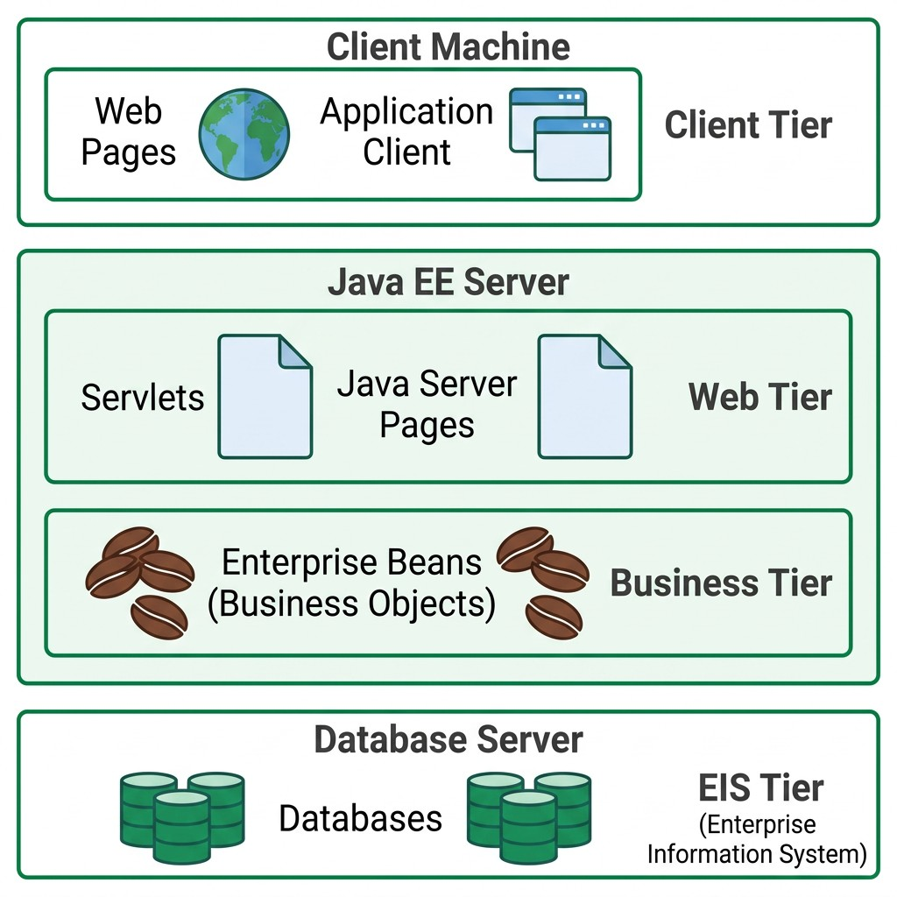
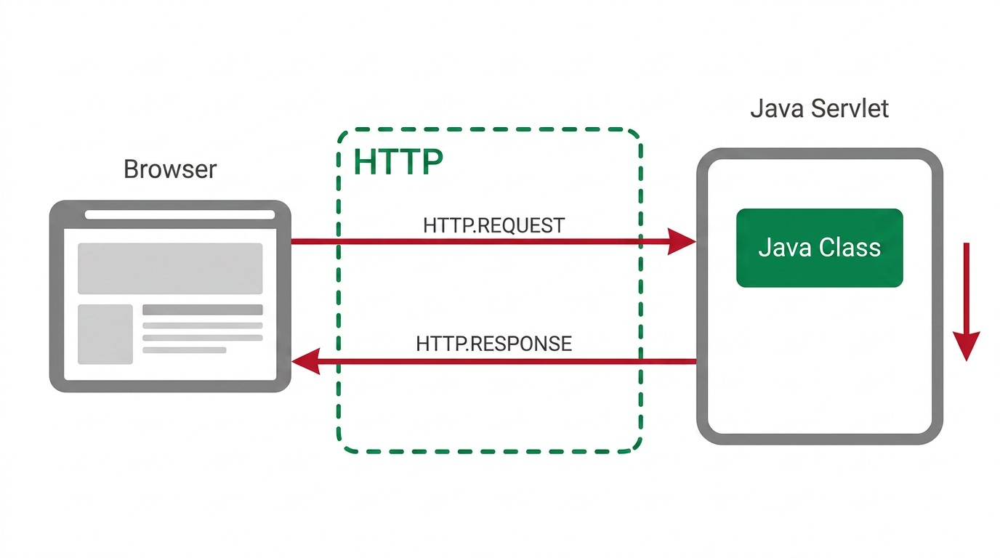
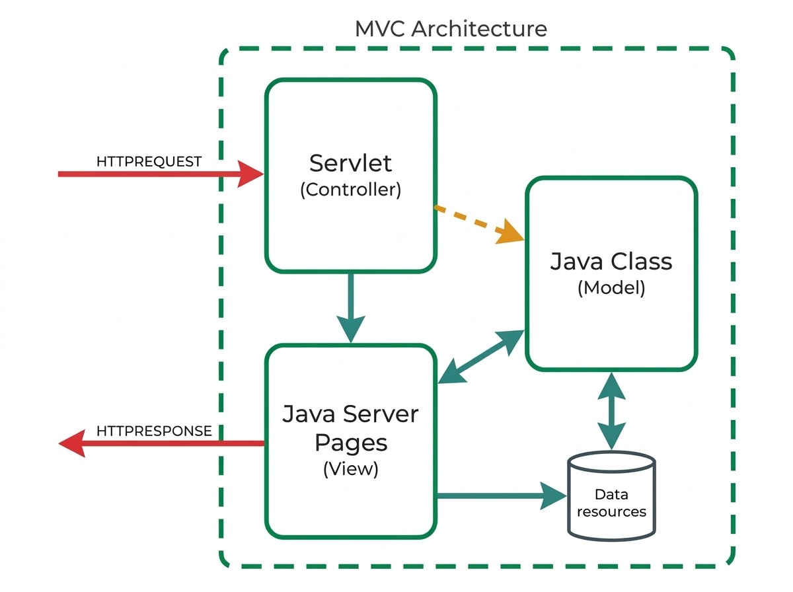

## Onde Estamos {.unnumbered}

<span class="eyebrow">Recapitulação</span>

- O Frontend (Cap. 2) está pronto; o Middleware, `HTTP` (Cap. 3), está detalhado
- Falta a terceira peça (Cap. 1): o **Backend**, que recebe os pedidos e lhes responde
- É o tema deste capítulo e dos seguintes

## A Plataforma Jakarta EE {.unnumbered}

<span class="eyebrow">Backend — Introdução</span>

- *Jakarta EE* (antes *Java EE*, até 2019) — serviços e *APIs* prontos para problemas comuns a qualquer aplicação Web
- Liberta quem desenvolve para se concentrar na lógica de negócio
- Assenta em Java e na `JVM`: portabilidade e gestão automática de memória

## Arquitetura em Camadas {.unnumbered}

<span class="eyebrow">Backend — Introdução</span>

| Camada | Onde reside | Componentes típicos |
|---|---|---|
| *Client Tier* | Máquina do cliente | Páginas Web, apps cliente |
| *Web Tier* | Servidor Jakarta EE | Servlets, JSP, Web Services |
| *Business Tier* | Servidor Jakarta EE | Enterprise Beans |
| *EIS Tier* | Servidor de BD | Bases de dados, SIE |

{height="260px"}

## Tomcat: Servlet Container {.unnumbered}

<span class="eyebrow">Backend — Introdução</span>

- O *Apache Tomcat*, usado nesta UC, é um **Servlet Container**
- Implementa apenas a **Web Tier** (Servlets, JSP)
- Não inclui *Enterprise Beans* nem a Business Tier (ao contrário de *WildFly*, *WebSphere*, *GlassFish*)
- Na prática: a lógica de negócio implementa-se em classes Java comuns, não em *Enterprise Beans*

## Porquê Servlets? {.unnumbered}

<span class="eyebrow">Servlets</span>

Implementar de raiz um servidor Web obrigaria a resolver sozinho vários problemas comuns. Uma Servlet resolve-os automaticamente:

- Interpretação (*parsing*) do pedido `HTTP`
- Gestão de *threads*, uma por pedido
- Gestão do ciclo de vida da própria Servlet
- Modelo de implantação empacotado num `.war` (*Web Application Archive*)

## Uma Servlet, do Ponto de Vista do Cliente {.unnumbered}

<span class="eyebrow">Servlets</span>

Do ponto de vista do cliente, uma Servlet é apenas mais um destino de pedidos HTTP: recebe um pedido, devolve uma resposta.

{height="360px"}

## O Ciclo de Vida de uma Servlet {.unnumbered}

<span class="eyebrow">Servlets</span>

- Sem instância em memória: o contentor carrega a classe e chama `init()`
- Por cada pedido: invoca `service()`, que despacha para `doGet()`, `doPost()`, ...
- Ao remover a Servlet (ex.: desligar o servidor): invoca `destroy()`

## Cuidado com o Estado Partilhado {.unnumbered}

<span class="eyebrow">Servlets</span>

Existe uma única instância de cada Servlet em memória, partilhada por todos os *threads* que atendem pedidos em simultâneo.

- Nunca guardar dados de um pedido em atributos de instância da Servlet
- Um pedido pode ler ou sobrescrever dados de outro pedido em curso
- Variáveis locais dentro de `doGet()`/`doPost()` são seguras: cada *thread* tem a sua cópia

## Uma Instância, Vários Threads {.unnumbered}

<span class="eyebrow">Servlets</span>

{height="420px"}

## Da Mensagem HTTP ao Método Java {.unnumbered}

<span class="eyebrow">Servlets — Mapeamento</span>

```java
@WebServlet("/country")
public class CountryServlet extends HttpServlet {
    // ...
}
```

A anotação `@WebServlet` liga a Servlet a uma `URL`: um pedido a `/country` é encaminhado para esta classe.

## Os Objetos request e response {.unnumbered}

<span class="eyebrow">Servlets — Mapeamento</span>

| Elemento HTTP | Acesso em Java |
|---|---|
| Cabeçalhos | `request.getHeader(nome)` |
| Parâmetros (GET/POST) | `request.getParameter(nome)` |
| Corpo em bruto (JSON) | `request.getInputStream()` |
| Escrever a resposta | `response.getWriter()` |

## Exemplo: doGet() {.unnumbered}

<span class="eyebrow">Servlets — Mapeamento</span>

```java
protected void doGet(HttpServletRequest request,
                      HttpServletResponse response) {
    String countryCode = request.getParameter("countrycode");
    // ...
}
```

Parâmetros de formulários tradicionais (Cap. 2) lêem-se com `getParameter()`.

## Content-Type: HTML vs. JSON {.unnumbered}

<span class="eyebrow">Servlets — Respostas</span>

:::: {.columns}
::: {.column width="50%"}
**Apresentação**
```java
response.setContentType("text/html");
PrintWriter out = response.getWriter();
out.println("<h1>Hello João</h1>");
```
:::
::: {.column width="50%"}
**Serviço**
```java
response.setContentType("application/json");
PrintWriter out = response.getWriter();
out.print("{\"name\":\"João\"}");
```
:::
::::

## Construir JSON Manualmente {.unnumbered}

<span class="eyebrow">Servlets — Respostas</span>

```java
String jsonResponse = "{\"country\": \"Portugal\", "
    + "\"capital\": \"Lisboa\", \"ccode\": \"PT\"}";
out.print(jsonResponse);
out.flush();
```

Sem biblioteca dedicada, o mais direto é construir a *String* manualmente, escapando aspas internas com `\"`.

## Códigos de Estado em Java {.unnumbered}

<span class="eyebrow">Servlets — Respostas</span>

| Código HTTP | Constante Java |
|---|---|
| `200` | `HttpServletResponse.SC_OK` |
| `201` | `HttpServletResponse.SC_CREATED` |
| `400` | `HttpServletResponse.SC_BAD_REQUEST` |
| `404` | `HttpServletResponse.SC_NOT_FOUND` |
| `500` | `HttpServletResponse.SC_INTERNAL_SERVER_ERROR` |

## Primeira Servlet: StatusServlet {.unnumbered}

<span class="eyebrow">Exemplo Completo</span>

```java
@WebServlet("/status")
public class StatusServlet extends HttpServlet {
    protected void doGet(HttpServletRequest request,
            HttpServletResponse response)
            throws ServletException, IOException {
        response.setContentType("text/plain");
        PrintWriter out = response.getWriter();
        out.print("OK");
    }
}
```

## CountryCapitalServlet {.unnumbered}

<span class="eyebrow">Exemplo Completo</span>

```java
@WebServlet("/countrycapital")
public class CountryCapitalServlet extends HttpServlet {
    protected void doGet(HttpServletRequest request,
            HttpServletResponse response)
            throws ServletException, IOException {
        response.setContentType("application/json");
        PrintWriter out = response.getWriter();
        String jsonResponse = "{\"country\": \"Portugal\", ...}";
        out.print(jsonResponse);
    }
}
```

## O que é um DAO? {.unnumbered}

<span class="eyebrow">Boas Práticas</span>

- *Data Access Object* — não é um conceito formal da Jakarta EE, é uma convenção
- Classe Java simples que isola a forma como os dados são obtidos
- Ex.: `findByCode(code)`, `validateUserCredentials(user, pass)`
- Esconde do resto do código se, por trás, está uma lista em memória, uma BD, ou outra fonte

## Servlets e o Padrão MVC {.unnumbered}

<span class="eyebrow">Boas Práticas</span>

- Servlets orientadas a serviço devolvem JSON — não têm, de facto, nenhuma *View*
- Servlet = **Controller**; uma *JavaServer Page* pode assumir o papel de **View** (Cap. 5)
- Mantém-se a separação de responsabilidades do MVC

{height="280px"}

## Síntese e Próximos Passos {.unnumbered}

<span class="eyebrow">Fecho</span>

- O Backend recebe pedidos `HTTP` através de Servlets, mapeadas por `@WebServlet`
- `request` e `response` dão acesso aos elementos da mensagem `HTTP` (Cap. 3)
- Falta a View da arquitetura MVC: as *JavaServer Pages*

::: {.footer-note}
Próxima aula: Cap. 5 — JavaServer Pages
:::
