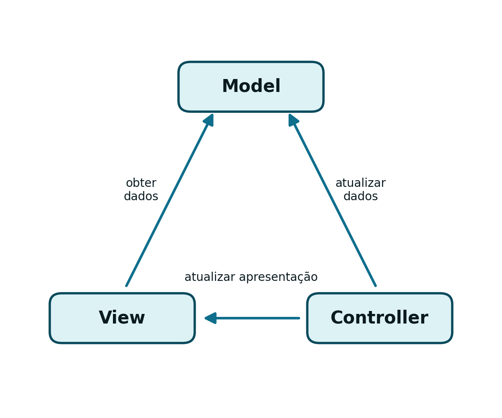
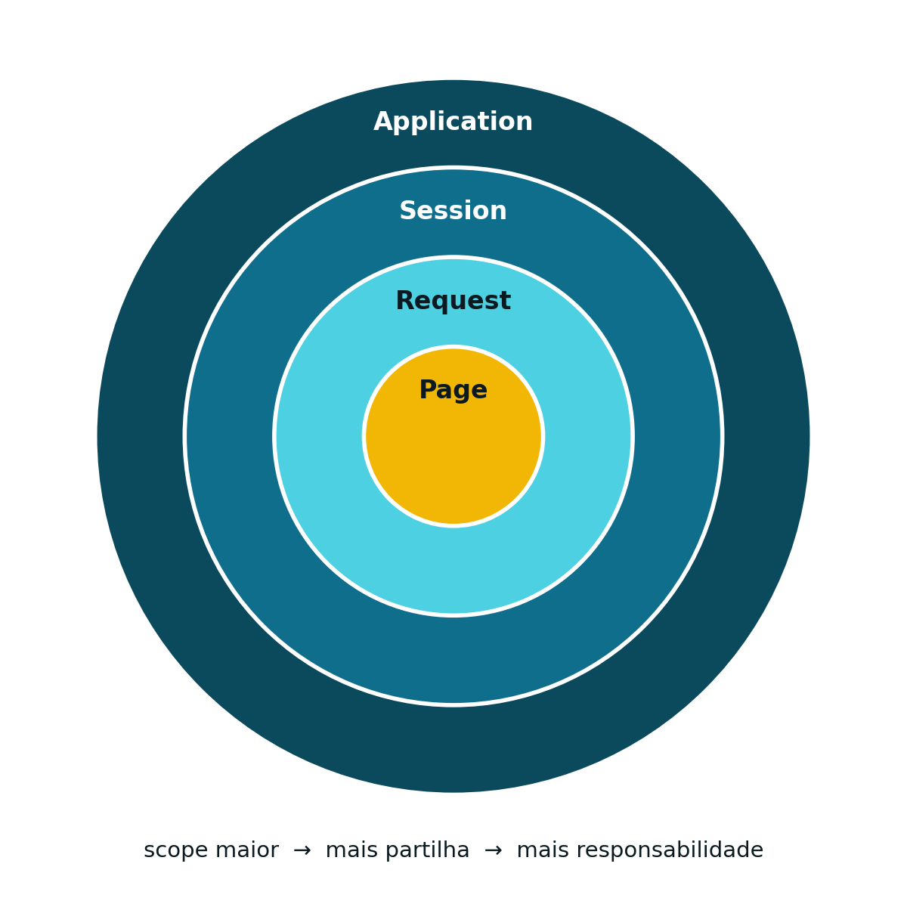

## Onde Estamos {.unnumbered}

<span class="eyebrow">Recapitulação</span>

- O Backend (Cap. 4) já recebe pedidos `HTTP` através de Servlets
- Mas cada pedido é tratado de forma independente — nada liga um pedido ao seguinte
- Falta resolver: como sabe o servidor que dois pedidos vêm do mesmo utilizador?

## HTTP é Sem Estado: o Problema {.unnumbered}

<span class="eyebrow">Estado</span>

- O `HTTP` é *stateless* (Cap. 1): o servidor não guarda memória de pedidos anteriores
- Não existe, ao nível do protocolo, nenhuma noção de "utilizador com sessão iniciada"
- Se um utilizador se autentica, como sabe um pedido seguinte que continua autenticado?

## Dois Mecanismos Complementares {.unnumbered}

<span class="eyebrow">Estado</span>

- ***Cookies*** — pedaço de informação guardado do lado do **cliente**, reenviado automaticamente em cada pedido
- **`HttpSession`** — objeto guardado do lado do **servidor**, associado a um identificador que o cliente devolve a cada pedido

## O que é um *Cookie*? {.unnumbered}

<span class="eyebrow">Cookies</span>

- Um par chave/valor guardado no *browser*
- O servidor envia um *cookie*; o cliente devolve-o em todos os pedidos seguintes ao mesmo domínio
- Implementa um mecanismo de identificação que se sobrepõe ao estado *stateless* do `HTTP`

## Session vs. Permanent {.unnumbered}

<span class="eyebrow">Cookies</span>

- ***Session cookies*** — mantidos apenas durante a sessão de navegação (`setMaxAge(-1)`); destruídos ao fechar a sessão
- ***Permanent cookies*** — persistentes, com tempo de vida definido (`setMaxAge(60*60*24*30)`, em segundos — aqui, 30 dias)

## Criar um *Cookie* {.unnumbered}

<span class="eyebrow">Cookies</span>

```java
Cookie cookie = new Cookie("userName", "Pedro");
cookie.setMaxAge(-1); // session cookie
response.addCookie(cookie);
```

## Ler um *Cookie* Recebido {.unnumbered}

<span class="eyebrow">Cookies</span>

```java
Cookie[] cookies = request.getCookies();
String user = null;

for (Cookie c : cookies) {
    if (c.getName().equals("userName")) {
        user = c.getValue();
    }
}
```

## Obter ou Criar uma Sessão {.unnumbered}

<span class="eyebrow">Sessões</span>

```java
HttpSession session = request.getSession();       // cria se não existir
HttpSession session = request.getSession(true);   // equivalente, explícito
HttpSession session = request.getSession(false);  // NUNCA cria; null se não houver
```

## Guardar e Terminar uma Sessão {.unnumbered}

<span class="eyebrow">Sessões</span>

```java
session.setAttribute("email", "foo@fool.com");
String email = (String) session.getAttribute("email");
session.invalidate();                  // termina a sessão
session.setMaxInactiveInterval(1800);  // inatividade, em segundos
```

## Como o Servidor Sabe? {.unnumbered}

<span class="eyebrow">Sessões</span>

- O identificador de sessão viaja num *cookie* chamado `JSESSIONID`
- Criado automaticamente pelo *Servlet Container* na primeira chamada a `getSession()`
- Sem *cookies*: alternativa é codificar o identificador na `URL` (`;jsessionid=...`)
- Boa prática: `response.encodeURL(url)` acrescenta o `jsessionid` só se necessário

## Autenticação: Login {.unnumbered}

<span class="eyebrow">Exemplo Completo</span>

```java
@WebServlet("/login")
public class LoginServlet extends HttpServlet {
    protected void doPost(HttpServletRequest request,
            HttpServletResponse response) throws ... {
        String user = request.getParameter("user");
        String pass = request.getParameter("pass");
        if (dao.validateUserCredentials(user, pass)) {
            HttpSession session = request.getSession(true);
            session.setAttribute("UserName", user);
            // ... resposta 200 OK
        } else {
            // ... resposta 403 FORBIDDEN
        }
    }
}
```

## Verificar Sessão e Logout {.unnumbered}

<span class="eyebrow">Exemplo Completo</span>

```java
HttpSession session = request.getSession(false);
if (session == null ||
        session.getAttribute("UserName") == null) {
    response.setStatus(HttpServletResponse.SC_FORBIDDEN);
    return;
}
// pedido autenticado: continuar
```

Logout: apenas `session.invalidate();`

## O Padrão MVC com Servlet e JSP {.unnumbered}

<span class="eyebrow">MVC e Vistas Dinâmicas</span>

- As páginas do Cap. 2 já são a *View* — mas estáticas
- Uma Servlet decide **o quê** mostrar; uma **JSP** gera o `HTML` dinamicamente
- O *Model* continua a ser uma classe Java comum (ex.: um *DAO*)

{height="260px"}

## Servlet → JSP: RequestDispatcher {.unnumbered}

<span class="eyebrow">MVC e Vistas Dinâmicas</span>

```java
request.setAttribute("user", user);
request.getRequestDispatcher("/home.jsp")
    .forward(request, response);
```

A Servlet coloca os dados num atributo do pedido e encaminha (*forward*) o próprio pedido para a página.

## Um Exemplo Simples de JSP {.unnumbered}

<span class="eyebrow">MVC e Vistas Dinâmicas</span>

```jsp
<%@ page contentType="text/html; charset=UTF-8"%>
<% String name = (String) request.getAttribute("userName"); %>

<html>
<body>
  <h1>Olá, <%= name %>!</h1>
</body>
</html>
```

## *Scriptlet* vs. Expressão {.unnumbered}

<span class="eyebrow">MVC e Vistas Dinâmicas</span>

- `<% ... %>` (*scriptlet*) — contém código Java arbitrário
- `<%= ... %>` (expressão) — insere o valor de uma expressão Java diretamente no `HTML`
- É o atributo `userName`, colocado pela Servlet via `setAttribute()`, que a JSP aqui recupera

## Ciclo de Vida e Objetos Implícitos {.unnumbered}

<span class="eyebrow">JSP — Detalhes</span>

- Mesmo modelo da Servlet (Cap. 4): recompilada automaticamente quando o `.jsp` muda
- Em vez de `init()`/`destroy()`: `jspInit()` e `jspDestroy()`

| Objeto implícito | Tipo |
|---|---|
| `out` | `JspWriter` |
| `request` | `HttpServletRequest` |
| `response` | `HttpServletResponse` |
| `session` | `HttpSession` |
| `page` | `Object` |

## Partilhar Informação Dentro do Servidor {.unnumbered}

<span class="eyebrow">Scopes</span>

- ***Web context*** — um por aplicação, partilhado por todos os módulos e utilizadores
- ***Session*** — um por utilizador, mantido entre vários pedidos
- ***Request*** — um por pedido, perdido assim que a resposta é enviada
- ***Page*** — exclusivo de JSP, não é usado nesta UC

## Hierarquia de Inclusão {.unnumbered}

<span class="eyebrow">Scopes</span>

{height="380px"}

Application contém Session, que contém Request, que contém Page — quanto maior o *scope*, mais partilha, mais responsabilidade.

## *Scopes* Não se Instanciam {.unnumbered}

<span class="eyebrow">Scopes</span>

- Os objetos de *scope* (`ServletContext`, `HttpSession`, `ServletRequest`) são fornecidos pelo contentor
- Nunca se cria uma instância nova com `new`
- Se um deles não existe, `getServletContext()`/`getSession()` criam-no ou devolvem o existente

## Síntese e Próximos Passos {.unnumbered}

<span class="eyebrow">Fecho</span>

- Estado entre pedidos resolve-se com *cookies* (cliente) e `HttpSession` (servidor)
- JSP alarga o papel de View da arquitetura MVC, gerando `HTML` dinamicamente
- *Scopes* organizam a partilha de dados: Application, Session, Request, Page

::: {.footer-note}
Próxima aula: Cap. 6 — Segurança e Filtros
:::
