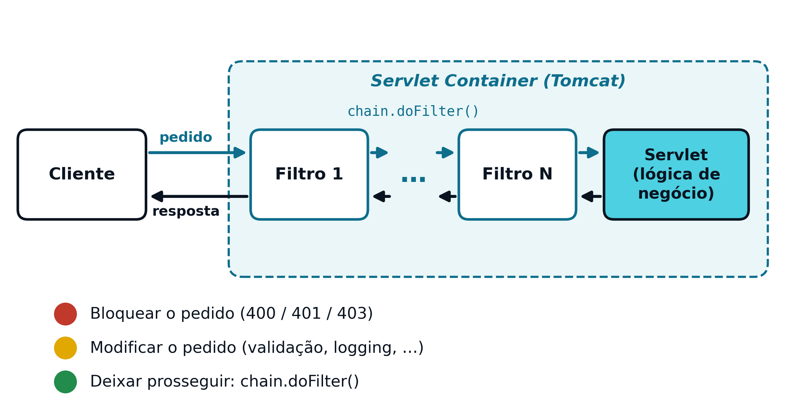
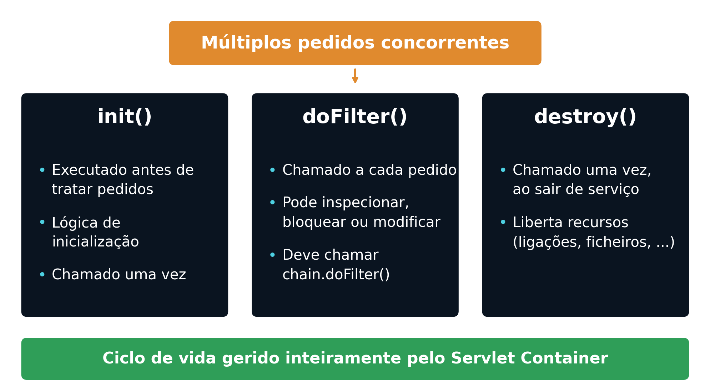
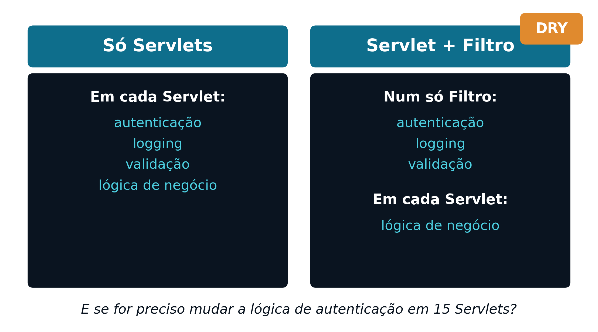

## Onde Estamos {.unnumbered}

<span class="eyebrow">Recapitulação</span>

- A autenticação por sessão (Cap. 5) funciona: `LoginServlet` valida credenciais e grava o utilizador na sessão
- Cada *endpoint* protegido repete a mesma verificação no início do seu `doGet()`/`doPost()`
- Isto tem um custo escondido: a lógica de autenticação vive duplicada em cada Servlet protegida

## Segurança Repetida em Cada Servlet {.unnumbered}

<span class="eyebrow">O Problema</span>

- A mesma verificação de sessão está repetida em todos os *endpoints* protegidos
- Existe risco real de inconsistência entre essas cópias
- É fácil esquecer a proteção ao criar um novo *endpoint*

## DRY e Responsabilidade Única {.unnumbered}

<span class="eyebrow">O Problema</span>

- Esta duplicação viola o princípio ***DRY*** (*Don't Repeat Yourself*)
- Viola também o **Princípio da Responsabilidade Única**: cada Servlet passa a ter duas responsabilidades
- A sua lógica de negócio própria, e a lógica de segurança que lhe é imposta
- Torna as políticas de segurança difíceis de evoluir e o desenho pouco escalável

## Autenticação vs. Autorização {.unnumbered}

<span class="eyebrow">Conceitos</span>

:::: {.columns}
::: {.column width="50%"}
**Autenticação** — "quem é?"
```java
if (username.equals("admin")
        && password.equals("1234")) {
    HttpSession session = request.getSession(true);
    session.setAttribute("UserName", username);
}
```
:::
::: {.column width="50%"}
**Autorização** — "o que pode aceder?"
```java
if (session.getAttribute("UserRole")
        .equals("ADMIN")) {
    // acesso permitido
}
```
:::
::::

## 401 vs. 403 {.unnumbered}

<span class="eyebrow">Conceitos</span>

- A autenticação acontece sempre primeiro: não há permissões a verificar sem identidade confirmada
- `401 Unauthorized` — o pedido não está autenticado
- `403 Forbidden` — o pedido está autenticado, mas não tem permissão para o recurso pedido

## O que é um Filtro {.unnumbered}

<span class="eyebrow">Filtros</span>

- Segurança é uma preocupação transversal (*cross-cutting concern*): atravessa toda a aplicação
- Um **Filtro** é um componente do lado do servidor que intercepta pedidos `HTTP`
- Executado **antes** da Servlet de destino, e opcionalmente **depois** (sobre a resposta)
- Pode bloquear, redirecionar ou modificar o pedido ou a resposta

## Outras Preocupações Transversais {.unnumbered}

<span class="eyebrow">Filtros</span>

- Além de autenticação e autorização, os Filtros servem outras preocupações transversais
- Registo de atividade (*logging*)
- *CORS* (*Cross-Origin Resource Sharing*)
- Validação de entrada
- Um Filtro separa estas preocupações da lógica de negócio, que fica exclusivamente na Servlet

## Onde um Filtro se Situa {.unnumbered}

<span class="eyebrow">Filtros</span>

```
Cliente → Filtro 1 → ... → Filtro N → Servlet (lógica de negócio) → Resposta
```

{height="360px"}

## Três Comportamentos de um Filtro {.unnumbered}

<span class="eyebrow">Filtros</span>

- **Bloquear o pedido** — ex.: `400` (dados inválidos), `401` (identidade inválida), `403` (sem permissão)
- **Modificar o pedido** — normalização e validação de dados, registo de atividade, entre outros
- **Deixar prosseguir** — chamando `chain.doFilter(request, response)`, passando ao próximo elemento

## Ciclo de Vida de um Filtro {.unnumbered}

<span class="eyebrow">Filtros</span>

- `init()` — executado uma única vez, quando o contentor coloca o Filtro em serviço
- `doFilter()` — executado a cada pedido; deve chamar `chain.doFilter()` para continuar a cadeia
- `destroy()` — executado uma única vez, ao retirar o Filtro de serviço
- Tal como a Servlet (Cap. 4): uma única instância, partilhada por pedidos concorrentes

## Uma Única Instância, Vários Pedidos {.unnumbered}

<span class="eyebrow">Filtros</span>

{height="420px"}

## Servlet vs. Filtro {.unnumbered}

<span class="eyebrow">Separação de Responsabilidades</span>

{height="420px"}

## Vantagens de Centralizar {.unnumbered}

<span class="eyebrow">Separação de Responsabilidades</span>

- A lógica de autenticação é escrita **uma única vez** (princípio *DRY*)
- A política de segurança é aplicada de forma consistente a todos os *endpoints*
- Deixa de haver risco de "esquecer" a proteção numa Servlet nova
- Fica clara a separação entre preocupações transversais (Filtro) e lógica de negócio (Servlet)

## Declarar um Filtro {.unnumbered}

<span class="eyebrow">Implementação</span>

```java
@WebFilter("/*")
public class AuthenticationFilter implements Filter {
    // ...
}
```

O padrão `"/*"` intercepta todos os pedidos. A classe implementa `jakarta.servlet.Filter`.

## doFilter() Típico {.unnumbered}

<span class="eyebrow">Implementação</span>

```java
public void doFilter(ServletRequest request,
        ServletResponse response, FilterChain chain)
        throws IOException, ServletException {
    HttpServletRequest req = (HttpServletRequest) request;
    HttpServletResponse res = (HttpServletResponse) response;
    HttpSession session = req.getSession(false);
    if (session == null ||
            session.getAttribute("UserName") == null) {
        res.sendError(HttpServletResponse.SC_UNAUTHORIZED);
        return;
    }
    chain.doFilter(request, response);
}
```

## Excluir /login e Recursos Estáticos {.unnumbered}

<span class="eyebrow">Implementação</span>

```java
String path = req.getRequestURI();
boolean isLogin = path.endsWith("/login");
boolean isStatic = path.startsWith(ctx + "/css")
        || path.startsWith(ctx + "/js")
        || path.startsWith(ctx + "/images");
if (isLogin || isStatic) {
    chain.doFilter(request, response);
    return;
}
```

Sem esta exceção, o utilizador nunca conseguiria sequer chegar ao formulário de *login*.

## Redirecionamento vs. 401 {.unnumbered}

<span class="eyebrow">Arquitetura</span>

- Aplicação Web tradicional, orientada à apresentação — resposta natural: **redirecionamento** (`302`) para o *login*
- API REST, cujo contrato é JSON (Cap. 7-8) — resposta correta: devolver **`401`**, sem redirecionamento
- É o cliente, não o servidor, quem decide o que fazer a seguir com esse `401`

## Preparação para Segurança Sem Estado {.unnumbered}

<span class="eyebrow">Arquitetura</span>

- Este modelo assenta inteiramente em sessão: o servidor guarda o estado do utilizador (`HttpSession`)
- Limitação: exige que o servidor mantenha memória de cada utilizador
- Problemático assim que existe mais do que uma instância do servidor (Cap. 8)
- Alternativa: autenticação baseada em *token* — o próprio pedido transporta a informação necessária

## Síntese e Próximos Passos {.unnumbered}

<span class="eyebrow">Fecho</span>

- Filtros centralizam preocupações transversais (segurança, *logging*, validação) fora das Servlets
- `doFilter()` intercepta, decide bloquear/modificar/deixar prosseguir com `chain.doFilter()`
- O modelo baseado em sessão é *stateful*; segue-se o modelo *stateless* com *tokens*

::: {.footer-note}
Próxima aula: Cap. 7 — Web Services REST e Arquitetura Stateless
:::
